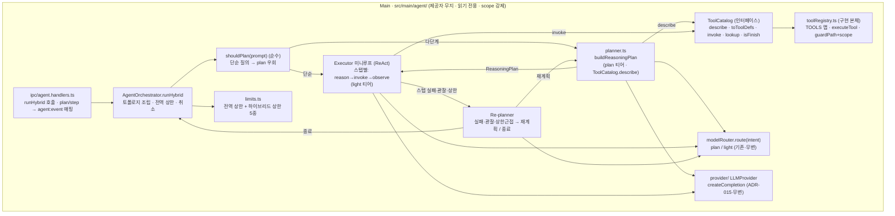

# 자연어 파일 에이전트(Agentic) — 컴포넌트·계약·데이터플로우 설계

> 작성: 시니어 아키텍트 · 2026-06-14 · **개정: 2026-06-14(멀티 AI 제공자)** · **개정: 2026-06-14(오케스트레이션 하이브리드·ToolCatalog — §14·§15 추가)** · 상태: **🔜 설계 완료·구현 전**(읽기 전용 Q&A 동작은 구현됨·하이브리드 리팩터는 🔜)
> 근거 ADR: [ADR-014](./adr/ADR-014-agentic-natural-language-file-agent.md)(루프·읽기자유/쓰기스테이징·op 재사용·위협모델) · **[ADR-015](./adr/ADR-015-multi-llm-provider-abstraction.md)(멀티 제공자 추상화·function-calling 정규화·내부 SSRF·제공자별 키)** · **[ADR-016](./adr/ADR-016-hybrid-orchestration-and-toolcatalog.md)(Plan-Execute+ReAct 하이브리드·ToolCatalog 추상화 — §14·§15)** · 정합: [ADR-005](./adr/ADR-005-process-security-model.md)·[ADR-007](./adr/ADR-007-remote-protocol-and-network-boundary.md)·[ADR-003](./adr/ADR-003-ipc-contract-style.md)
>
> **[2026-06-14 개정 — 하이브리드 오케스트레이션]** 초판 §6 ①의 **단일 ReAct 루프**는 사용자 직접 결정으로 **Plan-Execute + ReAct 하이브리드**로 재구성된다(ADR-016). 도구는 **`ToolCatalog` 인터페이스**로 추상화된다(현 `toolRegistry`가 구현체). **요구/스코프 무변경**(동일 읽기 전용 Q&A의 내부 리팩터). 하이브리드 컴포넌트·시퀀스·인터페이스·데이터 모델·이벤트 확장은 **§14·§15**에 둔다(초판 §1~§13은 보존·§6 ①에 §14 포인터). ⚠️ §14의 `ReasoningPlan`(추론 계획)은 §5.3의 쓰기 `PlannedOp`(파일쓰기 변경안)와 **완전 별개**(용어 분리).
> 기획 정합: features §Z1(Z1-a~e) · user-stories 에픽24(US-24.1~24.5) · flows F38~F41 · PRD §6(§Z Could)·§7 결정 **D8**·§12 M11
> **이 문서는 설계 표현(인터페이스 시그니처·스키마·계약·시퀀스)만 담는다. 실행 가능한 구현 코드 파일은 만들지 않는다.**

이 문서는 ADR-014(에이전트 루프·안전 레일)와 **ADR-015(멀티 LLM 제공자 추상화)** 의 결정을 **컴포넌트 경계·IPC 계약 스케치·데이터 플로우·위협 모델·비기능·구현 로드맵 토대·추적성 초안**으로 구체화한다.

> **[2026-06-14 개정 — 멀티 제공자]** 초판은 **Anthropic 단일 엔드포인트**를 전제했다. 사용자가 **3제공자(Claude·OpenAI·내부 자체 모델 — OpenAI 호환 HTTP)** 를 확정함에 따라, **`LLMProvider` 추상화·function-calling 정규화 어댑터·내부 엔드포인트 SSRF 방어·제공자별 키 슬롯**을 더한다(ADR-015). 에이전트 루프·읽기자유/쓰기스테이징·op:* 재사용·plan diff는 **제공자 무지로 무변**.

---

## 1. 개요

자연어 지시 → 에이전트가 **읽기 도구로 자율 탐색**하며 **변경안(plan)** 수집 → 사용자 **diff 확인** → 기존 `op:*` 파이프로 **실행(휴지통·undo 보장)**. 3단계: **① Plan(읽기 자율) → ② Preview/Confirm → ③ Execute(되돌릴 수 있게).** 에이전트 루프(LLM tool-use)는 **Main 프로세스**에 위치(키는 safeStorage·렌더러 미노출)하며, **`LLMProvider` 인터페이스 뒤에서 Claude·OpenAI·내부 모델을 동일하게 구동**(Orchestrator 제공자 무지·ADR-015 결정 G1). 렌더러는 NL 입력·스트림 표시·plan diff·확인·제공자/키 설정 UI만 담당.

---

## 2. 아키텍처 동인 (요구 → 설계 결정)

| 동인(요구) | 출처 | 설계 결정 |
|---|---|---|
| 자연어로 파일 작업 의도 표현 | PoC 컨셉 | tool-use 루프(ADR-014 ④)·NL→plan |
| **API 키 절대 미노출**(보안) | PoC·ADR-005/007 | Main 루프·safeStorage(ADR-014 ①②) |
| **되돌릴 수 있게**(안전) | PoC·§K undo | 휴지통만·op:* + undoMeta(ADR-014 ⑥) |
| **LLM이 직접 파괴 금지**(안전) | PoC | 읽기자유/쓰기스테이징(ADR-014 ③) |
| 프롬프트 인젝션 내성 | 비기능(보안) | 도구 화이트리스트·plan 미실행·diff 게이트(ADR-014 ⑦) |
| 비용·지연 최소(BYO 키) | 비기능 | 2-티어 라우팅·상한·메타 우선(ADR-014 ⑤⑦) |
| 외부 송신 격리·감사 | ADR-005 D5/D7/**D8** | 3목적지(Anthropic·OpenAI·SSRF 통과 내부)·ESLint 격리(ADR-014 ⑧·ADR-015 G8) |
| **멀티 제공자·동일 UX**(US-24.3) | 사용자 확정 | **`LLMProvider` 추상화 + 구현체 3종**·Orchestrator 무지(ADR-015 G1) |
| **function-calling 포맷 차이**(`tool_use`↔`tool_calls`) | 멀티 제공자 | **정규화 어댑터·공통 도구 호출 표현**·JSON Schema 1벌(ADR-015 G2) |
| **tool-use 미지원 모델**(US-24.3) | 내부 모델 다양성 | **degradation 판정**(capability+probe)·비활성/안내·자유텍스트 폴백 비채택(ADR-015 G3) |
| **내부 base URL SSRF**(US-24.4·D8) | 사용자 입력 URL | **화이트리스트 + IP리터럴/사설망/메타데이터 차단 + DNS 리바인딩/리다이렉트·Main 재검증**(ADR-015 G4) |
| 네이티브 0·SCHEMA 무변 | 프로젝트 기조 | `@anthropic-ai/sdk`+`openai` 순수 JS(전제·착수 시 재확인)·상태 휘발·비-비밀 설정만 옵셔널 영속 |

### 품질 속성 목표(가정·product-planner 확정 필요)
- **보안**: 키 평문 0·렌더러 노출 0·경로 스코프 강제·외부 송신 단일 엔드포인트.
- **안전성**: 모든 쓰기는 휴지통·undo 가능·사용자 confirm 필수·LLM 직접 실행 0.
- **성능/지연**: thinking 스트리밍 체감·읽기 도구 기존 워커 비차단·2-티어로 비용↓.
- **견고성**: throw 0·키 없음/네트워크 오류 시 기능 비활성(핵심 파일 기능 무영향).
- **유지보수성**: 도구 레지스트리·모델 ID·스코프 단일 출처·기존 인프라 재사용.

---

## 3. 시스템 아키텍처 (상위 수준)

```mermaid
flowchart LR
  subgraph Renderer["Renderer (React · 키·도구·네트워크 미접근)"]
    AP["AgentPanel<br/>NL 입력·thinking·plan diff·confirm"]
    APS["ProviderSettings<br/>제공자·모델·키·내부 base URL 화이트리스트"]
    AS["agentSlice<br/>plan/상태·활성 제공자(비밀 제외)"]
    AU["usecases/agent.ts<br/>run/confirm·provider 설정·plan→startOperation"]
    SO["usecases/fileOps.ts#startOperation<br/>(기존·undoMeta)"]
  end
  subgraph Main["Main 프로세스 (단일 신뢰 경계)"]
    AH["ipc/agent.handlers.ts<br/>sender·zod·scope·SSRF guard"]
    AO["agent/AgentOrchestrator<br/>tool-use 루프·상한·취소 (제공자 무지)"]
    TR["agent/toolRegistry<br/>read=실행 / write=stage · JSON Schema 1벌"]
    MR["agent/modelRouter<br/>추상 티어(plan/light)"]
    KS["agent/agentKeyStore<br/>제공자별 safeStorage 슬롯"]
    SC["agent/scope<br/>경로 화이트리스트"]
    subgraph PV["agent/provider/ (LLMProvider 추상화)"]
      PF["createProvider 팩토리"]
      NAd["normalize/ 어댑터<br/>tool_use ↔ tool_calls 양방향"]
      PA["AnthropicProvider"]
      PO["OpenAIProvider"]
      PI["InternalOpenAICompatProvider<br/>+ ssrfGuard"]
    end
    OM["operations/OperationManager<br/>(기존·op:* ·registerExternalOperation)"]
    RD["기존 read 인프라<br/>FileSystemService·GrepManager·ScanManager·HashManager"]
  end
  AntAPI(["api.anthropic.com"])
  OaiAPI(["api.openai.com"])
  IntAPI(["내부 호스트<br/>(화이트리스트만)"])

  AP-->AU-->|window.api| AH
  APS-->AU
  AH-->AO
  AO-->TR
  TR-->|read 즉시 실행| RD
  TR-->|write stage| AO
  AO-->|createCompletion(정규화 req)| PF
  PF-->PA & PO & PI
  PA & PO & PI -->NAd
  PA-->|messages.create| AntAPI
  PO-->|chat.completions| OaiAPI
  PI-->|ssrfGuard 후 chat.completions| IntAPI
  PF-->KS
  AO-->MR
  AO-->SC
  AH-->|agent:event 스트림| AS-->AP
  AU-->|confirm된 op| SO-->|op:start| OM
  OM-->|op:progress/done| SO
```

- **격리**: Renderer는 키·도구·네트워크·제공자 SDK에 절대 닿지 않는다(설정 UI도 채널로 Main 위임). `@anthropic-ai/sdk`·`openai`·`node:https`/`node:tls`/`node:dns` import는 `src/main/agent/`에만(ESLint 화이트리스트·`verify:eslint-agent`).
- **제공자 무지**: `AgentOrchestrator`는 `LLMProvider.createCompletion(...)` 1개만 본다 — Claude/OpenAI/내부 중 무엇인지 모른다(ADR-015 G1). 포맷 차이는 `normalize/` 어댑터(G2), 목적지 통제는 `ssrfGuard`(G4)에 격리.

---

## 4. 컴포넌트 / 모듈

### 4.1 Main — `src/main/agent/` (신규 격리 디렉토리)

| 모듈 | 책임 | 의존 | 재사용/선례 |
|---|---|---|---|
| `AgentOrchestrator.ts` | `agent:run` 1건당 tool-use 루프·상한 가드·취소·`agent:event` 푸시. **`LLMProvider`만 의존(제공자 무지)** | toolRegistry·modelRouter·agentKeyStore·scope·**`provider/` 팩토리** | HashManager 잡 수명·ADR-013 워커 큐 |
| `toolRegistry.ts` | 도구 **JSON Schema 1벌** ↔ 핸들러 매핑·read/write 분류·화이트리스트 강제·stage 변환. **포맷 무지**(제공자별 직렬화는 normalize 어댑터) | 기존 read 서비스 | **단일 출처**(임의 IPC 미노출) |
| `modelRouter.ts` / `models.ts` | **추상 티어 라우팅**(`route(turn,intent)→'plan'\|'light'`)·제공자별 티어→모델 ID 매핑 상수 | — | ADR-014 ⑤·ADR-015 G7 |
| `agentKeyStore.ts` | **제공자별 키 슬롯**(`ProviderId→암호문`) safeStorage 저장/복호/has/delete·평문 0 | electron safeStorage·atomic | **`os/credentials.ts#createCredentialStore` 동형**(주입 가능)·ADR-015 G5 |
| `scope.ts` | 경로 스코프 화이트리스트(연 루트/선택 조상)·시스템 폴더 차단·원격/archive prefix 거부 | `fs/paths`·guardPath | hash/grep `resolveLocal` 선례 |
| **`provider/LLMProvider.ts`** | 제공자 인터페이스(`createCompletion`·`capabilities`)·`NormalizedToolCall`·`LLMTurnResult`·`StopReason` 타입(키 필드 없음) | — | ADR-015 G1 |
| **`provider/createProvider.ts`** | `ProviderConfig→LLMProvider` 팩토리·복호 키 주입 시점 격리 | agentKeyStore·구현체 3종 | — |
| **`provider/AnthropicProvider.ts`** | `@anthropic-ai/sdk` 래핑·스트림·tier→`claude-*` 매핑·정규화 호출 | `@anthropic-ai/sdk`·`normalize/anthropic` | ADR-014 ⑧ |
| **`provider/OpenAIProvider.ts`** | `openai` SDK 래핑·고정 `api.openai.com`·tier→대형/소형·정규화 호출 | `openai`·`normalize/openai` | — |
| **`provider/InternalOpenAICompatProvider.ts`** | `openai` SDK + 사용자 `baseURL`·**`ssrfGuard` 통과 fetch 주입**·단일 모델 ID·capability 플래그 | `openai`·`ssrfGuard`·`normalize/openai` | ADR-015 G4 |
| **`provider/normalize/{anthropic,openai}.ts`** | **공통 도구 정의↔제공자 포맷·`tool_use`/`tool_calls`↔공통 파싱·tool_result 회신·stop 매핑·깨진 arguments→is_error**(순수·헤드리스 verify 핵심) | — | ADR-015 G2 |
| **`provider/ssrfGuard.ts`** | 내부 base URL 검증(화이트리스트·IP 리터럴/사설망/메타데이터 차단·DNS 리바인딩·리다이렉트 0). 순수 규칙 + DNS lookup 1지점 | `node:dns`(격리 내) | ADR-015 G4·ADR-007 D7 정신 |
| `agentDto.ts`(또는 shared/dto) | `PlannedOp`·`AgentEvent`·`ProviderConfig`·`ModelInfo` DTO(**키 필드 없음**) | — | — |

### 4.2 Main — `src/main/ipc/agent.handlers.ts` (신규)
- `agent:*` + `agent:provider:*` invoke 채널 등록. **handleGuarded 패턴**(hash.handlers.ts 복제): `isTrustedSender` + `parseArgs(zod)` + 경로는 `guardPath` + `scope` 재검증 + **내부 base URL은 `ssrfGuard` 형식 검증**.
- 실행: `agent:run`/`agent:confirm`/`agent:cancel`. 설정: `agent:provider:set`/`get`/`list-models`/`probe`. 키: `agent:key:set`/`agent:key:has`(provider 인자). `agent:event`는 Orchestrator가 `event.sender`로 직접 푸시(hash/grep 선례).
- **비밀 격리**: `agent:provider:*`(비-비밀 설정·SSRF 검증)와 `agent:key:*`(safeStorage·키)를 settings 채널과 분리(ADR-015 G6). 키는 Main 밖으로 나가지 않음(렌더러 응답 DTO에 키 필드 부재).

### 4.3 Renderer — `src/renderer/`
| 모듈 | 위치 | 책임 |
|---|---|---|
| `AgentPanel.tsx` | `ui/agent/` | NL 입력창·thinking 스트림·plan diff 리스트(op별 체크박스·충돌정책)·confirm/cancel 버튼·키 설정 진입·활성 제공자 표시·**tool-use 미지원 시 degradation 안내** |
| `ProviderSettings.tsx` | `ui/agent/` | **제공자(Claude·OpenAI·내부) 선택·전환**·제공자별 모델 선택·키 입력(보유 여부만 표시)·**내부 base URL 화이트리스트 관리**(추가/삭제·SSRF 거부 사유 표시) |
| `PlanDiffView.tsx` | `ui/agent/` | `PlannedOp[]`를 사람이 읽는 diff(생성/이동/이름변경/휴지통·근거 표시)로 렌더 |
| `agent.ts` | `app/usecases/` | `agent:run`/`confirm`/`cancel` 호출·`agent:event` 구독→agentSlice·**confirm된 op를 `startOperation`(undoMeta)로 실행** |
| `agentSlice.ts` | `app/stores/` | run 상태(idle/thinking/plan-ready/error)·`PlannedOp[]`·선택 집합·도구 호출 로그 |
| `infra/api` 래퍼 | `infra/api/` | `window.api.agent.*` (preload 노출 메서드) |

### 4.4 계층 경계(.eslintrc 규약 준수)
- `domain`은 SDK·IPC·React import 금지(불변) — 에이전트 plan→op 정규화 중 **순수 규칙**(예: PlannedOp→OpStartReq 매핑·스코프 판정)은 `domain/rules/agentPlan.ts`(순수)로, IO는 usecase로.
- `renderer`는 `node:*`·SDK import 금지(불변). 네트워크·키·도구·제공자 SDK는 Main에만.
- **`src/main/agent/`만** `@anthropic-ai/sdk`·`openai`·`node:https`/`node:tls`/`node:dns` import 허용(ESLint 화이트리스트·ADR-014 ⑧·ADR-015 G8). `verify:eslint-agent`(신규·`verify:eslint-remote` 동형)로 격리 강제. 그 외 main 전 경로·domain·shared·renderer 전면 금지(불변).

---

## 5. IPC 계약 스케치 (contracts.ts 양식)

> `shared/ipc/channels.ts` 등록 + `contracts.ts` 타입 + `guard.ts` zod + `ChannelMap` 항목 + preload 래퍼. 전부 **신규**(P1 동결 후 신기능 선례 동일 규약·동결 위반 아님).

### 5.1 channels.ts (추가)
```text
// ── agent:* 자연어 파일 에이전트 (신규 §Z — ADR-014·ADR-015) ──────────────
// 루프=Main AgentOrchestrator(제공자 무지). 키=제공자별 safeStorage(렌더러 미노출).
// 읽기 즉시·쓰기 staged. 실행은 신규 채널 없이 기존 op:start(+undoMeta) 재사용.
// 외부 송신=Anthropic·OpenAI·SSRF 통과 내부 호스트(3목적지·D8).
// ── 실행 ──
AGENT_RUN:      'agent:run',       // invoke → Result<{ runId }>  (루프 비동기 시작)
AGENT_EVENT:    'agent:event',     // 푸시 evt (thinking/tool-call/plan-add/plan-ready/error)
AGENT_CONFIRM:  'agent:confirm',   // invoke → Result<{ confirmed: ConfirmedOpDTO[] }>
AGENT_CANCEL:   'agent:cancel',    // invoke → Result<void>
// ── 제공자 설정 (비-비밀·SSRF 검증) ──
AGENT_PROVIDER_SET:    'agent:provider:set',    // invoke → Result<void>  (id·model·baseUrl·toolUse플래그)
AGENT_PROVIDER_GET:    'agent:provider:get',    // invoke → Result<{ active; available[] }> (키 미포함)
AGENT_PROVIDER_MODELS: 'agent:provider:list-models', // invoke → Result<{ models[] }>
AGENT_PROVIDER_PROBE:  'agent:provider:probe',  // invoke → Result<{ toolUse: boolean }> (degradation)
// ── 키 (제공자별·safeStorage·평문 0) ──
AGENT_KEY_SET:  'agent:key:set',   // invoke { provider, apiKey } → Result<void>
AGENT_KEY_HAS:  'agent:key:has',   // invoke { provider } → Result<{ has: boolean }>
// EVENT_CHANNELS 에 AGENT_EVENT 추가. 전부 신규(P1 동결 후 신기능 선례 동일 규약).
```

### 5.2 contracts.ts (요청/응답·이벤트 타입)
```ts
export type ProviderId = 'anthropic' | 'openai' | 'internal'

// 키 (값은 즉시 safeStorage·응답/로그/DTO 어디에도 평문 미수록)
export interface AgentKeySetReq { readonly provider: ProviderId; readonly apiKey: string }
export interface AgentKeyHasReq { readonly provider: ProviderId }
export interface AgentKeyHasRes { readonly has: boolean }

// 제공자 설정 (비-비밀만 — 키 필드 구조적 부재)
export interface ProviderConfig {
  readonly id: ProviderId
  readonly planModel?: string          // anthropic/openai 티어=plan 실모델 ID(선택·기본 상수)
  readonly lightModel?: string         // 티어=light 실모델 ID
  readonly baseUrl?: string            // internal 만 — 화이트리스트 등록된 호스트
  readonly modelId?: string            // internal 단일 모델 ID
  readonly supportsToolUse?: boolean   // internal capability 플래그(degradation·G3)
}
export interface AgentProviderSetReq { readonly config: ProviderConfig }
export interface AgentProviderGetRes {
  readonly active: ProviderConfig                       // 키 미포함
  readonly available: readonly ProviderId[]             // 키 보유 제공자
  readonly allowedInternalHosts: readonly string[]      // 내부 화이트리스트(비-비밀)
}
export interface AgentProviderModelsReq { readonly id: ProviderId }
export interface ModelInfo { readonly id: string; readonly label: string; readonly tier?: 'plan' | 'light' }
export interface AgentProviderModelsRes { readonly models: readonly ModelInfo[] }
export interface AgentProviderProbeReq { readonly id: ProviderId }
export interface AgentProviderProbeRes { readonly toolUse: boolean }

// 실행 시작
export interface AgentRunReq {
  readonly prompt: string
  readonly context: { readonly cwd: string; readonly selection: readonly string[] }
  /** 파일 실내용(preview) 전송 동의(SG-4). 기본 false=경로·메타만. */
  readonly contentConsent?: boolean
}
export interface AgentRunRes { readonly runId: string }

// 푸시 이벤트(단방향 스트림)
export type AgentEvent =
  | { readonly type: 'thinking';  readonly runId: string; readonly text: string }
  | { readonly type: 'tool-call'; readonly runId: string; readonly tool: string; readonly mode: 'read' | 'write'; readonly target?: string }
  | { readonly type: 'plan-add';  readonly runId: string; readonly op: PlannedOp }
  | { readonly type: 'plan-ready'; readonly runId: string; readonly plan: readonly PlannedOp[]; readonly summary: string; readonly truncated: boolean }
  | { readonly type: 'error';     readonly runId: string; readonly error: FileOpError }

// 확정 실행(스코프 재검증·정규화)
export interface AgentConfirmReq {
  readonly runId: string
  readonly ops: readonly PlannedOp[]           // 사용자가 부분 수용한 ops
  readonly conflictByOp?: Readonly<Record<string, ConflictResolution>>
}
export interface AgentConfirmRes { readonly confirmed: readonly ConfirmedOpDTO[] } // 검증 통과·op:start 정규화형
export interface AgentCancelReq { readonly runId: string }

// ChannelMap 추가
[CHANNELS.AGENT_RUN]:             { req: AgentRunReq;            res: Result<AgentRunRes> }
[CHANNELS.AGENT_CONFIRM]:         { req: AgentConfirmReq;        res: Result<AgentConfirmRes> }
[CHANNELS.AGENT_CANCEL]:          { req: AgentCancelReq;         res: Result<void> }
[CHANNELS.AGENT_PROVIDER_SET]:    { req: AgentProviderSetReq;    res: Result<void> }
[CHANNELS.AGENT_PROVIDER_GET]:    { req: void;                   res: Result<AgentProviderGetRes> }
[CHANNELS.AGENT_PROVIDER_MODELS]: { req: AgentProviderModelsReq; res: Result<AgentProviderModelsRes> }
[CHANNELS.AGENT_PROVIDER_PROBE]:  { req: AgentProviderProbeReq;  res: Result<AgentProviderProbeRes> }
[CHANNELS.AGENT_KEY_SET]:         { req: AgentKeySetReq;         res: Result<void> }
[CHANNELS.AGENT_KEY_HAS]:         { req: AgentKeyHasReq;         res: Result<AgentKeyHasRes> }
```

### 5.3 dto (PlannedOp — 키 필드 구조적 부재)
```ts
export type PlannedOpKind = 'move' | 'copy' | 'rename' | 'mkdir' | 'trash'
export interface PlannedOp {
  readonly opId: string
  readonly kind: PlannedOpKind
  readonly sources?: readonly string[]   // move/copy/trash
  readonly destDir?: string              // move/copy/mkdir(parent)
  readonly path?: string                 // rename 대상
  readonly newName?: string              // rename/mkdir
  readonly reason: string                // 사용자 diff용 근거(LLM 설명)
}
export interface ConfirmedOpDTO {        // op:start 로 정규화된 실행 단위(렌더러가 startOperation 호출)
  readonly opId: string
  readonly kind: OpKind                  // 'copy'|'move'|'trash' 또는 fs:mkdir/rename 경로
  readonly sources: readonly string[]
  readonly destDir?: string
  readonly conflictPolicy?: ConflictResolution
}
```

### 5.4 guard.ts (zod 지점)
```ts
const zAgentScopePath = zPath  // 핸들러가 guardPath + scope 화이트리스트 재검증
const zProviderId = z.enum(['anthropic', 'openai', 'internal'])

// 키 (값 오류 메시지에 미수록 — guard 선례)
export const zAgentKeySetReq = z.object({ provider: zProviderId, apiKey: z.string().min(1).max(8192) })
export const zAgentKeyHasReq = z.object({ provider: zProviderId })

// 제공자 설정 (비-비밀·SSRF 형식 검증은 핸들러가 ssrfGuard로 추가 수행)
const zHttpsUrl = z.string().url().refine(u => /^https?:\/\//.test(u), 'http(s) only')
export const zProviderConfig = z.object({
  id: zProviderId,
  planModel: z.string().max(128).optional(),
  lightModel: z.string().max(128).optional(),
  baseUrl: zHttpsUrl.max(2048).optional(),      // internal 만 — 핸들러가 ssrfGuard.validateRegister 추가
  modelId: z.string().max(128).optional(),
  supportsToolUse: z.boolean().optional()
}).refine(c => c.id !== 'internal' || (!!c.baseUrl && !!c.modelId), 'internal requires baseUrl+modelId')
export const zAgentProviderSetReq = z.object({ config: zProviderConfig })
export const zAgentProviderModelsReq = z.object({ id: zProviderId })
export const zAgentProviderProbeReq = z.object({ id: zProviderId })
export const zAgentRunReq = z.object({
  prompt: z.string().min(1).max(8192),
  context: z.object({ cwd: zAgentScopePath, selection: z.array(zPath).max(10000) }),
  contentConsent: z.boolean().optional()
})
export const zPlannedOp = z.object({
  opId: z.string().min(1), kind: z.enum(['move','copy','rename','mkdir','trash']),
  sources: z.array(zPath).optional(), destDir: zPath.optional(),
  path: zPath.optional(), newName: z.string().min(1).max(255).optional(),
  reason: z.string().max(2048)
})
export const zAgentConfirmReq = z.object({
  runId: z.string().min(1),
  ops: z.array(zPlannedOp).min(1).max(50),    // MAX_STAGED_OPS 상한
  conflictByOp: z.record(z.enum(['overwrite','skip','rename','merge'])).optional()
})
export const zAgentCancelReq = z.object({ runId: z.string().min(1) })
```

> **guard 핵심**: 모든 경로(cwd·selection·PlannedOp의 sources/destDir/path)는 핸들러에서 `guardPath`(정규화·`..` 차단) + **`scope.assertInScope`**(연 루트/선택 조상 경계·시스템 폴더 차단·원격/archive prefix 거부)를 통과해야 한다. confirm 시점에 **재검증**(TOCTOU·LLM 오염 방지). 내부 `baseUrl`은 zod 형식 검증 후 **`ssrfGuard`**(§5.7)를 추가 통과해야 화이트리스트에 등록된다.

### 5.5 LLMProvider 인터페이스 (제공자 추상화 — ADR-015 G1)
```ts
// src/main/agent/provider/LLMProvider.ts (설계 시그니처)
export interface LLMProvider {
  readonly id: ProviderId
  readonly capabilities: { readonly toolUse: boolean; readonly streaming: boolean }
  createCompletion(
    req: NormalizedCompletionReq,                 // { messages, tools(JSON Schema 1벌), tier, maxTokens, signal }
    onDelta: (d: { text: string }) => void        // thinking/text 스트림 → agent:event(thinking)
  ): Promise<LLMTurnResult>
}
export interface NormalizedToolCall { readonly id: string; readonly name: string; readonly input: Readonly<Record<string, unknown>> }
export type StopReason = 'tool_use' | 'end_turn' | 'max_tokens' | 'stop' | 'error'
export interface LLMTurnResult {
  readonly text: string
  readonly toolCalls: readonly NormalizedToolCall[]
  readonly stopReason: StopReason
  readonly usage?: { readonly inputTokens: number; readonly outputTokens: number }
}
// 팩토리: createProvider(config) → LLMProvider (키는 호출 직전 agentKeyStore 복호·주입·DTO/config 미수록)
```
- **Orchestrator는 `createCompletion` 1개만 호출**(제공자 무지). 루프(§6 ①)의 `messages.create` 라인이 `provider.createCompletion(...)`으로 바뀌는 것이 멀티 제공자 개정의 유일한 루프 변화.

### 5.6 function-calling 정규화 어댑터 (ADR-015 G2 — 헤드리스 verify 핵심)
공통 도구 호출 표현 ↔ 제공자 포맷 양방향. **toolRegistry의 JSON Schema 1벌**을 제공자별로 직렬화하고 응답을 공통으로 파싱한다.

| 추상(공통) | Anthropic 직렬화/파싱 | OpenAI·내부(호환) 직렬화/파싱 |
|---|---|---|
| 도구 정의 `{name,description,inputSchema}` | `{name,description,input_schema}` | `{type:'function',function:{name,description,parameters}}` |
| 모델→호출 `NormalizedToolCall` | content `{type:'tool_use',id,name,input}` 파싱 | `tool_calls[].{id,function:{name,arguments(JSON 문자열)}}` 파싱 |
| 도구 결과 회신 `{callId,content,isError}` | user `{type:'tool_result',tool_use_id,content,is_error}` | role:`tool` `{tool_call_id,content}`(오류는 content 표기) |
| stop `'tool_use'` / `'end_turn'` | `stop_reason` 그대로 | `finish_reason:'tool_calls'→tool_use` / `'stop'→end_turn` |

- **깨진 arguments 처리**(OpenAI 계열): `JSON.parse(arguments)` try 실패 → 해당 호출을 `is_error` tool_result로 회신(throw 0·루프 계속). Anthropic은 파싱 객체라 무관.
- **멀티 tool_call**: 한 응답에 복수 호출 → `toolCalls[]` 배열로 공통화. read=즉시/write=stage 처리는 Orchestrator(ADR-014 ④) 그대로.
- **streaming tool_calls 조립**(OpenAI·UQ-G3): 델타로 쪼개진 `arguments`는 SDK 누적 API로 완결 후 정규화.
- 위치: `provider/normalize/{anthropic,openai}.ts`(순수 함수·IO 0) → verify: 양방향 라운드트립·깨진 arguments·멀티콜·stop 매핑.

### 5.7 ssrfGuard 검증 (내부 base URL — ADR-015 G4)
```ts
// src/main/agent/provider/ssrfGuard.ts (설계 시그니처)
validateRegister(url: string, allowList: readonly string[]): Result<void>   // 설정 등록 시(1~4단계)
assertRequestAllowed(url: string, allowList: readonly string[]): Promise<Result<void>>  // 요청 직전(1~6·DNS 포함)
```
| 단계 | 규칙 | 차단 |
|---|---|---|
| 1 스킴 | https 권장·http는 명시 등록 호스트만(루프백 dev 예외) | file/ftp/gopher 거부 |
| 2 호스트 정규화 | 소문자·trailing dot 제거·punycode·포트 포함 | 정규화 우회 |
| 3 화이트리스트 | 정규화 `host:port` 정확 일치(와일드카드 기본 불가) | 목록 밖 전면 거부 |
| 4 IP 리터럴 | 사설(10/8·172.16/12·192.168/16)·loopback(127/8·::1)·링크로컬(169.254/16·fe80::/10)·**메타데이터 169.254.169.254**·0.0.0.0·멀티캐스트 거부 | 클라우드 메타데이터·내부망 |
| 5 DNS 리바인딩 | 요청 직전 `lookup(all:true)` → 해석 IP 중 4단계 사설/메타 있으면 거부 | 도메인→사설 IP 리바인딩 |
| 6 리다이렉트 | 내부 요청 `maxRedirects:0`(follow 시 매 홉 1~5 재검증) | 화이트→사설 리다이렉트 |

- **검증 2지점**: 설정 등록 시(`agent:provider:set` 핸들러·1~4) + **요청 직전**(`InternalOpenAICompatProvider.createCompletion` 진입·1~6). 렌더러 미관여(우회 불가).
- **fetch 단일 통로**: 내부 provider는 `openai` SDK에 `assertRequestAllowed`를 거치는 커스텀 `fetch` 주입 → SDK가 임의 호스트로 직접 못 나감.

---

## 6. 데이터 플로우 + 시퀀스

### ① Plan 루프 (읽기 자율 · 쓰기 스테이징)

> **[2026-06-14 — ADR-016 하이브리드]** 아래 단일 ReAct 루프는 **§14의 Plan-Execute + ReAct 하이브리드로 재구성**된다(단순 질의는 plan 우회로 아래 루프와 동치). 하이브리드 토폴로지·시퀀스·ToolCatalog·`ReasoningPlan` 데이터 모델·이벤트 확장은 §14·§15 참조. 아래 ①은 **Executor 미니루프의 본체 + plan 우회 경로**로 보존된다(삭제 아님).

```text
사용자 NL 입력 ──window.api.agent.run──> [Main] agent:run handler
  guard(sender·zod·cwd scope) → AgentOrchestrator.start(runId)
  provider = createProvider(activeConfig)   # 제공자 무지: Claude|OpenAI|내부 중 하나
  if !provider.capabilities.toolUse: agent:event(error, degradation 안내) → return  # G3
  ┌─ loop ─────────────────────────────────────────────────────────────┐
  │ tier = modelRouter.route(turn)   # 'plan' | 'light' (추상·제공자 무지) │
  │ resp = provider.createCompletion({messages, tools, tier, signal}, onDelta) │
  │   # 내부 normalize 어댑터가 tools→제공자 포맷·응답→공통 LLMTurnResult    │
  │   # 내부 provider는 ssrfGuard.assertRequestAllowed 통과 후에만 송신     │
  │   onDelta(text) ──agent:event(thinking)──> [Renderer] 표시             │
  │ if resp.stopReason == 'tool_use':   # 공통 표현(Anthropic stop_reason / OpenAI finish_reason 정규화) │
  │   for toolCall in resp.toolCalls:   # 멀티콜·깨진 arguments는 어댑터가 is_error 처리 │
  │     registry.lookup(toolCall.name):                                  │
  │       · 미등록           → tool_result(is_error)        (화이트리스트) │
  │       · read  → guardPath+scope → 기존 서비스 실행 → tool_result(요약) │
  │                 (list/search/preview*/scan/dup/compare)               │
  │       · write → scope 검증 → PlannedOp 적재(미실행)                     │
  │                 ──agent:event(plan-add, op)──> [Renderer] diff 증분    │
  │                 → tool_result({staged:true, opId})                    │
  │       · finish → break                                                │
  │   messages += assistant(tool_use)+user(tool_result)                  │
  │   가드: turn>MAX | ops>MAX | tokens>MAX | wall>MAX → break(부분)        │
  │   취소(agent:cancel) → AbortController.abort() → break                 │
  │ else end_turn → break                                                 │
  └──────────────────────────────────────────────────────────────────────┘
  ──agent:event(plan-ready, {plan, summary, truncated})──> [Renderer]
  * read_preview 는 contentConsent==true 일 때만 실내용 전송(아니면 메타만)
```

### ② Preview / Confirm (부분 수용)
```text
[Renderer] AgentPanel: plan-ready 수신
  PlanDiffView 렌더(op별: 무엇을·어디로·왜 / 체크박스 / 충돌정책 select)
  사용자: 일부 op 체크 해제(부분 수용) + 충돌정책 선택
  "실행" 클릭 → usecases/agent.ts
    ──window.api.agent.confirm({runId, ops(선택분), conflictByOp})──>
  [Main] agent:confirm handler:
    각 op 경로 재검증(guardPath + scope.assertInScope) ── 실패 op 제외
    PlannedOp → ConfirmedOpDTO 정규화(kind→op:start/fs:mkdir/fs:rename 매핑)
    → Result<{confirmed}>  반환
```

### ③ Execute (op:start 재사용 · undo 보장)
```text
[Renderer] usecases/agent.ts: confirmed[] 수신
  for each confirmed op:
    · move/copy/trash → startOperation(kind, sources, destDir, conflictPolicy, undoMeta)
                        (기존 클립보드/D&D 와 동일 경로)
    · mkdir           → fsApi.mkdir(...) + undo create 엔트리
    · rename          → fsApi.rename(...) + undo rename 엔트리
        │
        └─> op:start ─> [Main] OperationManager (기존)
              op:progress(200ms)─> ProgressDialog/StatusBar (기존)
              op:conflict/resolve ─> ConflictDialog (기존)
              op:done ─> 완료 토스트 + undoSlice.pushUndo(undoMeta) (기존)
  결과: 모든 변경은 휴지통(trash)·Ctrl+Z(undo.ts 역연산) 로 되돌릴 수 있음
  * 신규 실행/undo 코드 0 — ADR-014 결정⑥ "기존 op:* + undoMeta 재사용"
```

### ④ 제공자·키 설정 + degradation (F40·F41 — 멀티 제공자)
```text
[Renderer] ProviderSettings: 제공자 선택(Claude|OpenAI|내부)
  키 입력 ──agent:key:set({provider, apiKey})──> [Main] safeStorage 즉시 암호화(슬롯)·평문 0
  보유 확인 ──agent:key:has({provider})──> { has }   # 키 미노출
  [내부 모델] base URL 입력 ──agent:provider:set({config})──> [Main] handler
     zod 형식 + ssrfGuard.validateRegister(url, allowList)   # 1~4단계
        · 통과 → 화이트리스트 등록·비-비밀 config 영속(키 별도 safeStorage)
        · 거부(목록 밖·사설 IP·메타데이터·http) → Result.err(사유) → UI 표시
  [degradation] agent:provider:probe({id})           # G3
     internal capabilities.toolUse 미지정 → 더미 도구 1개로 짧은 completion
        · tool_calls 회신 → toolUse=true 캐시
        · 미회신/미지원 → toolUse=false → 에이전트 비활성 + 명확 안내(자유텍스트 폴백 없음)
  [전환] 제공자/모델 전환 → activeConfig 교체만 → 에이전트는 동일 UX(루프 무변·G1)
  ※ 외부 송신: Claude api.anthropic.com / OpenAI api.openai.com / 내부=화이트리스트 호스트만(D8)
```

---

## 7. 위협 모델 / 신뢰 경계 (ADR-014 결정⑦ + ADR-015 SSRF·제공자 신뢰차)

```text
신뢰 경계:
  [신뢰] Main(agent/): 키 복호·제공자 SDK·도구 디스패치·scope·guardPath·ssrfGuard
  [반신뢰] LLM 응답(tool_call 인자) = 외부 입력 → 경로 guardPath+scope, 도구 화이트리스트, 깨진 arguments→is_error
  [반신뢰] 파일명·파일 내용 = 외부 입력 → tool_result 데이터 래핑(지시 아님 명시)
  [반신뢰·차등] 내부 자체 모델 = 사용자 등록 호스트 → Anthropic/OpenAI보다 신뢰·가용성 약함(응답 변조 가정)
  [비신뢰] Renderer: 키·도구·네트워크·SDK 미접근(표시만)
  [비신뢰] 사용자 입력 base URL = SSRF 벡터 → ssrfGuard(화이트리스트·IP·DNS·리다이렉트)
```

| 위협 | 완화 |
|---|---|
| 프롬프트 인젝션(파일명·내용→지시 오염) | 쓰기=plan 적재만(즉시 실행 0)·diff 게이트·파괴/원격/셸 도구 미노출·tool_result 데이터 래핑 |
| 경로 탈출·시스템 폴더 | guardPath + scope 화이트리스트 + 시스템 폴더 차단 + 원격/archive prefix 거부 |
| 내용 유출 | read_preview 동의 게이트·기본 메타만·상한 바이트·도구 로그 정직 표시(전송 목적지=활성 제공자) |
| 키 유출 | **제공자별** safeStorage 암호문만·Main 복호·렌더러/응답/로그/plan/config DTO 키 필드 0 |
| 과도 op·비용 폭주 | 턴/op/토큰/시간 하드 상한·cancel·부분 반환·비용 한도 고지·probe 토큰 최소화 |
| **SSRF(내부 base URL)** | **화이트리스트 정확 일치 + IP 리터럴(사설/loopback/링크로컬/169.254.169.254) 차단 + DNS 리바인딩(lookup all) + 리다이렉트 0 + 요청 직전 Main 재검증**(ADR-015 G4·렌더러 우회 불가) |
| **제공자 응답 변조**(특히 내부 모델) | 응답을 신뢰 못 하는 입력으로 취급 — 변조된 tool_call도 경로 scope·도구 화이트리스트·**쓰기 stage + diff 게이트**로 즉시 실행 0(ADR-014 안전 레일이 제공자 신뢰차를 흡수) |
| **tool-use 조용한 오작동** | capability+probe degradation → 미지원 모델 명시 비활성·자유텍스트 plan 폴백 비채택(구조적 도구 호출 안전 유지·ADR-015 G3) |
| **깨진 function-calling 응답** | OpenAI arguments JSON 파싱 실패 → is_error tool_result·throw 0·루프 계속(ADR-015 G2) |
| 임의 외부 송신 | **3목적지(Anthropic·OpenAI·SSRF 통과 내부)만**·ESLint 격리(`src/main/agent/`·`verify:eslint-agent`) |

---

## 8. 비기능

- **비용**: 2-티어 라우팅(계획=Opus·경량=Sonnet)·tool_result 요약/절단(UQ-Z1)·메타 우선(내용은 동의 시만)·토큰 예산 상한. 후속 prompt caching(UQ-Z2).
- **지연**: thinking 스트리밍 중계(체감)·읽기 도구는 기존 Worker(grep/hash/scan)로 비차단·짧은 도구 결과.
- **취소**: `agent:cancel` → `AbortController` in-flight 중단 + 진행 중 jobId(hash/grep) 취소.
- **상한**: MAX_TURNS·MAX_STAGED_OPS·MAX_TOKENS·MAX_WALL_MS(상수·`agent/limits.ts` 단일 출처).
- **실패/재시도**: SDK 429/5xx는 제한 재시도(지수 백오프·상한 내)·그 외 throw 0 → `agent:event(error)`. 부분 plan 보존. **깨진 function-calling 응답(OpenAI arguments 파싱 실패)은 is_error tool_result로 루프 계속**(ADR-015 G2).
- **오프라인(키 없음)**: 선택 제공자 키 없으면 기능 비활성·진입 숨김/안내. 핵심 파일 기능(§A~§Y) 완전 무영향(에이전트는 부가).
- **제공자별 비용/지연**(ADR-015): Claude·OpenAI는 토큰당 단가·지연이 모델/티어별 상이 — `modelRouter` 추상 티어로 plan=고성능·light=요약 분리해 구조적 절감. 내부 모델은 사내 호스트라 단가·지연이 운영 환경 의존(BYO 키 가시 비용 고지). 제공자 전환 시 비용/지연 특성이 바뀜을 UI에 표시.
- **degradation**(ADR-015 G3): tool-use 미지원 모델은 capability+probe로 사전 판정 → 비활성·안내(조용한 오작동 0). 자유텍스트 plan 폴백 없음(안전 우선).
- **SSRF 지연**(ADR-015 G4·UQ-G2): 내부 엔드포인트는 요청 직전 DNS lookup이 1왕복 추가 — 짧은 TTL 캐시로 완화.

---

## 9. 디렉토리 구조 (제안 — 비파괴 추가)

```text
src/main/agent/                  # ▶ 신규 격리(SDK·네트워크 특권·ESLint 화이트리스트)
  AgentOrchestrator.ts           #   tool-use 루프·상한·취소·event 푸시(제공자 무지)
  toolRegistry.ts                #   tool↔핸들러 매핑·read/write 분류·stage·JSON Schema 1벌
  modelRouter.ts / models.ts     #   추상 티어 라우팅(plan/light)·제공자별 티어→모델 ID 상수
  agentKeyStore.ts               #   제공자별 키 safeStorage 슬롯(credentials 동형·주입 가능)
  scope.ts                       #   경로 스코프 화이트리스트·시스템 폴더 차단
  limits.ts                      #   상한 상수 단일 출처
  provider/                      # ▶ LLMProvider 추상화(ADR-015)
    LLMProvider.ts               #     인터페이스·NormalizedToolCall·LLMTurnResult·StopReason
    createProvider.ts            #     ProviderConfig→LLMProvider 팩토리·키 복호 주입 격리
    AnthropicProvider.ts         #     @anthropic-ai/sdk·tier→claude-*
    OpenAIProvider.ts            #     openai SDK·고정 api.openai.com·tier→대형/소형
    InternalOpenAICompatProvider.ts #  openai SDK + baseURL + ssrfGuard fetch 주입·단일 모델
    normalize/anthropic.ts       #     tool_use↔공통(순수·verify)
    normalize/openai.ts          #     tool_calls↔공통·깨진 arguments→is_error(순수·verify)
    ssrfGuard.ts                 #     화이트리스트·IP/사설망/메타데이터·DNS 리바인딩·리다이렉트
src/main/ipc/agent.handlers.ts   #   agent:* + agent:provider:* 채널 등록(handleGuarded·scope·ssrfGuard)
src/renderer/ui/agent/           #   AgentPanel.tsx·PlanDiffView.tsx·ProviderSettings.tsx
src/renderer/app/usecases/agent.ts        #   run/confirm/cancel·provider 설정·plan→startOperation
src/renderer/app/stores/agentSlice.ts     #   plan·상태·활성 제공자(비밀 제외)·도구 로그
src/renderer/domain/rules/agentPlan.ts    #   PlannedOp→op 정규화·스코프 판정(순수)
shared/ipc/{channels,contracts}.ts        #   agent:* · agent:provider:* (확장)
shared/dto/index.ts                       #   PlannedOp·AgentEvent·ProviderConfig·ModelInfo·ConfirmedOpDTO 확장
.eslintrc.cjs                             #   @anthropic-ai/sdk·openai·node:https/tls/dns → src/main/agent/ 만 allow
scripts/verify-eslint-agent.ts            #   에이전트 import 격리 강제(verify-eslint-remote 동형)
```

---

## 10. 구현 로드맵 토대 (Phase 분해)

| Phase | 범위 | 재사용 | 신규 | 검증(헤드리스 ✅ / 🟡) |
|---|---|---|---|---|
| **Z0 키·격리·계약 동결** | `agent:*`+`agent:provider:*` 채널·contracts·guard·ESLint 격리·agentKeyStore(제공자별 슬롯) | credentials·channels 양식 | 채널 다수·스토어 1·`verify:eslint-agent` | 제공자별 key safeStorage 라운드트립·zod·ESLint 격리 verify ✅ |
| **ZP 제공자 추상화·정규화·SSRF** | `LLMProvider`·팩토리·구현체 3종·normalize 어댑터 2벌·ssrfGuard·modelRouter 티어 | — | provider/ 전체 | **정규화 양방향·SSRF 차단·팩토리·degradation 분기 verify ✅** / 실 API·실 SSRF 네트워크 🟡 |
| **Z1 읽기전용 Q&A(최소 PoC)** | 루프 + read 도구 6종 + thinking 스트림·plan 없음(질의응답) | FileSystemService·Grep/Scan/Hash Manager | Orchestrator·toolRegistry(read) | 도구 화이트리스트·scope·**LLMProvider 스텁 루프(제공자 무지)** verify ✅ / 실 API·실 GUI 🟡 |
| **Z2 쓰기 스테이징** | write 도구 5종 stage·plan-add/ready·상한 가드 | — | PlannedOp·stage·limits | stage 미실행·상한·인젝션 시 plan 적재만 verify ✅ |
| **Z3 Preview/Confirm·부분 실행** | PlanDiffView·부분 수용·confirm 재검증·plan→startOperation | **op:* + undo(startOperation·undo.ts)** | AgentPanel·agentSlice·agentPlan 정규화 | confirm 재검증·plan→op:start 정규화 verify ✅ / 실 실행·undo·diff GUI 🟡 |
| **Z4 제공자 설정 UI·안전·비용 다듬기** | ProviderSettings(제공자/모델/키/화이트리스트)·티어 라우팅·내용 동의 게이트·도구 로그·비용 한도·degradation 안내 | modelRouter | — | 라우팅·동의 게이트·전환 분기 verify ✅ / 실 제공자 전환·실 비용·실 인젝션 내성 🟡 |

- **각 Phase 완료 직후 doc-sync 게이트**(CLAUDE.md 규약): roadmap §0.5 상태·traceability 갱신·✅위장 금지(실 API/실 GUI 🟡 정직 구분).

---

## 11. 추적성 초안 (이 기능 → 예정 구현 파일 매핑 · 🔜 설계 단계)

> 상태 **🔜 설계 완료·구현 전** — 아래 파일은 아직 코드 없음(유령 매핑 아님·설계 예정 대상). 구현 후 doc-sync가 실재 파일로 정정·상태 갱신(✅위장 금지). **본 초안은 architecture/ 내 설계 추적성만 갱신**한다 — `docs/architecture/traceability.md §1-Z`로의 정식 편입·roadmap §0.5 상태는 product-planner/doc-sync 영역(여기서 건드리지 않음). 기획 4종 편입은 완료(features §Z1·user-stories 에픽24·flows F38~F41·PRD §6/§7 D8).

| 기능(추적원·가정) | UI 컴포넌트(예정) | 유스케이스/스토어(예정) | 도메인 규칙(예정) | IPC 채널(예정) | 관련 ADR |
|---|---|---|---|---|---|
| **NL 에이전트 — Plan 루프**(§Z1·US-24.1, Could) | `ui/agent/AgentPanel.tsx`·`PlanDiffView.tsx` | `usecases/agent.ts`·`stores/agentSlice.ts` | `domain/rules/agentPlan.ts`(순수) | `agent:run`·`agent:event`·`agent:cancel`(신규) | **ADR-014**, ADR-005, ADR-007 |
| **NL 에이전트 — 도구 실행(읽기)**(US-24.5) | — | `main/agent/AgentOrchestrator`·`toolRegistry` | scope 검증 | (도구→`fs:list`·`search:content:*`·`analyze:scan:*`·`hash:*`·`preview:read` 재사용·신규 0) | ADR-014, ADR-005 |
| **NL 에이전트 — 쓰기 스테이징**(US-24.2) | `PlanDiffView`(diff·체크박스) | `toolRegistry`(write stage)·`agentSlice.plan` | `PlannedOp` 모델 | (실행 안 함·plan 적재만) | ADR-014 ③ |
| **NL 에이전트 — Confirm/Execute(undo)**(US-24.2) | `AgentPanel`(confirm) | `usecases/agent.ts`→**`fileOps.ts#startOperation`(기존)** | `agentPlan` 정규화·confirm 재검증 | `agent:confirm`(신규) → **`op:start`/`op:progress`/`op:done`(기존 재사용)** + undo(`undo.ts` 기존) | ADR-014 ⑥, ADR-003 |
| **NL 에이전트 — 멀티 제공자 추상화**(US-24.3) | `ProviderSettings.tsx`(제공자 선택·전환) | `usecases/agent.ts`(provider 설정)·`agentSlice`(활성 제공자) | — | `agent:provider:set`·`get`·`list-models`·`probe`(신규) | **ADR-015 G1**, ADR-014 |
| **NL 에이전트 — function-calling 정규화** | — | `main/agent/provider/normalize/{anthropic,openai}.ts`·`LLMProvider`·구현체 3종 | (공통 도구 호출 표현·순수) | (제공자 API 호출은 provider 내부·신규 IPC 0) | **ADR-015 G2** |
| **NL 에이전트 — tool-use degradation**(US-24.3) | `AgentPanel`·`ProviderSettings`(안내) | `provider.capabilities`·probe | — | `agent:provider:probe`(신규) | **ADR-015 G3** |
| **NL 에이전트 — 내부 엔드포인트 SSRF**(US-24.4) | `ProviderSettings`(화이트리스트 관리) | `main/agent/provider/ssrfGuard.ts`·`InternalOpenAICompatProvider` | (호스트 정규화·IP 판정·순수) | `agent:provider:set`(baseUrl 검증)(신규) | **ADR-015 G4**, ADR-007(D7) |
| **NL 에이전트 — 제공자별 BYO 키 보관**(US-24.3·24.4) | `ProviderSettings`(키 입력·보유 여부) | `usecases/agent.ts`(set/has) | — | `agent:key:set`·`agent:key:has`(provider 인자·신규) | ADR-014 ②, **ADR-015 G5**, ADR-007(safeStorage) |
| **NL 에이전트 — 모델 티어 라우팅**(US-24.3) | — | `main/agent/modelRouter.ts`(추상 티어)·provider 티어→모델 | — | (provider 내부·신규 IPC 0) | **ADR-015 G7**, ADR-014 ⑤ |
| **NL 에이전트 — 네트워크 격리**(D8) | — | `main/agent/provider/*`·`.eslintrc`·`verify:eslint-agent` | — | (3목적지: Anthropic·OpenAI·SSRF 통과 내부·ESLint `src/main/agent/` 화이트리스트) | **ADR-015 G8**, ADR-014 ⑧, ADR-007(D7) |

- **신규 IPC 채널**: `agent:*`(run·event·confirm·cancel) + `agent:provider:*`(set·get·list-models·probe) + `agent:key:*`(set·has·provider 인자) — P1 동결 후 신기능 선례 동일 규약(동결 위반 아님).
- **신규 npm 의존성**: `@anthropic-ai/sdk` + `openai`(둘 다 순수 JS·네이티브 0 **전제**·착수 시 `npm ls`로 전이 의존 포함 재확인·끼면 fetch 직접 호출 폴백·UQ-G1). 내부 모델은 `openai` SDK `baseURL` 재사용(별도 SDK 0).
- **신규 ADR**: ADR-014(루프·안전) + **ADR-015(멀티 제공자·정규화·SSRF·제공자별 키)**. **`SESSION_SCHEMA_VERSION` 무변 목표**(키=safeStorage·제공자/모델/화이트리스트=비-비밀 옵셔널 필드 → 비파괴·구현 시 미러 검증·UQ-G5).
- **재사용(신규 0)**: read 도구 6종 핸들러·op:* 실행 파이프·undo 스택·credentialStore 패턴·ESLint 격리 모델(`verify-eslint-remote` 동형)·OpenAI 호환 정규화는 내부 provider 공유.

---

## 12. 리스크 및 가정

- **가정(product-planner 확정 — 기획 4종 편입 완료)**: §Z1 Could·BYO 키(제공자별)·로컬/휴지통 한정 도구·내용 동의 게이트·경로 스코프·상한 기본값·멀티 제공자(US-24.3·24.4). ADR-014 스코프 게이트 SG-1~SG-6는 기획 편입으로 대부분 해소(잔여는 한도 기본값 등 구현 튜닝).
- **리스크**: ① 프롬프트 인젝션(최종 방어선=사용자 diff 확인 → diff 가독성이 안전의 일부)·② 비용 비결정성(BYO 키·상한으로 폭주만 차단·제공자별 단가 상이)·③ LLM plan 품질 비결정(부분 수용·거부·undo 안전망)·④ 외부 API 의존(키 없음/오류 시 기능 비활성·핵심 기능 무영향)·⑤ SDK 버전·모델 ID 변경(`models.ts`·provider 구현체 단일 출처로 흡수)·⑥ **내부 모델 신뢰차**(응답 변조 가정 — 쓰기 stage·diff·scope가 흡수)·⑦ **SSRF 우회 변종**(IPv6·DNS 리바인딩 — 다단계 가드+요청 직전 재검증·verify로 케이스 고정)·⑧ **SDK 전이 네이티브 의존**(착수 시 재확인·fetch 폴백·UQ-G1)·⑨ **tool-use 미지원 모델 비결정**(probe 캐시·설정 플래그·degradation 안내).

## 13. 미해결 질문
- ADR-014 §미해결 질문 UQ-Z1~UQ-Z6(도구 결과 토큰 예산·prompt caching·멀티 윈도우 동시 run·스코프 정밀도·쓰기 도구 확대·과금 UX).
- **ADR-015 §미해결 질문 UQ-G1~UQ-G6**(SDK 네이티브 0 실측·DNS 리바인딩 캐시·OpenAI streaming tool_calls 조립·내부 capability 플래그 vs probe·비-비밀 설정 영속의 SCHEMA 영향·tool_result 토큰 예산).
- **ADR-016 §미해결 질문 UQ-H1~UQ-H5**(plan 우회 휴리스틱 정밀도·상한 기본값 보정·plan 산출 포맷·멀티 윈도우 카탈로그 격리·다단계 비용 절감 가설 실측).

---

# 14. 오케스트레이션 하이브리드 (Plan-Execute + ReAct) — ADR-016

> 사용자 직접 결정으로 §6 ①의 **단일 ReAct 루프**를 **Plan-Execute + ReAct 하이브리드**로 재구성한다. **요구/스코프 무변경**(동일 읽기 전용 Q&A 능력의 내부 리팩터·product-planner 불요). 현 구현 `AgentOrchestrator.runAgentLoop`·`toolRegistry`를 비파괴 확장한다. 결정·대안·트레이드오프는 [ADR-016](./adr/ADR-016-hybrid-orchestration-and-toolcatalog.md).

## 14.1 컴포넌트 (Planner / Executor / Re-planner / ToolCatalog)



| 컴포넌트 | 위치 | 책임 | 비고 |
|---|---|---|---|
| `runHybrid` | `AgentOrchestrator.ts`(개정) | 토폴로지 조립·전역 상한·취소·plan/step 이벤트 emit. **현 `runAgentLoop` 본체는 Executor 미니루프 + plan 우회로 재사용** | `runAgentLoop` 시그니처 동형(provider·RunOptions·emit) |
| `shouldPlan` | `AgentOrchestrator.ts` 또는 별 순수 모듈 | 단순/다단계 판정(순수·LLM 호출 0). 불확실 → false(plan 우회·현 동작) | verify 대상 |
| `buildReasoningPlan` | `planner.ts`(신규) | provider+catalog로 `ReasoningPlan` 산출(plan 티어·`plan` 도구 JSON Schema 강제) | provider 호출 격리 |
| Executor 미니루프 | `AgentOrchestrator.ts` | 스텝 1개 = ReAct 미니루프(light 티어·`ToolCatalog.invoke`·observation) | 현 도구 디스패치 로직 이식 |
| Re-planner | `AgentOrchestrator.ts` | 실패·관찰·상한 트리거 판정·`MAX_REPLANS` 가드·plan 해시 반복 감지 | 순수 판정 + planner 재호출 |
| `ToolCatalog` | `ToolCatalog.ts`(신규) | 도구 발견·실행·메타 추상화 인터페이스 + `createDefaultToolCatalog` | §15 |
| `toolRegistry` | `toolRegistry.ts`(보존) | `TOOLS` 맵·`executeTool` = 카탈로그 구현 본체 | 동작 무변·deprecated 주석 |

## 14.2 시퀀스 (plan → execute(ReAct) → replan)

```text
agent:run ── handler(guard·scope·catalog 생성) ── runHybrid(provider, opts, emit)
  catalog = createDefaultToolCatalog({scope, guardPath, backend, contentConsent, locations, dispatchAction})
  ┌─ plan 우회 판정 ─────────────────────────────────────────────────┐
  │ if !shouldPlan(prompt):  → 단일 ReAct(현 runAgentLoop 경로·plan 없음) → 종료 │
  └──────────────────────────────────────────────────────────────────┘
  # 다단계 경로:
  plan = buildReasoningPlan(provider, catalog.describe(), prompt, tier='plan')
     # 'plan' 도구(JSON Schema)로 steps[] 강제 · MAX_PLAN_STEPS 절단 · 깨진 arguments→is_error→1회 재시도→실패 시 plan 우회 폴백
  emit({type:'plan', steps, replanCount:0})        # 패널 스텝 체크리스트 표시
  replans = 0
  for (i, step) in plan.steps:
    emit({type:'step', stepId, index:i, total, phase:'start'})
    # ── Executor 미니루프(ReAct·light) ──
    stepTurns = 0; stepErrors = 0
    loop:
      if 전역상한 초과(limits) → 요약 종료(부분 답 보존)
      if signal.aborted → aborted 종료
      resp = provider.createCompletion({messages(step), tools=catalog.toToolDefs(), tier='light', signal}, onDelta→thinking)
      if resp.stopReason != tool_use → step 완료(observation 요약) → break
      for call in resp.toolCalls:
        if catalog.isFinish(call.name) → 전체 종료
        if call.name == 'step_done' → step 완료 → break
        exec = catalog.invoke(call.name, call.input, ctx)   # guardPath+scope 재검증·read/navigate만·write→is_error
        if exec.isError → stepErrors++
        tool_result 회신(clampToolResult)
      stepTurns++
      if stepTurns >= MAX_STEP_TURNS || stepErrors >= MAX_STEP_TOOL_ERRORS → 재계획 트리거
    # ── 재계획 판정 ──
    if 재계획 트리거 && replans < MAX_REPLANS && 전역 예산 < REPLAN_BUDGET_RATIO:
       replans++; plan = buildReasoningPlan(...현 관찰...); emit({type:'plan', steps, replanCount:replans}); restart from new plan
    elif 재계획 트리거:  # 가드 초과·예산 근접
       emit({type:'step', phase:'failed'}); 요약 종료(부분 답)
    else:
       emit({type:'step', phase:'done'})
  ── agent:event(plan-ready, {plan:[], summary, truncated}) ──> [Renderer]   # 읽기 전용: 쓰기 ops 0
```

- **plan 산출물 = 신뢰 못 하는 데이터**: `step.suggestedTools`는 힌트일 뿐. Executor의 `catalog.invoke`는 항상 화이트리스트·guardPath·scope 재검증을 통과한다(인젝션이 plan을 오염시켜도 읽기/navigate·scope만 가능 → 상한이 흡수). ADR-014 결정⑦ 위협 모델 그대로.
- **단순 질의 = 현 동작**: plan 우회 시 시퀀스는 §6 ①과 동일(plan/step 이벤트 0·패널 스텝 표시 없음).

## 14.3 ReasoningPlan / Step 데이터 모델 (Main 내부·IPC 노출은 요약만)

```ts
// src/main/agent/planner.ts (Main 내부 모델 — ⚠️ §5.3 PlannedOp(파일쓰기)와 별개)
export interface ReasoningStep {
  readonly id: string                    // 'step-1' …
  readonly goal: string                  // 이 스텝이 달성할 하위 목표(사용자 표시)
  readonly rationale?: string            // 왜 이 스텝인지(thinking 보조)
  readonly suggestedTools?: readonly string[]  // 힌트(비강제·invoke는 항상 카탈로그 화이트리스트 통과)
}
export interface ReasoningPlan {
  readonly steps: readonly ReasoningStep[]   // MAX_PLAN_STEPS 상한
  readonly replanCount: number               // 재계획 횟수(루프 가드·이벤트 노출)
}
```

- **IPC 노출(비파괴)**: `agent:event`의 `plan` 변형은 `steps: {id, goal}[]`만 노출(rationale/suggestedTools는 내부). 패널 표시용 최소 정보.

## 14.4 이벤트 확장 (contracts.ts `AgentEvent` 비파괴 추가 · 신규 IPC 채널 0)

```ts
// 기존 변형(thinking/tool-call/plan-add/action/plan-ready/error) 전부 무변. 아래 2개 비파괴 추가.
export type AgentEvent =
  | …기존…
  | { readonly type: 'plan'; readonly runId: string
      readonly steps: ReadonlyArray<{ readonly id: string; readonly goal: string }>
      readonly replanCount: number }
  | { readonly type: 'step'; readonly runId: string
      readonly stepId: string; readonly index: number; readonly total: number
      readonly phase: 'start' | 'done' | 'failed' }
// OrchestratorEvent(루프 내부)도 동형 확장 → toAgentEvent 매핑 추가(agent.handlers.ts).
```
- **패널 표시(사용자에게 보이는 유일한 변화)**: `plan` 수신 시 AgentPanel이 스텝 체크리스트를 thinking 위에 표시·`step`으로 진행(진행중/완료/실패) 갱신. `plan` 미수신(단순 질의·plan 우회) → **현재와 동일 UI**. 비파괴·점진적.

## 14.5 상한·취소·안전 (limits.ts 확장 · 전부 보존)

| 상한 | 값(추정·UQ-H2) | 의미 |
|---|---|---|
| `MAX_PLAN_STEPS` | 8 | ReasoningPlan 스텝 수(산출 시 절단) |
| `MAX_STEP_TURNS` | 6 | 스텝당 미니루프 턴(전역 MAX_TURNS가 항상 우선) |
| `MAX_STEP_TOOL_ERRORS` | 3 | 스텝 내 연속 is_error 임계(재계획 트리거) |
| `MAX_REPLANS` | 2 | 재계획 횟수(루프 가드·plan 해시 반복도 종료) |
| `REPLAN_BUDGET_RATIO` | 0.8 | 전역 토큰/시간 임계 도달 시 재계획 금지·요약 종료 |

- **전역 상한 우선**: 기존 MAX_TURNS·MAX_TOOL_CALLS·MAX_TOKENS·MAX_WALL_MS·MAX_TOOL_RESULT_CHARS는 하이브리드 전체에 누적·항상 최종 차단.
- **보존 불변식**: 읽기 전용(쓰기 도구 0·write→is_error)·scope·guardPath·SSRF·키 safeStorage·네이티브 0·`SESSION_SCHEMA_VERSION` 무변·제공자 무지(Planner/Executor 모두 `createCompletion`)·프롬프트 인젝션 내성(plan/실행 오염도 읽기/navigate·scope만) — 전부 ADR-014/015 그대로.

---

# 15. ToolCatalog 인터페이스 스펙 — ADR-016

> 도구 **발견(describe/toToolDefs)·실행(invoke)·메타(lookup/isFinish)** 를 단일 인터페이스로 추상화한다. 현 `toolRegistry.ts`(`TOOLS` 맵·`executeTool`·`runOpenTab`·`runListLocations`)가 `createDefaultToolCatalog`로 감싸여 구현체가 된다(읽기 전용·scope·is_error 1:1 보존). Planner=describe·Executor=invoke·provider 정규화=toToolDefs.

```ts
// src/main/agent/ToolCatalog.ts (신규 · 설계 시그니처)
export interface ToolDescriptor {
  readonly name: string
  readonly description: string
  readonly mode: ToolMode                                   // 'read'|'write'|'navigate' (기존)
  readonly inputSchema: Readonly<Record<string, unknown>>   // JSON Schema 1벌(기존 NormalizedToolDef)
}
export interface ToolInvokeCtx { /* per-call override 여지(현재 비어있음·향후 확장) */ }

export interface ToolCatalog {
  describe(): readonly ToolDescriptor[]                      // Planner 컨텍스트(finish/step_done 제외 옵션)
  toToolDefs(): readonly NormalizedToolDef[]                 // provider 정규화 접점(finish 포함)
  lookup(name: string): ToolDescriptor | undefined
  isFinish(name: string): boolean
  invoke(name: string, input: Record<string, unknown>, ctx?: ToolInvokeCtx): Promise<ToolExecResult>
                                                            // 미등록·scope 밖·write → is_error(throw 0)
}
export interface ToolCatalogDeps {                          // 생성 시 1회 캡처(run 1건 = 카탈로그 1개)
  readonly scope: AgentScope
  readonly guardPath: GuardPathFn
  readonly backend: ReadToolBackend                          // 기존(읽기 서비스 주입·verify 스텁)
  readonly contentConsent: boolean
  readonly locations?: AgentLocations
  readonly dispatchAction?: (a: DispatchAction) => void
}
export function createDefaultToolCatalog(deps: ToolCatalogDeps): ToolCatalog
```

| 메서드 | 현 toolRegistry 대응 | 비고 |
|---|---|---|
| `describe()` | `Object.values(TOOLS)` 순회(def+mode) | Planner가 "쓸 수 있는 도구"를 안다 |
| `toToolDefs()` | `listToolDefs()` | provider tools 포맷으로 직렬화될 JSON Schema 1벌(finish 포함) |
| `lookup(name)` | `lookupTool(name)` | 메타(mode) 조회 |
| `isFinish(name)` | `isFinish(name)` | 루프 종료 판정 |
| `invoke(...)` | `executeTool(name, input, {backend,scope,guardPath,contentConsent,locations,dispatchAction})` | scope/backend는 `deps`에 캡처 → invoke 인자 단순화. **guardPath+assertInScope·write→is_error 보존** |

- **주입성(헤드리스 verify)**: `createDefaultToolCatalog(deps)`에 스텁 `backend`·스텁 `scope`·스파이 `dispatchAction`을 주입 → 실 LLM/실 서비스 없이 카탈로그 단위 verify(describe 정확성·invoke의 scope 거부·write is_error·open_tab dispatch). 현 `verify-agent.ts`의 `executeTool` 케이스가 카탈로그 invoke로 이관.
- **provider 정규화 접점(ADR-015 G2)**: `catalog.toToolDefs()` → `normalize/{anthropic,openai}.ts`가 Anthropic `input_schema` / OpenAI `function.parameters`로 직렬화. 카탈로그는 포맷 무지.
- **`step_done` 도구(선택)**: Executor 미니루프의 스텝 종료 신호. `finish`(전체 종료)와 구분되는 경량 종료 도구로 카탈로그에 추가(또는 "도구 없이 응답 = 스텝 완료" 규약으로 대체·UQ-H3). 어느 쪽이든 읽기 전용·실행 부수효과 0.

## 15.1 추적성 갱신 (이 리팩터 → 영향 파일 · 🔜 설계)

> 상태 🔜 설계. 구현 후 doc-sync가 실재 파일·상태 정정(✅위장 금지). 기획 4종·`traceability.md §1-Z`·roadmap §0.5는 **본 개정에서 건드리지 않음**(설계만·architecture/ 내).

| 동인(기존 §Z 내부 품질) | 컴포넌트(예정/개정) | 도메인/순수(예정) | 이벤트·계약 | ADR |
|---|---|---|---|---|
| 다단계 추론 견고화(US-24.1·24.5 내부) | `AgentOrchestrator.runHybrid`(개정)·`planner.ts`(신규) | `shouldPlan`(순수)·재계획 판정(순수) | `agent:event` plan/step 변형(비파괴·신규 채널 0) | **ADR-016 A** |
| 도구 추상화 | `ToolCatalog.ts`(신규)·`toolRegistry.ts`(구현 본체·보존) | — | `catalog.toToolDefs()`→provider 정규화(ADR-015 G2) | **ADR-016 B** |
| 모델 라우팅(단계별) | `modelRouter.ts`(무변·intent 재사용) | `route(intent)` 순수 | — | **ADR-016 C**, ADR-015 G7 |
| 상한·취소 | `limits.ts`(상한 5종 추가) | `exceededLimit`(전역·무변) | — | ADR-016, ADR-014 §8 |
| 패널 스텝 표시 | `ui/agent/AgentPanel.tsx`(plan/step 렌더·plan 없으면 현 UI) | — | `agent:event` plan/step 구독 | ADR-016 |

- **신규 IPC 채널 0**·**신규 npm/네이티브 의존성 0**·**`SESSION_SCHEMA_VERSION` 무변**·**읽기 전용/scope/SSRF/키 보존**. 검증: 헤드리스 `verify:agent` 확장(스텁 provider plan→steps→tool_use·재계획·상한·카탈로그 invoke/describe) ✅ / 실 LLM·실 GUI(패널 스텝) 🟡.
