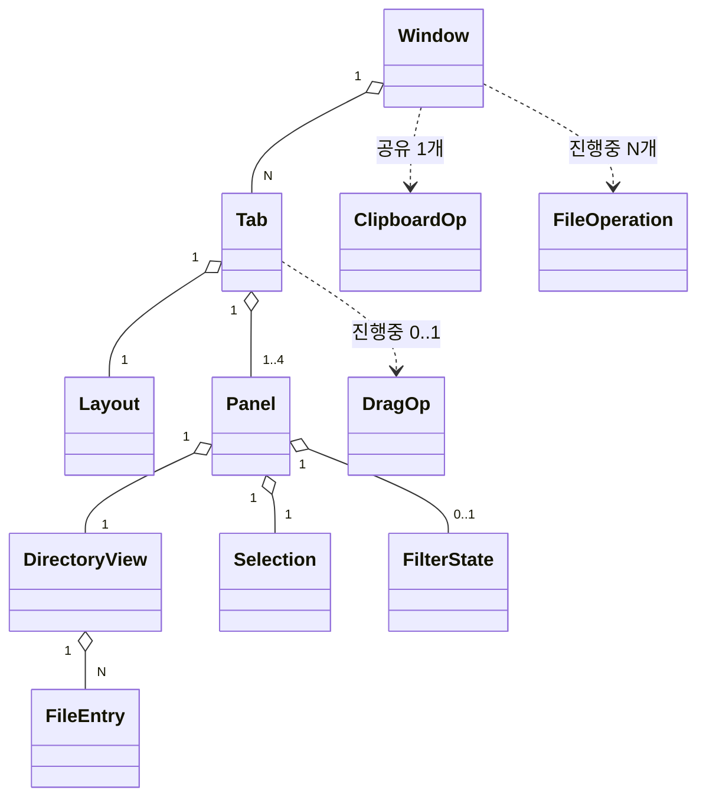
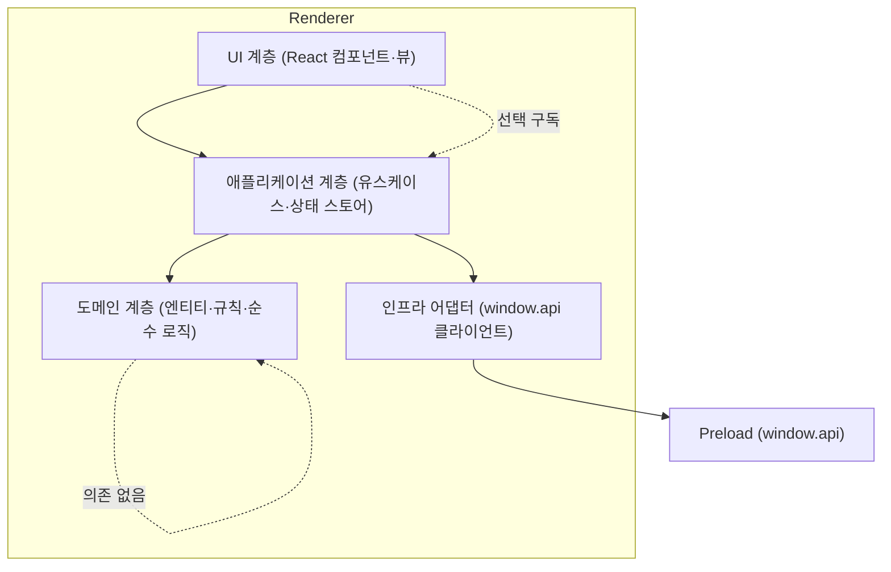
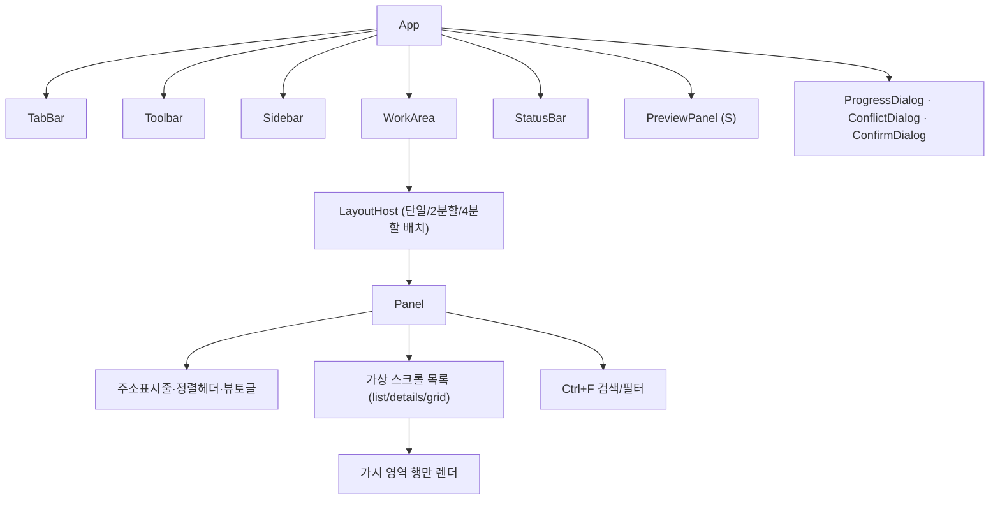
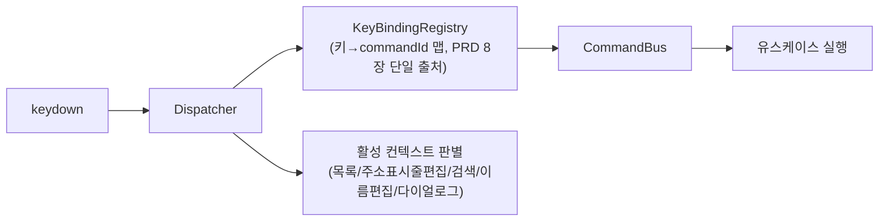

# 소프트웨어 아키텍처 (추상화) — Explorer

> 작성: 시니어 아키텍트 · 2026-06-06 · 상태: 제안 v1
> 입력: [PRD.md](../PRD.md) · [features.md](../features.md) · [user-stories.md](../user-stories.md) · [flows.md](../flows.md)
> 관련: [system-architecture.md](./system-architecture.md) · [directory-structure.md](./directory-structure.md) · [adr/ADR-000-index.md](./adr/ADR-000-index.md)

---

## 1. 개요

이 문서는 **Renderer 내부**의 도메인 모델·계층 경계·의존 방향·상태관리 전략·성능(가상 스크롤)·단축키/드래그&드롭 처리 위치를 정의한다. 프로세스/IPC/FS는 [system-architecture.md](./system-architecture.md) 참조.

설계 목표는 **친숙함 위 강화·동시성 우선·키보드 일급·비차단**(PRD 5장 원칙)을 구조로 보장하고, 변화 가능성이 큰 부분(보기 종류·미리보기·4분할·워크스페이스)을 모듈 경계로 격리하는 것이다.

---

## 2. 도메인 모델

### 2.1 핵심 엔티티 (개념 수준)

```text
Window
 ├─ tabs: Tab[]            # 창 = 탭 N개
 ├─ activeTabId
 └─ closedHistory         # 닫은 탭 복원 스택(Ctrl+Shift+T) — 창 단위·휘발(세션 비직렬화)

Tab
 ├─ id
 ├─ layout: Layout        # 단일/2분할(좌우·상하)/4분할(2x2, S)
 ├─ panels: Panel[]       # 레이아웃에 따라 1·2·4개
 └─ activePanelId         # 활성 패널 (정확히 하나)

Layout = 'single' | 'split-2-h' | 'split-2-v' | 'grid-4'

Panel                     # = 독립 탐색 뷰
 ├─ id
 ├─ path: string          # 현재 경로
 ├─ navHistory: { back: string[]; forward: string[] }   # 패널별 독립
 ├─ view: ViewState       # viewMode(list/details/grid-S) · sort(key,dir) · folderFirst
 ├─ directoryView: DirectoryView   # 현재 경로의 목록 상태(로딩/엔트리/오류)
 ├─ selection: Selection
 ├─ filter: FilterState   # 검색어/패턴(Ctrl+F)
 └─ scrollTop

DirectoryView
 ├─ status: 'idle'|'loading'|'streaming'|'ready'|'error'|'empty'|'denied'
 ├─ entries: FileEntry[]  # 정렬·필터 적용 전 원본
 └─ error?: FileOpError   # 권한/네트워크 등 사유

FileEntry
 ├─ name, path, ext
 ├─ kind: 'file'|'dir'|'drive'|'symlink'|'junction'
 ├─ size, mtime
 ├─ attrs: { hidden, system, readonly, isLink }
 └─ iconRef                # 시스템 아이콘 지연 로드 키

Selection
 ├─ anchorIndex            # Shift 범위 선택 기준점
 ├─ selectedPaths: Set<string>
 └─ (파생) count, totalSize  # 상태바용

ClipboardOp               # OS 클립보드 연동 복사/잘라내기
 └─ mode: 'copy'|'cut'; sources: string[]

DragOp                    # 패널 간 D&D 진행 중 의도
 ├─ sources: string[]; sourcePanelId
 ├─ intent: 'move'|'copy'  # 기본 규칙+수정키로 산출
 └─ dropTarget: { panelId; path }   # 빈영역=현재폴더, 폴더위=그 폴더

FileOperation             # 복사/이동/삭제 진행 상태 (Renderer 측 미러)
 ├─ operationId, kind
 ├─ status: 'pending'|'running'|'conflict'|'cancelling'|'done'|'partial-failed'
 ├─ progress: { processedBytes, totalBytes, processedItems, totalItems, currentName }
 └─ summary?: OpSummary    # 성공/실패 항목·사유
```

### 2.2 관계 (도메인 모델 다이어그램)



> **계층 규칙의 핵심**: `Tab → Layout → Panel → DirectoryView`. 분할은 "탭 안의 레이아웃"이며 각 패널은 완전 독립 상태를 가진다 (features A2, US-1.2). 활성 패널은 탭마다 정확히 하나.

### 2.3 핵심 상태 전이

**Panel 내비게이션**
```
ready --(navigate path)--> loading --(첫 청크)--> streaming --(done)--> ready
loading/streaming --(권한거부)--> denied
loading/streaming --(빈)--> empty
ready --(Alt+←)--> [back 스택 pop] loading...
```

**FileOperation (복사/이동/삭제)**
```
pending --(start)--> running
running --(같은이름 발견)--> conflict --(resolve)--> running
running --(cancel)--> cancelling --> done(부분처리 summary)
running --(완료)--> done | partial-failed(실패목록)
```

---

## 3. 계층 / 모듈 경계

### 3.1 레이어 (Clean Architecture 변형)



**의존 방향 규칙(엄수)**:
- 화살표는 안쪽(도메인)을 향한다. **도메인은 React·IPC·Node를 모른다**(순수 TS).
- UI는 애플리케이션 계층(스토어·유스케이스)에만 의존하고, 인프라/Preload를 직접 부르지 않는다.
- 인프라 어댑터만 `window.api`를 안다. FS 접근을 한 곳으로 모아 모킹·테스트·교체가 쉽다.
- `shared/`(IPC 타입·DTO·상수)는 모든 계층이 import 가능(타입 전용).

### 3.2 모듈별 책임

| 계층 | 모듈 | 책임 |
|---|---|---|
| 도메인 | `domain/` | 엔티티 정의, 순수 규칙: 정렬(자연정렬·폴더우선), 충돌 명명("이름 (n)"·"복사본"), 드래그 의도 판정(같은/다른 드라이브, 수정키), 순환이동 차단 판정, 경로 유틸, 선택 집합 연산. **부수효과 없음** |
| 애플리케이션 | `app/usecases/` | 유스케이스: 탭열기/복제/복원, 분할토글, 패널포커스이동, 폴더진입, 패널간 복사/이동(F5/F6·D&D), 검색/필터, 세션복원. 도메인+인프라 조합 |
| 애플리케이션 | `app/stores/` | 상태 스토어(슬라이스): tabs/panels/layout, selection, navigation, operations, sidebar, ui/settings |
| 인프라 | `infra/api/` | `window.api` 래핑 클라이언트, IPC 이벤트→스토어 액션 브리지(진행률·스트림 청크 수신) |
| UI | `ui/` | React 컴포넌트(아래 4), 단축키 디스패처, D&D 핸들러, 가상 스크롤 |

---

## 4. UI 컴포넌트 구조



| 컴포넌트 | 책임 | 추적 |
|---|---|---|
| TabBar | 탭 추가/닫기/전환/드래그 순서/복제/복원 | US-1.1 |
| Toolbar | 뒤로/앞/위, 주소표시줄, 보기·정렬·분할 컨트롤, 검색 진입 | US-3.1, A2 |
| Sidebar | 트리·즐겨찾기·최근·드라이브·휴지통, 토글/폭 | US-3.2, US-3.3 |
| LayoutHost | 레이아웃에 따른 패널 배치·분할선·최소폭 규칙 | US-1.2, US-1.4 |
| Panel | 독립 탐색 뷰 셸(헤더+목록+검색), 활성 표시 | US-1.2 |
| FileListView | 가상 스크롤 목록, 다중 선택, 인라인 이름편집, D&D 소스/타겟 | US-2.1, US-5.1, US-5.6 |
| PreviewPanel (S) | 이미지/텍스트/메타 미리보기, Ctrl+P 토글 | US-4.3 |
| ProgressDialog | 진행률·취소·결과 요약 | US-5.2 |
| ConflictDialog | 덮어쓰기/건너뛰기/둘다유지/병합/모두적용, 크기·수정일 비교 | US-2.4 |
| StatusBar | 항목수·선택개수·용량·활성경로·진행 인디케이터 | US-5.7 |

---

## 5. 상태 관리 전략

### 5.1 선정: Zustand (+ Immer, 슬라이스 분할)

대안 비교·근거는 [ADR-002 상태관리 라이브러리](./adr/ADR-002-state-management.md). 요지:
- 탭/패널/선택/내비게이션은 **트리형·고빈도·국소 갱신** 상태다. Redux는 보일러플레이트·오버헤드가 크고, Context+useReducer는 대형 트리에서 리렌더 폭발 위험. **Zustand는 셀렉터 기반 구독으로 "바뀐 패널만" 리렌더**할 수 있어 가상 스크롤·다중 패널 성능에 유리.

### 5.2 스토어 슬라이스 설계

| 슬라이스 | 보유 상태 | 갱신 빈도 | Immer 적용(ADR-002) |
|---|---|---|---|
| `tabsSlice` | windows(closedHistory 포함)·tabs·layout·activeTab/activePanel | 중 | 적용(중첩 깊음) |
| `panelsSlice` | panelId별 path·navHistory·view·directoryView | 높음(스트림 청크) | 적용(중첩) |
| `selectionSlice` | panelId별 selection (anchor·selectedPaths) | 매우 높음 | **제외(수동 set, Set 직접 조작)** |
| `operationsSlice` | operationId별 진행/충돌/요약 | 높음(200ms 진행 푸시) | **제외(수동 set, progress 필드만 교체)** |
| `sidebarSlice` | favorites·recent·tree 확장 상태·폭 | 낮음 | 적용 |
| `uiSlice` | theme·previewOpen·dialog 상태·settings | 낮음 | 적용 |

> Immer 적용/제외 기준: "중첩 깊은 갱신=Immer, 평탄·초고빈도 갱신=수동 set"([ADR-002](./adr/ADR-002-state-management.md) 근거). `closedHistory`는 창 단위 휘발 상태로 `tabsSlice`(windows 보유)에 두되 세션 직렬화에서 제외(§5.3, SA 5.1).

**리렌더 격리 원칙**: 컴포넌트는 필요한 슬라이스의 **최소 셀렉터**만 구독한다. 예) `FileListView`는 자기 `panelId`의 entries/selection만 구독 → 다른 패널 스트리밍이나 다른 패널 선택 변경에 리렌더되지 않는다. 진행률 같은 초고빈도 갱신은 ProgressDialog/StatusBar 인디케이터에만 도달.

### 5.3 영속화 연동

`tabsSlice + panelsSlice(view/path/history) + sidebarSlice + uiSlice`의 직렬화 가능한 부분을 `SessionSnapshot`으로 디바운스 저장(시스템 아키텍처 5장). 셀렉션·진행작업은 제외.

---

## 6. 성능 — 가상 스크롤 & 대량 목록

목표: **10,000개 폴더 첫 화면 1.5초**, **검색 입력 200ms 반영** (US-5.6, US-4.1).

### 6.1 가상 스크롤(virtualization)

선정·대안은 [ADR-004 파일목록 가상화](./adr/ADR-004-list-virtualization.md). 핵심:
- **윈도잉**: 가시 영역 + 오버스캔 행만 DOM에 렌더. 1만 행이어도 실제 DOM 노드는 수십 개.
- **details 보기**: 행 높이 고정 → 단순·고성능 고정 크기 윈도잉.
- **grid 보기(S)**: 열 수×행 높이 기반 그리드 윈도잉.
- 스크롤·리사이즈 시 가시 범위만 재계산. 정렬/필터는 파생 메모이즈(아래).

### 6.2 첫 렌더 1.5초 파이프라인

```
fs:list:start → streamId
  → fs:list:chunk (증분) → panelsSlice append
     → 첫 청크 도착 즉시 "첫 화면" 렌더(스피너 해제)  ← 1.5초 목표의 핵심
  → 백그라운드로 나머지 청크 계속 수신, 가상 스크롤이 흡수
  → fs:list:done → total 확정(상태바 항목 수)
```
- IPC DTO는 가벼운 필드만(아이콘은 `iconRef`로 지연). 아이콘은 화면 진입 행만 `shell:icon` 요청+캐시(메모리 상한, PRD 7장 lazy/캐시).

### 6.3 정렬/필터/검색의 200ms 보장

- 정렬·필터는 **도메인 순수 함수 + 메모이즈 셀렉터**로 계산. 입력은 디바운스/트랜지션(예: React `useDeferredValue`/transition)으로 타이핑 블로킹 방지.
- 1차 전략: 메모이즈+증분으로 1만 개 목록 200ms 충족 목표(US-4.1 Must).

**200ms 미충족 시 폴백(결정 가능한 단계적 대응)** — M1 성능 스파이크에서 "1만 개 목록 입력 후 200ms 내 가시 결과" 측정을 명시 항목으로 포함하고, 임계 미달 시 아래를 순서대로 적용한다:
1. **가시영역 우선 필터**: 가상 스크롤 가시 범위(+오버스캔) 항목만 먼저 동기 필터해 즉시 표시하고, 전체 목록 필터는 비동기(transition/`requestIdleCallback`)로 이어 적용 → 체감 200ms 확보. 사용자는 입력 즉시 상단 결과를 본다.
2. **입력 디바운스 조정**: 타이핑 중간 프레임을 건너뛰고 마지막 입력 기준으로만 전체 재계산(디바운스 ~80ms).
3. **경량 Web Worker 오프로드**: 위로도 200ms를 못 지키면 Renderer 측 필터 전용 Web Worker로 전체 매칭을 오프로드하고, 결과를 청크로 수신해 메인 스레드 블로킹을 제거. 도입 시점은 M1 측정 결과로 확정(§10 미해결 1).

> 위 1·2는 추가 인프라 없이 MVP에 포함, 3은 측정 실패 시에만 도입하는 조건부 확장이다.

---

## 7. 단축키 디스패치 아키텍처 (PRD 8장)

### 7.1 구조: 중앙 KeyBindingRegistry + 컨텍스트 스코프



- **단일 출처**: PRD 8장 단축키 표를 `domain/keybindings`에 선언적 맵(키 조합 → `commandId`)으로 1회 정의. UI/설정 "단축키 보기"도 이 맵을 읽어 표시 → 표와 코드 불일치 방지.
- **명령 패턴**: 키는 `commandId`로 변환되고 `CommandBus`가 해당 유스케이스를 호출. 같은 명령을 메뉴/버튼/단축키가 공유.
- **컨텍스트 스코프**: 입력 컨텍스트별로 활성 바인딩이 다르다. 예) 주소표시줄 편집·검색창·인라인 이름편집 중에는 `Tab`/`F2`/문자키가 텍스트 입력으로 가고 패널 명령은 비활성. 다이얼로그 열림 시 전역 단축키 차단.
- **충돌 회피 검증 반영**: `Tab`=패널 포커스, `F5`=복사, `F6`=이동, `Ctrl+R`=새로고침이 고유 매핑(PRD D4). 레지스트리가 같은 컨텍스트 내 중복 매핑을 부팅 시 assert.

### 7.2 대표 매핑 (발췌)

> **포커스 이동 명령 구분**: `panel.focusNext`(Tab)는 패널을 **순환** 전환하고, `panel.focusDir(dir)`(Ctrl+←/→)는 **방향(left/right)** 으로 인접 패널 포커스를 옮긴다. 2분할에서는 두 명령의 결과가 같을 수 있으나, 4분할(grid-4)에서는 순환과 방향 이동이 달라지므로 별개 commandId로 둔다.

| 키 | commandId | 처리 위치 |
|---|---|---|
| `Tab` | `panel.focusNext` | tabsSlice 활성패널 순환 전환 |
| `Ctrl+←/→` | `panel.focusDir(dir)` | tabsSlice 방향 인접 패널 포커스 |
| `F5` / `F6` | `panel.copyToOther` / `panel.moveToOther` | usecase → op:start |
| `Ctrl+R` | `panel.refresh` | 현재 패널 재스캔 |
| `Ctrl+T`/`Ctrl+W`/`Ctrl+Shift+T`/`Ctrl+D` | `tab.*` | tabsSlice |
| `Ctrl+\` | `layout.toggleSplit2` | tabsSlice layout |
| `Alt+←/→/↑`,`Backspace` | `nav.*` | panelsSlice navHistory |
| `Ctrl+F`,`Ctrl+L` | `search.open`/`address.edit` | 컨텍스트 진입 |
| `Delete`/`Shift+Delete` | `file.trash`/`file.deletePermanent` | usecase → op:trash/op:delete |
| `Ctrl+C/X/V`,`F2`,`Ctrl+A`,`Ctrl+P` | `file.*`/`select.all`/`preview.toggle` | 각 슬라이스 |

---

## 8. 드래그&드롭 / 패널 간 이동·복사 의도 규칙 (features A3, US-1.3)

### 8.1 처리 위치 분담

| 단계 | 위치 | 내용 |
|---|---|---|
| 드래그 시작 | UI(FileListView) → DragOp 생성 | sources·sourcePanelId 기록 |
| **의도 판정** | **도메인 순수 함수** `resolveDragIntent(src, dst, modifiers)` | 같은 드라이브=이동/다른 드라이브=복사 기본, `Ctrl`=복사강제/`Shift`=이동강제 |
| 드롭 타겟 해석 | UI + 도메인 | 빈 영역=현재 폴더, 폴더 항목 위=그 폴더 안 |
| 시각 피드백 | UI | 드롭 가능 하이라이트, 복사/이동 커서·툴팁(항상 의도 명시) |
| **선검증** | usecase + Main | 동일 폴더 드롭=무시, 조상→자손 이동=차단·안내 |
| 실행 | usecase → `op:start` | 충돌은 ConflictDialog로 |

- **의도 판정을 도메인 순수 함수로 격리**한 이유: 키보드(F5/F6)·드래그·붙여넣기가 동일 규칙을 공유하고 단위 테스트가 쉽기 때문. UI는 표현만, 규칙은 도메인.
- F5/F6(키보드)도 같은 `op:start` 경로를 타되 의도가 고정(복사/이동)된 형태로 진입 → 마우스/키보드 동작 일관.

---

## 9. 변화 격리 (확장 대비)

| 바뀔 가능성 큰 부분 | 격리 경계 |
|---|---|
| 보기 종류(grid/썸네일 S) | `ui/panel/views/*` 플러그형, ViewState만 추가 |
| 미리보기 렌더러(이미지/텍스트/메타, S) | `ui/preview/renderers/*` 형식별 등록 |
| 4분할·자유 비율(S/C) | LayoutHost가 Layout 타입만 확장 |
| 워크스페이스 저장(S) | 세션 스냅샷 구조 재사용, `workspace:*` 채널만 추가 |
| 단축키 사용자 정의(C) | KeyBindingRegistry를 설정 주입형으로 |
| 다중 OS(C) | FS/휴지통/아이콘을 Main 어댑터 인터페이스 뒤로 |

---

## 11. §M 외부 연계 — 원격 FS 추상화 · 클립보드/드래그 모듈 경계 (2026-06-08 추가)

> 비파괴 추가. 보안·프로세스 결정은 [ADR-007](./adr/ADR-007-remote-protocol-and-network-boundary.md). 채널·데이터 흐름은 [system-architecture §5-M](./system-architecture.md). 상태: **🔜 미착수(설계 단계)**.

### 11.1 원격 파일시스템 — 로컬 FS와의 통합/분리 전략

**결정: 별도 경로 네임스페이스(`sftp://`·`ftp://`·`ftps://`) + 공통 도메인 인터페이스(추상화는 공유, 구현은 분리).**

| 옵션 | 장점 | 단점 | 판정 |
|---|---|---|---|
| **별도 네임스페이스 + 공통 인터페이스(채택)** | 패널은 경로 prefix로 로컬/원격을 구분(UI/탐색 코드 재사용·멀티 디렉토리 차별점 원격 확장)·세션·자격증명·전송 의미차를 어댑터 뒤로 격리 | 라우팅 계층 1개 필요 | **채택** |
| 로컬 FS와 완전 동일 인터페이스(투명 통합) | 호출부 무분기 | 세션·인증·연결끊김·진행률·취소 의미가 로컬과 달라 누수 발생·오류 격리 모델 충돌 | 비채택 |
| 완전 분리(원격 전용 UI) | 단순 | 멀티 디렉토리 차별점(로컬↔원격 나란히)을 못 살림·UI 중복 | 비채택 |

- **도메인 추가**: `Panel`에 `location: LocalLocation | RemoteLocation`을 둔다. `RemoteLocation = { kind:'remote'; sessionId; protocol; host; user; path }`. 기존 로컬 패널은 `{ kind:'local'; path }`. 기존 `Panel.path`는 로컬 호환 유지(원격은 표기용 `프로토콜://사용자@호스트/경로` 파생).
- **라우팅**: `usecases/navigation`이 `location.kind`로 분기 — 로컬은 `fs:list:*`, 원격은 `remote:list`. 정렬/필터/선택/가상 스크롤은 **동일 `DirectoryView`·`FileEntry` 모델 재사용**(원격 entries도 `FileEntryDTO`로 정규화). → UI(`FileListView`·`PanelHeader`·`SearchBar`)는 로컬/원격을 거의 구분하지 않는다.
- **전송 라우팅**: 패널 간 D&D/붙여넣기 시 출발·도착 `location.kind` 조합으로 분기 — 로컬↔로컬=`op:start`, 로컬→원격=`remote:upload`, 원격→로컬=`remote:download`, 원격↔원격=1차 범위 밖(후속). 이 분기는 `domain/rules/transferRoute.ts`(순수 함수)로 격리해 D&D·클립보드·키보드가 동일 규칙 공유.
- **오류 격리**: 원격 `DirectoryView.status`에 `'disconnected'|'timeout'` 상태 추가. 한 원격 패널 오류가 다른 패널·로컬을 막지 않음(F장·US-12.5).

### 11.2 계층 배치 (비파괴 — 기존 레이어에 모듈 추가)

| 계층 | 신규 모듈 | 책임 |
|---|---|---|
| 도메인 | `domain/rules/transferRoute.ts` | 출발·도착 location 조합 → 전송 종류(copy/move/upload/download) 판정(순수) |
| 도메인 | `domain/entities`(확장) | `RemoteLocation`·`RemoteProfile`(비밀 제외)·`RemoteError` 타입 |
| 애플리케이션 | `app/usecases/remote.ts` | 연결/해제·프로필 CRUD·원격 탐색·업/다운로드 트리거(infra 경유) |
| 애플리케이션 | `app/usecases/clipboardExternal.ts` | CF_HDROP 쓰기/읽기·붙여넣기 라우팅(내부/외부 우선순위 규칙·ADR-007 ⑦) |
| 애플리케이션 | `app/usecases/externalDrag.ts` | 외부 드래그 감지·`dnd:start-drag` 위임(내부 A3와 분기) |
| 애플리케이션 | `app/stores/remoteSlice.ts` | 세션·프로필 목록·연결 상태·호스트키 경고 UI 상태 |
| 인프라 | `infra/api`(확장) | `remoteApi`·`clipboardApi`·`dndApi` 래퍼(window.api) |
| UI | `ui/remote/` | 연결 다이얼로그·사이드바 "원격" 섹션·원격 패널 배지·호스트키/비암호화 경고 |
| UI | `ui/dnd`(확장) | 외부 드래그 시작 핸들러(도착지 외부 판정 → externalDrag) |

> **계층 규칙 불변**: 네트워크·소켓은 렌더러에 절대 없다. `usecases/remote.ts`는 `remote:*` IPC만 호출(infra 경유). 도메인은 여전히 순수(`transferRoute`는 IO 모름).

### 11.3 변화 격리(§9 표 확장)

| 바뀔 가능성 큰 부분 | 격리 경계 |
|---|---|
| 원격 프로토콜 추가(WebDAV/S3 등 C) | Main `RemoteService` 어댑터 + `RemoteLocation.protocol` 확장. 상위 무변경 |
| CF_HDROP 외 클립보드 포맷 | `os/shellClipboard.ts` 어댑터 한 곳 |
| 자격증명 백엔드 교체(safeStorage→keyring) | `os/credentials.ts` 인터페이스 뒤 |

---

## 12. §N 즐겨찾기 UX — 워터마크 판정 규칙 · 즐겨찾기 정렬 모듈 경계 (2026-06-08 추가)

> 비파괴 추가. 채널·데이터 흐름은 [system-architecture §5-N](./system-architecture.md). 상태: **🔜 미착수(설계 단계)**. **신규 IPC 채널 0 · 신규 의존성 0 · 신규 ADR 0**. 모두 **Renderer 내부**(도메인 순수 규칙·`sidebarSlice`·UI)에서 완결되며 계층 규칙(§3.1 의존 방향) 불변.

### 12.1 N1 — 워터마크 판정·텍스트 소스 (도메인 순수 규칙)

**결정: 일치 판정과 표시 텍스트 결정을 `domain/rules/favoriteWatermark.ts` 순수 함수로 격리.** UI(Panel)는 그 결과를 배경 레이어로 그릴 뿐.

```text
// domain/rules/favoriteWatermark.ts (설계 시그니처 — 순수·부수효과 없음)
resolveFavoriteWatermark(
  panelPath: string,
  favorites: readonly string[],
  favoriteLabels: Readonly<Record<string, string>>
): { match: true; text: string } | { match: false }
  # panelPath·favorites 항목을 normalizeDisplay(domain/paths)로 정규화해 정확 일치(===)만 매치.
  # "내 PC"('')·원격 경로(locationKindOf!=='local')는 비매치. 부분/하위경로 비매치(1차).
  # 다중 일치 시: favorites 배열의 첫 일치 인덱스 1개만 반환·나머지 무시(겹쳐 깔지 않음·결정론).
  # 매치 시 text = favoriteLabels[firstMatch] ?? baseName(firstMatch) (J7과 동일 폴백·빈 별칭은 basename).
```

- **격리 이유**: 판정·텍스트 규칙을 도메인에 두면 ① React/IPC 무관 단위 테스트 용이, ② Sidebar `FavoriteRow.display`(별칭/basename 폴백)와 **동일 규칙 1곳 공유**(드리프트 방지), ③ 향후 부분 일치·토글 정책 변경 시 한 곳만 수정. 도메인은 기존 `domain/paths`(normalizeDisplay·baseName·isMyPc)·`domain/rules/remoteLocation`(locationKindOf)만 의존(순수 유지).
- **UI 배치**: `ui/panel/`에 배경 워터마크 레이어 추가(`Panel.tsx`가 `FileListView` 뒤에 `position:absolute` 형제 레이어를 두거나 별도 `FavoriteWatermark.tsx`). **마운트 전제**: `Panel.tsx` 외곽 div는 현재 `display:flex; flexDirection:column`만 있고 `position`이 없으므로, absolute 워터마크 기준을 잡기 위해 **Panel(또는 본문 영역) 컨테이너에 `position:relative` 추가** 필요(워터마크 `inset:0`, `FileListView` 더 높은 z-index). `pointer-events:none`·`aria-hidden`로 상호작용·접근성 영향 0.
- **셀렉터 구독 격리**: 워터마크는 자기 패널 `path` + `favorites`/`favoriteLabels`만 최소 구독(SW §5.2 리렌더 격리). `favorites` 변경이 전 패널 워터마크를 리렌더할 수 있으나 `sidebarSlice` 갱신은 저빈도(SW §5.2)라 실질 비용 무시 가능 — 텍스트 계산은 `resolveFavoriteWatermark` 결과를 파생 메모이즈.
- **상태 추가 없음**: N1은 파생 표시이므로 신규 슬라이스 필드 불요(기존 `panels[id].path`·`favorites`·`favoriteLabels`로 계산). 토글 후속 시에만 `uiSlice` 1필드.

### 12.2 N2 — 즐겨찾기 순서 데이터 · 재배열 액션 · 드래그 모듈

**결정: 순서는 기존 `favorites: string[]` 배열 순서 재사용**(별도 order 배열·인덱스 필드 0). 재배열은 `sidebarSlice` 액션, 드래그는 사이드바 전용 경량 모듈.

| 계층 | 모듈 | 책임 |
|---|---|---|
| 애플리케이션 | `app/stores/sidebarSlice.ts`(확장) | `reorderFavorite(from, to)` — `favorites` 배열 재배열(Immer 슬라이스). 기존 add/remove/label 액션 불변 |
| 애플리케이션 | `app/usecases/session.ts`(불변) | 변경 없음 — `[...s.favorites]` 직렬화가 순서를 그대로 영속(기존 코드). `coerceSidebar`(main defaults)도 순서 보존(불변) |
| UI | `ui/sidebar/useFavoriteReorder.ts`(신규) | 사이드바 즐겨찾기 전용 경량 드래그 훅 + 외부 pub/sub 상태(파일 `dragState`와 별개). 삽입 위치 계산·섹션 경계 가드 |
| UI | `ui/sidebar/Sidebar.tsx`(확장) | 즐겨찾기 리스트에 드래그 핸들/드롭 인디케이터·`Alt+Shift+↑/↓` 키 핸들러(로컬 `onKeyDown`)·항목 `tabindex` 포커스·정렬 ARIA(`posinset/setsize`·`aria-grabbed`). 타 섹션(트리/최근/원격/휴지통) 무영향 |

- **드래그 방식 결정 근거(경량 전용 vs `useDrag` 재사용)**: 기존 `ui/dnd/useDrag.ts`+`dragState.ts`는 **파일 경로 묶음 → 드롭 폴더 → `resolveDragIntent`(복사/이동)·`performDrop`(op:start)** 전용 모델이다(SW §8). 사이드바 즐겨찾기 재정렬은 "동일 리스트 내 인덱스 이동"으로 드롭 대상이 폴더도, 전송도 아니다 — 의미가 달라 재사용 시 분기·누수가 커진다. 따라서 **사이드바 전용 경량 구현**을 택한다(파일 D&D 패턴은 *형태만* 모방: 외부 pub/sub + `useSyncExternalStore`).
- **순서 데이터 결정 근거(배열 재사용 vs 별도 필드)**: `favorites`가 이미 배열이고 렌더·직렬화·복원이 전부 순서 보존이므로 **배열 재배열로 표시·영속·복원 자동 충족**. 별도 order 필드는 `favorites`/`favoriteLabels`와의 정합 부담만 추가(과설계). 스키마 버전 미상향(구조 불변·하위호환).
- **키보드 대체수단·충돌 0 근거(코드 정합)**: 키는 **`Alt+Shift+↑/↓`**(전역 `KeyBindingRegistry` 미배정 조합). `KeyboardDispatcher`가 `window` capture에서 이 조합을 어떤 commandId로도 매핑하지 못해 가로채지 않으므로, 버블 단계 Sidebar 로컬 `onKeyDown`이 정상 동작한다. **컨텍스트 분리가 아니라 키 조합 자체가 미사용이라 충돌 0** — `KeyContext`에 `'sidebar'` 추가·`setInputContext` 전환 불요. (1차안 `Alt+↑/↓`는 `domain/keybindings`의 `alt+arrowup→nav.up`(context `'list'`)이 capture에서 가로채 폐기 — review-N [높음-1].)
- **섹션 격리**: 드롭/키 이동 모두 즐겨찾기 컨테이너 인덱스 범위 안에서만 계산. 타 섹션으로 끌면 무효(원위치). **0~1개 경계**: `Sidebar.tsx`는 `favorites.length>0`일 때만 섹션 렌더 → 0개=섹션 미렌더(자연 무동작), 1개=드래그 시작 허용하되 유효 드롭 위치 없음→원위치(키 이동도 무효).

### 12.3 변화 격리(§9·§11.3 표 확장)

| 바뀔 가능성 큰 부분 | 격리 경계 |
|---|---|
| 워터마크 일치 정책(정확→부분/하위 일치 C) | `domain/rules/favoriteWatermark.ts` 한 함수 |
| 워터마크 표시 토글(설정 C) | `uiSlice` 1필드 + `Panel` 조건 렌더 |
| 즐겨찾기 정렬 UX(드래그 핸들·인디케이터 변경) | `ui/sidebar/useFavoriteReorder.ts` + `Sidebar` |
| 즐겨찾기 순서 의미 확장(그룹/폴더 C) | `sidebarSlice` + `SidebarSnapshot`(그때 스키마 +1) |

---

## 13. §P~§U 파워 기능 — 무거운 백그라운드 모듈 경계 (archive·hash·grep·전송 큐) (2026-06-09 추가)

> 비파괴 추가. 채널·흐름은 [system-architecture §5-PU](./system-architecture.md). ADR: [008](./adr/ADR-008-archive-namespace-adapter.md)/[009](./adr/ADR-009-hash-and-compare-engine.md)/[010](./adr/ADR-010-content-search-grep-engine.md)/[011](./adr/ADR-011-transfer-queue.md). 상태: **🔜 미착수(설계 단계)**. 계층 규칙(§3.1 의존 방향)·네트워크 0(로컬만)·throw0/Result 불변.

### 13.1 압축 `archive://` 어댑터 (Q1)

§11.1 원격 패턴(별도 네임스페이스 + 공통 인터페이스)을 차용. `Panel.location`에 `ArchiveLocation = { kind:'archive'; sessionId; archivePath; innerPath }` 추가, `usecases/navigation`이 `location.kind`로 분기(`archive:list`), `transferRoute.ts`에 archive→local(추출)·local→archive(추가) 조합 추가.

| 계층 | 신규 모듈 | 책임 |
|---|---|---|
| 도메인 | `domain/entities`(확장) | `ArchiveLocation` 타입 |
| 도메인 | `domain/rules/archiveSafePath.ts` | **Zip Slip** 경계 검증(순수·destDir 하위 판정·`../`/절대/드라이브/UNC/심볼릭 거부) |
| 도메인 | `domain/rules/transferRoute.ts`(확장) | archive↔local 전송 종류 판정 추가 |
| 애플리케이션 | `app/usecases/archive.ts` | open/list/close·추출·추가 트리거(infra 경유) |
| 애플리케이션 | `app/stores/`(확장) | 압축 세션 상태(remoteSlice 형태 또는 panelsSlice location) |
| 인프라 | `infra/api`(확장) | `archiveApi` 래퍼 |
| UI | `ui/`(확장) | 압축 패널 배지·"폴더처럼 열기"/"추출" 액션(로컬 패널 UX 재사용) |
| Main | `src/main/archive/*` | `ArchiveService`·`ZipReader`(yauzl)·`ZipWriter`(yazl)·`ArchiveSessionManager` + 추출/추가 워커 |

### 13.2 공용 해시·비교 엔진 (P1 해시 옵션·R2·R4)

세 기능이 단일 엔진 공유(ADR-009). 비교 4상태 분류 규칙은 도메인 순수, 실제 해시·스캔은 Main 워커.

| 계층 | 신규 모듈 | 책임 |
|---|---|---|
| 도메인 | `domain/rules/compare.ts` | 4상태(좌만/우만/다름/같음) 분류·짝지음 순수 규칙(렌더러 표시·Main 엔진과 타입 공유) |
| 애플리케이션 | `app/usecases/compare.ts`·`dedup.ts`·`checksum.ts` | 비교/중복/검증 잡 트리거·결과 수신 브리지 |
| 애플리케이션 | `app/stores/`(신규 `compareSlice`·`dedupSlice`) | diff 상태·동기 스크롤·중복 그룹·검증 결과 |
| UI | `ui/compare/`·`ui/dedup/` | diff 뷰(동기 스크롤·"차이만 보기")·미러 미리보기·중복 그룹 패널 |
| Main | `src/main/hash/*` | `hashEngine`(스트리밍·algo)·`compareEngine`·`dupEngine`·`HashManager`(jobId·취소·200ms) + 워커 |

- **P1 동기 스크롤**: 짝지어진 좌/우 목록을 같은 가상 스크롤 인덱스로 동기화(짝 없는 항목은 플레이스홀더). FileListView 가상 스크롤(§6) 위에 "동기 스크롤 컨트롤러"를 얹는다(렌더러).
- **P1 미러(파괴적)**: 변경 미리보기(복사 N·덮어쓰기 M·삭제 K) → 사용자 확정 → 기존 `op:*`(삭제는 휴지통 경유·D4 충돌)·K1 되돌리기 누적. 메타 비교(M6)는 해시 없이 동작, 해시 옵션(M7)은 hash 엔진 연결.

### 13.3 내용 검색(grep) 엔진 (S1)

| 계층 | 신규 모듈 | 책임 |
|---|---|---|
| 애플리케이션 | `app/usecases/contentSearch.ts` | grep 잡 트리거·증분 결과 수신·점프 |
| 애플리케이션 | `app/stores/`(신규 `searchSlice` 또는 panelsSlice 확장) | 결과 목록(가상 스크롤)·진행·취소 |
| UI | `ui/search/`(확장) | "내용 검색" 모드·결과 목록(라인·하이라이트)·미리보기 점프(D3/J5 재사용) |
| Main | `src/main/search/*` | `grepEngine`(스트리밍 라인 스캔)·`binaryDetect`·`GrepManager` + 워커 |

### 13.4 전송 큐 (R3)

| 계층 | 신규 모듈 | 책임 |
|---|---|---|
| 애플리케이션 | `app/stores/operationsSlice`(확장) | 큐 항목(`QueueItemDTO`)·상태(대기/진행/일시정지/완료/실패)·동시성 |
| 애플리케이션 | `app/usecases/queue.ts` | pause/resume/retry/concurrency·큐 스냅샷 구독 |
| UI | `ui/queue/` | 전송 큐 패널(작업 목록·진행률·속도·ETA·제어 버튼)·StatusBar 인디케이터 연동 |
| Main | `OperationManager`(확장) | 내부 `TransferQueue` 스케줄러·일시정지 플래그(SharedArrayBuffer/stream)·재시도. op:* 채널·의미 불변 |

---

## 14. §P~§U 경량·독립 기능 — 모듈 설계 (ADR 불요) (2026-06-09 추가)

> ADR이 과한 경량 기능(R1·S2·T1·T2·T3·U1·U2·U3)을 모듈 설계로 정의한다. 대부분 **렌더러 전용·신규 채널 0**(§5-PU.0). 메타/필터 결정은 [ADR-012](./adr/ADR-012-metadata-persistence-and-filter-composition.md). 상태: **🔜 미착수**.

### 14.1 R1 고급 일괄 이름변경 (신규 채널 0)
- `domain/rules/batchRename.ts`(순수): 규칙(찾기/바꾸기·정규식·접두/접미·연번·대소문자·확장자) → 현재명→변경후명 매핑 계산 + **충돌 검사**(변경 후 서로 충돌·기존 파일 충돌)·금지문자/예약명/빈 이름(B3 규칙 재사용). 실시간 미리보기는 이 순수 함수 결과.
- `ui/rename/BatchRenameDialog.tsx`: 규칙 입력·미리보기 표·충돌 경고. 실행 = 기존 `fs:rename` 반복(또는 안전 2단계 rename으로 순환 충돌 회피) → **K1 undo 스택에 한 묶음으로 push**(features §R1).
- 미디어 메타 명명·이름변경 프리셋은 1차 제외.

### 14.2 S2 명령 팔레트 (신규 채널 0·Ctrl+Shift+P)
- `ui/palette/CommandPalette.tsx`(오버레이): 입력 → **명령(commandBus의 commandId 전체·단축키 표기)·즐겨찾기·최근·드라이브** 통합 검색(부분 일치·점수·최근 가중). 명령 실행 = 기존 `commandBus.execCommand`(키보드/아이콘바와 동일 수렴)·위치 항목 = 그 경로 navigate. 컨텍스트 불가 명령은 흐림/제외(activeWhen 재사용).
- `domain/keybindings`에 `Ctrl+Shift+P`→`palette.open` 등록(PRD §8 신규·미배정 조합·충돌 0). 매칭 점수는 `domain/rules/paletteMatch.ts`(순수).

### 14.3 T1 태그/색상 라벨 · ~~T3 정렬/필터 프리셋 · 복수 필터 합성~~(T3·합성 폐기) (신규 채널 0)
> **폐기 주석(2026-06-09 사용자 결정):** **T3 정렬/필터 프리셋 및 복수 필터 합성(`filterComposition.ts`) 부분은 폐기·코드 전면 제거**됐다(`presetsSlice`·`usecases/presets`·`ui/preset/*`·`FilterPreset` DTO·`SessionSnapshot.filterPresets` 삭제·`computeVisible`→기존 `filterEntries` 환원·`SESSION_SCHEMA_VERSION` 2→1 환원). **T1 태그 메타 영속(`tagsByPath`·`tags.ts`·`ui/tags/`)는 M8용으로 유효**하나, T1 태그 필터 합성은 `filterComposition.ts` 폐기로 구현 시 재설계 필요. 아래 T3·합성 관련 설계는 이력으로만 보존.
- 메타 영속: `SessionSnapshot.tagsByPath`(T1·유효)·~~`filterPresets`(T3·폐기)~~ 확장(J7 `favoriteLabels`·O1 `pinnedByDir` 패턴·`coerce*` 재사용·신규 채널 0·스키마 version +1). ADR-012 결정①(태그 부분 유효).
- ~~**복수 필터 합성(ADR-012 결정②)**: `domain/rules/filterComposition.ts`(순수) — **차원 간 AND·차원 내 OR**(이름 query·확장자 패턴·태그 색·"차이만 보기" diffOnly). `selectors.ts#computeVisible`가 이 함수로 가시 목록 파생(메모이즈). D1/D2/T1/P1/T3가 동일 규칙 공유.~~ **(폐기·`filterComposition.ts` 삭제됨)**
- `domain/rules/tags.ts`(팔레트·키 정규화·T1 유효)·~~`app/stores/presetsSlice`(폐기)~~·`ui/tags/`(부여·표시·필터·T1)·~~`ui/preset/`(저장/적용/관리·폐기)~~.
- 데이터 비파괴(파일/ADS 미변경)·고아 키 lazy GC(ADR-012 결정③).

### 14.4 T2 폴더 용량 인라인 (신규 채널 0·scanEngine 재사용)
- 자세히 보기 폴더 행의 온디맨드 재귀 크기 계산. 기존 `scanEngine.ts`(순환차단·권한 skip·취소·진행률) 재사용 — 단일 폴더 합계만(`analyze:scan:*` 재사용 또는 단일 폴더 경량 호출). 폴더 이동/정렬 변경 시 진행 잡 취소·정리. 기본 off·결과 영속 캐시 1차 제외.
- `app/usecases/folderSize.ts`·`ui/panel/views/FileListView`(details 폴더 행 크기 칸 인라인 상태).

### 14.5 U1 Space 퀵룩 (신규 채널 0·preview 재사용)
- `ui/quicklook/QuickLookOverlay.tsx`: `Space`로 중앙 큰 미리보기 오버레이(이미지/텍스트/코드/마크다운/메타) — **D3/J5 렌더러 재사용**(`preview:read`·CSP·DOMPurify·렌더러 직접 파일 접근 없음). 연 채 ↑/↓ 이전/다음 항목 전환·`Space`/`Esc` 닫기. `domain/keybindings`에 `Space`→`quicklook.toggle`(목록 컨텍스트·텍스트 입력 중 비활성).

### 14.6 U2 브레드크럼 드롭다운 (신규 채널 0·fs:tree-children 재사용)
- `ui/toolbar/Breadcrumb`(확장): 각 세그먼트 ▾ 클릭 → 그 구간 **형제 폴더 목록** 드롭다운(기존 `fs:tree-children` 온디맨드 호출·폴더만). 선택 시 navigate·키보드 내비(↑/↓·Enter·Esc)·많으면 스크롤/필터. 권한 없음/지연 안내.

### 14.7 U3 탭 색상/잠금 · 탭 분리(새 창) (Could·복잡도 명시)
- **탭 색상·잠금(경량)**: `Tab`에 `color?`·`locked?` 추가·세션 영속(tabsSlice·SessionSnapshot). 잠금 시 `tab.close`/가운데클릭/X 차단(commandBus 가드). 우클릭 메뉴 토글.
- **탭 분리=새 창(복잡도 큼)**: 신규 `BrowserWindow` 생성·해당 탭을 새 창으로 이전·원 창에서 제거. **멀티 윈도우 영향(정직 명시)**:
  - **세션 복원**: 현재 `SessionSnapshot.windows[]`는 다중 창 구조를 이미 가지나(SA §5.1) 실제로는 단일 창 중심이었다 → 다중 창 복원·창별 활성 탭·창 위치/크기 영속이 필요(US-5.5 연계 범위 확장).
  - **IPC 라우팅**: 진행률·이벤트 푸시가 `webContents`(창)별로 분기돼야 함(현재 단일 창 가정 코드 점검 필요). OperationManager·watch·scan 푸시의 대상 창 라우팅.
  - **상태 격리**: 창 간 상태 격리(각 창 독립 store)·창 간 탭 드래그 이동은 1차 제외(features §U3).
  - 복잡도 때문에 **Could·M9 마지막**. 창 간 IPC guard(sender 검증)는 각 창에 동일 적용.

---

## 10. 미해결 질문

0. **§P~§U 미해결**: 각 ADR-008~012 "미해결 질문(설계 deferral)" 절을 단일 출처로 둔다(압축 라이브러리 최종 픽스 UQ-Q1·zip 외 포맷 UQ-Q2·해시 고속화 UQ-H1·grep 인코딩 UQ-S1·큐 resume UQ-R2·태그 저장소 분리 UQ-T2 등). 전부 1차 범위 밖·구현 착수 비차단. **탭 분리(U3) 멀티 윈도우 범위**(세션 다중 창 복원·IPC 창 라우팅 수준)는 사용자/PM 결정 필요(§14.7·아래 보고).
1. **Renderer 필터 Web Worker 오프로드 도입 시점**: MVP 메모이즈+가시영역 우선 필터(§6.3 폴백 1·2)로 200ms 충족되는지 **M1 성능 스파이크("1만 개 목록 입력 후 200ms 내 가시 결과" 측정)** 후 결정. 미달 시에만 §6.3 폴백 3(Web Worker) 도입.
2. **인라인 이름편집·주소표시줄 컨텍스트 스코프 세분화 수준**: 접근성(포커스 트랩) 요구와 함께 디자인 단계 확정.
3. flows 5장의 시각/배치 질문(분할 컨트롤 위치·미리보기 부착 방향)은 UI 디자인 단계 사안으로 본 설계는 LayoutHost/PreviewPanel을 양쪽 배치 가능하게만 열어둠.
