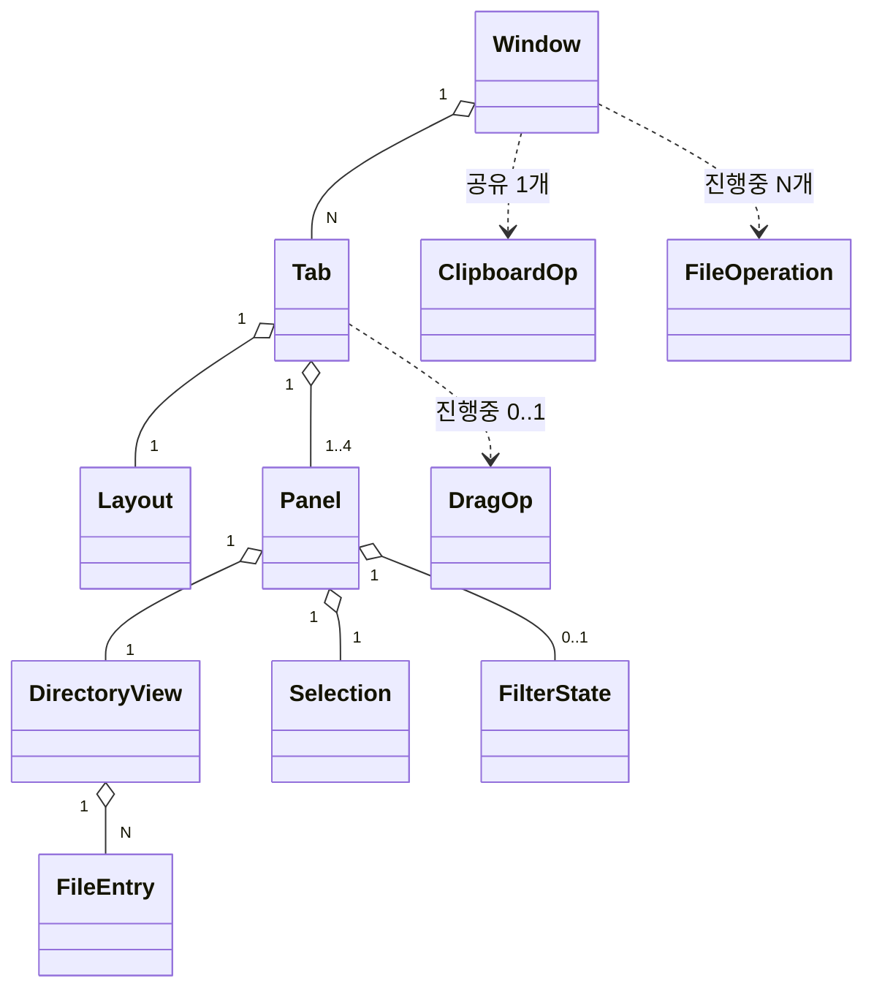
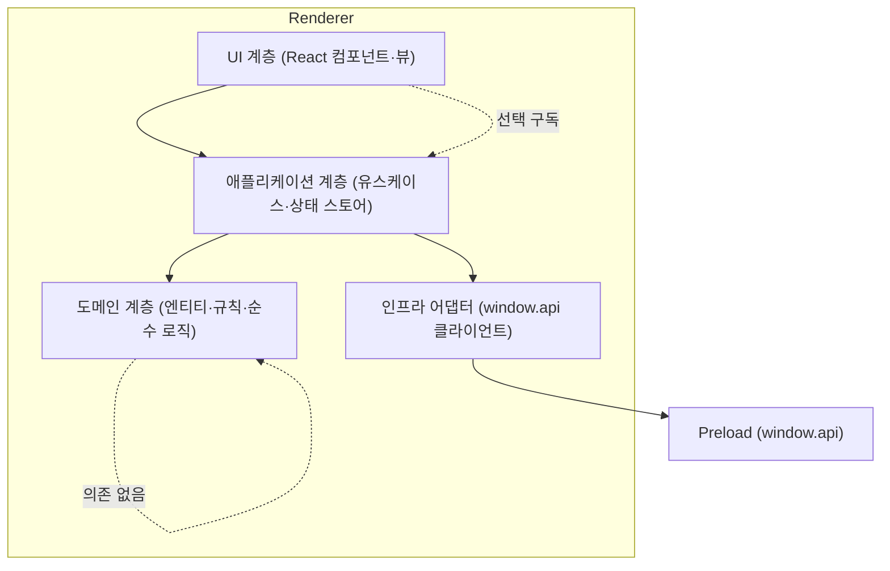
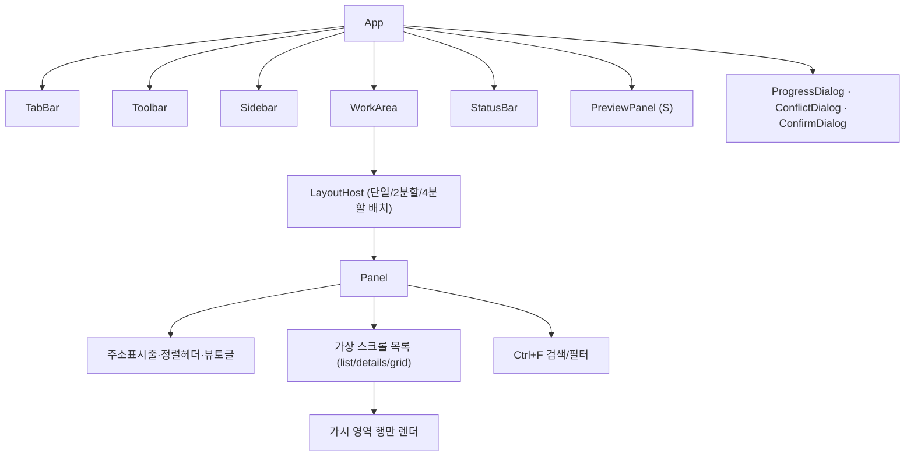
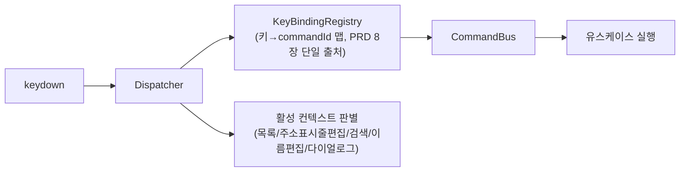

# 소프트웨어 아키텍처 (추상화) — Explorer

> 작성: 시니어 아키텍트 · 2026-06-06 · 상태: 제안 v1
> 입력: [PRD.md](../PRD.md) · [features.md](../features.md) · [user-stories.md](../user-stories.md) · [flows.md](../flows.md)
> 관련: [system-architecture.md](./system-architecture.md) · [directory-structure.md](./directory-structure.md) · [adr/ADR-000-index.md](./adr/ADR-000-index.md)

---

## 1. 개요

이 문서는 **Renderer 내부**의 도메인 모델·계층 경계·의존 방향·상태관리 전략·성능(가상 스크롤)·단축키/드래그&드롭 처리 위치를 정의한다. 프로세스/IPC/FS는 [system-architecture.md](./system-architecture.md) 참조.

설계 목표는 **친숙함 위 강화·동시성 우선·키보드 일급·비차단**(PRD 5장 원칙)을 구조로 보장하고, 변화 가능성이 큰 부분(보기 종류·미리보기·4분할·워크스페이스)을 모듈 경계로 격리하는 것이다.

---

## 2. 도메인 모델

### 2.1 핵심 엔티티 (개념 수준)

```text
Window
 ├─ tabs: Tab[]            # 창 = 탭 N개
 ├─ activeTabId
 └─ closedHistory         # 닫은 탭 복원 스택(Ctrl+Shift+T) — 창 단위·휘발(세션 비직렬화)

Tab
 ├─ id
 ├─ layout: Layout        # 단일/2분할(좌우·상하)/4분할(2x2, S)
 ├─ panels: Panel[]       # 레이아웃에 따라 1·2·4개
 └─ activePanelId         # 활성 패널 (정확히 하나)

Layout = 'single' | 'split-2-h' | 'split-2-v' | 'grid-4'

Panel                     # = 독립 탐색 뷰
 ├─ id
 ├─ path: string          # 현재 경로
 ├─ navHistory: { back: string[]; forward: string[] }   # 패널별 독립
 ├─ view: ViewState       # viewMode(list/details/grid-S) · sort(key,dir) · folderFirst
 ├─ directoryView: DirectoryView   # 현재 경로의 목록 상태(로딩/엔트리/오류)
 ├─ selection: Selection
 ├─ filter: FilterState   # 검색어/패턴(Ctrl+F)
 └─ scrollTop

DirectoryView
 ├─ status: 'idle'|'loading'|'streaming'|'ready'|'error'|'empty'|'denied'
 ├─ entries: FileEntry[]  # 정렬·필터 적용 전 원본
 └─ error?: FileOpError   # 권한/네트워크 등 사유

FileEntry
 ├─ name, path, ext
 ├─ kind: 'file'|'dir'|'drive'|'symlink'|'junction'
 ├─ size, mtime
 ├─ attrs: { hidden, system, readonly, isLink }
 └─ iconRef                # 시스템 아이콘 지연 로드 키

Selection
 ├─ anchorIndex            # Shift 범위 선택 기준점
 ├─ selectedPaths: Set<string>
 └─ (파생) count, totalSize  # 상태바용

ClipboardOp               # OS 클립보드 연동 복사/잘라내기
 └─ mode: 'copy'|'cut'; sources: string[]

DragOp                    # 패널 간 D&D 진행 중 의도
 ├─ sources: string[]; sourcePanelId
 ├─ intent: 'move'|'copy'  # 기본 규칙+수정키로 산출
 └─ dropTarget: { panelId; path }   # 빈영역=현재폴더, 폴더위=그 폴더

FileOperation             # 복사/이동/삭제 진행 상태 (Renderer 측 미러)
 ├─ operationId, kind
 ├─ status: 'pending'|'running'|'conflict'|'cancelling'|'done'|'partial-failed'
 ├─ progress: { processedBytes, totalBytes, processedItems, totalItems, currentName }
 └─ summary?: OpSummary    # 성공/실패 항목·사유
```

### 2.2 관계 (도메인 모델 다이어그램)



> **계층 규칙의 핵심**: `Tab → Layout → Panel → DirectoryView`. 분할은 "탭 안의 레이아웃"이며 각 패널은 완전 독립 상태를 가진다 (features A2, US-1.2). 활성 패널은 탭마다 정확히 하나.

### 2.3 핵심 상태 전이

**Panel 내비게이션**
```
ready --(navigate path)--> loading --(첫 청크)--> streaming --(done)--> ready
loading/streaming --(권한거부)--> denied
loading/streaming --(빈)--> empty
ready --(Alt+←)--> [back 스택 pop] loading...
```

**FileOperation (복사/이동/삭제)**
```
pending --(start)--> running
running --(같은이름 발견)--> conflict --(resolve)--> running
running --(cancel)--> cancelling --> done(부분처리 summary)
running --(완료)--> done | partial-failed(실패목록)
```

---

## 3. 계층 / 모듈 경계

### 3.1 레이어 (Clean Architecture 변형)



**의존 방향 규칙(엄수)**:
- 화살표는 안쪽(도메인)을 향한다. **도메인은 React·IPC·Node를 모른다**(순수 TS).
- UI는 애플리케이션 계층(스토어·유스케이스)에만 의존하고, 인프라/Preload를 직접 부르지 않는다.
- 인프라 어댑터만 `window.api`를 안다. FS 접근을 한 곳으로 모아 모킹·테스트·교체가 쉽다.
- `shared/`(IPC 타입·DTO·상수)는 모든 계층이 import 가능(타입 전용).

### 3.2 모듈별 책임

| 계층 | 모듈 | 책임 |
|---|---|---|
| 도메인 | `domain/` | 엔티티 정의, 순수 규칙: 정렬(자연정렬·폴더우선), 충돌 명명("이름 (n)"·"복사본"), 드래그 의도 판정(같은/다른 드라이브, 수정키), 순환이동 차단 판정, 경로 유틸, 선택 집합 연산. **부수효과 없음** |
| 애플리케이션 | `app/usecases/` | 유스케이스: 탭열기/복제/복원, 분할토글, 패널포커스이동, 폴더진입, 패널간 복사/이동(F5/F6·D&D), 검색/필터, 세션복원. 도메인+인프라 조합 |
| 애플리케이션 | `app/stores/` | 상태 스토어(슬라이스): tabs/panels/layout, selection, navigation, operations, sidebar, ui/settings |
| 인프라 | `infra/api/` | `window.api` 래핑 클라이언트, IPC 이벤트→스토어 액션 브리지(진행률·스트림 청크 수신) |
| UI | `ui/` | React 컴포넌트(아래 4), 단축키 디스패처, D&D 핸들러, 가상 스크롤 |

---

## 4. UI 컴포넌트 구조



| 컴포넌트 | 책임 | 추적 |
|---|---|---|
| TabBar | 탭 추가/닫기/전환/드래그 순서/복제/복원 | US-1.1 |
| Toolbar | 뒤로/앞/위, 주소표시줄, 보기·정렬·분할 컨트롤, 검색 진입 | US-3.1, A2 |
| Sidebar | 트리·즐겨찾기·최근·드라이브·휴지통, 토글/폭 | US-3.2, US-3.3 |
| LayoutHost | 레이아웃에 따른 패널 배치·분할선·최소폭 규칙 | US-1.2, US-1.4 |
| Panel | 독립 탐색 뷰 셸(헤더+목록+검색), 활성 표시 | US-1.2 |
| FileListView | 가상 스크롤 목록, 다중 선택, 인라인 이름편집, D&D 소스/타겟 | US-2.1, US-5.1, US-5.6 |
| PreviewPanel (S) | 이미지/텍스트/메타 미리보기, Ctrl+P 토글 | US-4.3 |
| ProgressDialog | 진행률·취소·결과 요약 | US-5.2 |
| ConflictDialog | 덮어쓰기/건너뛰기/둘다유지/병합/모두적용, 크기·수정일 비교 | US-2.4 |
| StatusBar | 항목수·선택개수·용량·활성경로·진행 인디케이터 | US-5.7 |

---

## 5. 상태 관리 전략

### 5.1 선정: Zustand (+ Immer, 슬라이스 분할)

대안 비교·근거는 [ADR-002 상태관리 라이브러리](./adr/ADR-002-state-management.md). 요지:
- 탭/패널/선택/내비게이션은 **트리형·고빈도·국소 갱신** 상태다. Redux는 보일러플레이트·오버헤드가 크고, Context+useReducer는 대형 트리에서 리렌더 폭발 위험. **Zustand는 셀렉터 기반 구독으로 "바뀐 패널만" 리렌더**할 수 있어 가상 스크롤·다중 패널 성능에 유리.

### 5.2 스토어 슬라이스 설계

| 슬라이스 | 보유 상태 | 갱신 빈도 | Immer 적용(ADR-002) |
|---|---|---|---|
| `tabsSlice` | windows(closedHistory 포함)·tabs·layout·activeTab/activePanel | 중 | 적용(중첩 깊음) |
| `panelsSlice` | panelId별 path·navHistory·view·directoryView | 높음(스트림 청크) | 적용(중첩) |
| `selectionSlice` | panelId별 selection (anchor·selectedPaths) | 매우 높음 | **제외(수동 set, Set 직접 조작)** |
| `operationsSlice` | operationId별 진행/충돌/요약 | 높음(200ms 진행 푸시) | **제외(수동 set, progress 필드만 교체)** |
| `sidebarSlice` | favorites·recent·tree 확장 상태·폭 | 낮음 | 적용 |
| `uiSlice` | theme·previewOpen·dialog 상태·settings | 낮음 | 적용 |

> Immer 적용/제외 기준: "중첩 깊은 갱신=Immer, 평탄·초고빈도 갱신=수동 set"([ADR-002](./adr/ADR-002-state-management.md) 근거). `closedHistory`는 창 단위 휘발 상태로 `tabsSlice`(windows 보유)에 두되 세션 직렬화에서 제외(§5.3, SA 5.1).

**리렌더 격리 원칙**: 컴포넌트는 필요한 슬라이스의 **최소 셀렉터**만 구독한다. 예) `FileListView`는 자기 `panelId`의 entries/selection만 구독 → 다른 패널 스트리밍이나 다른 패널 선택 변경에 리렌더되지 않는다. 진행률 같은 초고빈도 갱신은 ProgressDialog/StatusBar 인디케이터에만 도달.

### 5.3 영속화 연동

`tabsSlice + panelsSlice(view/path/history) + sidebarSlice + uiSlice`의 직렬화 가능한 부분을 `SessionSnapshot`으로 디바운스 저장(시스템 아키텍처 5장). 셀렉션·진행작업은 제외.

---

## 6. 성능 — 가상 스크롤 & 대량 목록

목표: **10,000개 폴더 첫 화면 1.5초**, **검색 입력 200ms 반영** (US-5.6, US-4.1).

### 6.1 가상 스크롤(virtualization)

선정·대안은 [ADR-004 파일목록 가상화](./adr/ADR-004-list-virtualization.md). 핵심:
- **윈도잉**: 가시 영역 + 오버스캔 행만 DOM에 렌더. 1만 행이어도 실제 DOM 노드는 수십 개.
- **details 보기**: 행 높이 고정 → 단순·고성능 고정 크기 윈도잉.
- **grid 보기(S)**: 열 수×행 높이 기반 그리드 윈도잉.
- 스크롤·리사이즈 시 가시 범위만 재계산. 정렬/필터는 파생 메모이즈(아래).

### 6.2 첫 렌더 1.5초 파이프라인

```
fs:list:start → streamId
  → fs:list:chunk (증분) → panelsSlice append
     → 첫 청크 도착 즉시 "첫 화면" 렌더(스피너 해제)  ← 1.5초 목표의 핵심
  → 백그라운드로 나머지 청크 계속 수신, 가상 스크롤이 흡수
  → fs:list:done → total 확정(상태바 항목 수)
```
- IPC DTO는 가벼운 필드만(아이콘은 `iconRef`로 지연). 아이콘은 화면 진입 행만 `shell:icon` 요청+캐시(메모리 상한, PRD 7장 lazy/캐시).

### 6.3 정렬/필터/검색의 200ms 보장

- 정렬·필터는 **도메인 순수 함수 + 메모이즈 셀렉터**로 계산. 입력은 디바운스/트랜지션(예: React `useDeferredValue`/transition)으로 타이핑 블로킹 방지.
- 1차 전략: 메모이즈+증분으로 1만 개 목록 200ms 충족 목표(US-4.1 Must).

**200ms 미충족 시 폴백(결정 가능한 단계적 대응)** — M1 성능 스파이크에서 "1만 개 목록 입력 후 200ms 내 가시 결과" 측정을 명시 항목으로 포함하고, 임계 미달 시 아래를 순서대로 적용한다:
1. **가시영역 우선 필터**: 가상 스크롤 가시 범위(+오버스캔) 항목만 먼저 동기 필터해 즉시 표시하고, 전체 목록 필터는 비동기(transition/`requestIdleCallback`)로 이어 적용 → 체감 200ms 확보. 사용자는 입력 즉시 상단 결과를 본다.
2. **입력 디바운스 조정**: 타이핑 중간 프레임을 건너뛰고 마지막 입력 기준으로만 전체 재계산(디바운스 ~80ms).
3. **경량 Web Worker 오프로드**: 위로도 200ms를 못 지키면 Renderer 측 필터 전용 Web Worker로 전체 매칭을 오프로드하고, 결과를 청크로 수신해 메인 스레드 블로킹을 제거. 도입 시점은 M1 측정 결과로 확정(§10 미해결 1).

> 위 1·2는 추가 인프라 없이 MVP에 포함, 3은 측정 실패 시에만 도입하는 조건부 확장이다.

---

## 7. 단축키 디스패치 아키텍처 (PRD 8장)

### 7.1 구조: 중앙 KeyBindingRegistry + 컨텍스트 스코프



- **단일 출처**: PRD 8장 단축키 표를 `domain/keybindings`에 선언적 맵(키 조합 → `commandId`)으로 1회 정의. UI/설정 "단축키 보기"도 이 맵을 읽어 표시 → 표와 코드 불일치 방지.
- **명령 패턴**: 키는 `commandId`로 변환되고 `CommandBus`가 해당 유스케이스를 호출. 같은 명령을 메뉴/버튼/단축키가 공유.
- **컨텍스트 스코프**: 입력 컨텍스트별로 활성 바인딩이 다르다. 예) 주소표시줄 편집·검색창·인라인 이름편집 중에는 `Tab`/`F2`/문자키가 텍스트 입력으로 가고 패널 명령은 비활성. 다이얼로그 열림 시 전역 단축키 차단.
- **충돌 회피 검증 반영**: `Tab`=패널 포커스, `F5`=복사, `F6`=이동, `Ctrl+R`=새로고침이 고유 매핑(PRD D4). 레지스트리가 같은 컨텍스트 내 중복 매핑을 부팅 시 assert.

### 7.2 대표 매핑 (발췌)

> **포커스 이동 명령 구분**: `panel.focusNext`(Tab)는 패널을 **순환** 전환하고, `panel.focusDir(dir)`(Ctrl+←/→)는 **방향(left/right)** 으로 인접 패널 포커스를 옮긴다. 2분할에서는 두 명령의 결과가 같을 수 있으나, 4분할(grid-4)에서는 순환과 방향 이동이 달라지므로 별개 commandId로 둔다.

| 키 | commandId | 처리 위치 |
|---|---|---|
| `Tab` | `panel.focusNext` | tabsSlice 활성패널 순환 전환 |
| `Ctrl+←/→` | `panel.focusDir(dir)` | tabsSlice 방향 인접 패널 포커스 |
| `F5` / `F6` | `panel.copyToOther` / `panel.moveToOther` | usecase → op:start |
| `Ctrl+R` | `panel.refresh` | 현재 패널 재스캔 |
| `Ctrl+T`/`Ctrl+W`/`Ctrl+Shift+T`/`Ctrl+D` | `tab.*` | tabsSlice |
| `Ctrl+\` | `layout.toggleSplit2` | tabsSlice layout |
| `Alt+←/→/↑`,`Backspace` | `nav.*` | panelsSlice navHistory |
| `Ctrl+F`,`Ctrl+L` | `search.open`/`address.edit` | 컨텍스트 진입 |
| `Delete`/`Shift+Delete` | `file.trash`/`file.deletePermanent` | usecase → op:trash/op:delete |
| `Ctrl+C/X/V`,`F2`,`Ctrl+A`,`Ctrl+P` | `file.*`/`select.all`/`preview.toggle` | 각 슬라이스 |

---

## 8. 드래그&드롭 / 패널 간 이동·복사 의도 규칙 (features A3, US-1.3)

### 8.1 처리 위치 분담

| 단계 | 위치 | 내용 |
|---|---|---|
| 드래그 시작 | UI(FileListView) → DragOp 생성 | sources·sourcePanelId 기록 |
| **의도 판정** | **도메인 순수 함수** `resolveDragIntent(src, dst, modifiers)` | 같은 드라이브=이동/다른 드라이브=복사 기본, `Ctrl`=복사강제/`Shift`=이동강제 |
| 드롭 타겟 해석 | UI + 도메인 | 빈 영역=현재 폴더, 폴더 항목 위=그 폴더 안 |
| 시각 피드백 | UI | 드롭 가능 하이라이트, 복사/이동 커서·툴팁(항상 의도 명시) |
| **선검증** | usecase + Main | 동일 폴더 드롭=무시, 조상→자손 이동=차단·안내 |
| 실행 | usecase → `op:start` | 충돌은 ConflictDialog로 |

- **의도 판정을 도메인 순수 함수로 격리**한 이유: 키보드(F5/F6)·드래그·붙여넣기가 동일 규칙을 공유하고 단위 테스트가 쉽기 때문. UI는 표현만, 규칙은 도메인.
- F5/F6(키보드)도 같은 `op:start` 경로를 타되 의도가 고정(복사/이동)된 형태로 진입 → 마우스/키보드 동작 일관.

---

## 9. 변화 격리 (확장 대비)

| 바뀔 가능성 큰 부분 | 격리 경계 |
|---|---|
| 보기 종류(grid/썸네일 S) | `ui/panel/views/*` 플러그형, ViewState만 추가 |
| 미리보기 렌더러(이미지/텍스트/메타, S) | `ui/preview/renderers/*` 형식별 등록 |
| 4분할·자유 비율(S/C) | LayoutHost가 Layout 타입만 확장 |
| 워크스페이스 저장(S) | 세션 스냅샷 구조 재사용, `workspace:*` 채널만 추가 |
| 단축키 사용자 정의(C) | KeyBindingRegistry를 설정 주입형으로 |
| 다중 OS(C) | FS/휴지통/아이콘을 Main 어댑터 인터페이스 뒤로 |

---

## 10. 미해결 질문

1. **Renderer 필터 Web Worker 오프로드 도입 시점**: MVP 메모이즈+가시영역 우선 필터(§6.3 폴백 1·2)로 200ms 충족되는지 **M1 성능 스파이크("1만 개 목록 입력 후 200ms 내 가시 결과" 측정)** 후 결정. 미달 시에만 §6.3 폴백 3(Web Worker) 도입.
2. **인라인 이름편집·주소표시줄 컨텍스트 스코프 세분화 수준**: 접근성(포커스 트랩) 요구와 함께 디자인 단계 확정.
3. flows 5장의 시각/배치 질문(분할 컨트롤 위치·미리보기 부착 방향)은 UI 디자인 단계 사안으로 본 설계는 LayoutHost/PreviewPanel을 양쪽 배치 가능하게만 열어둠.
