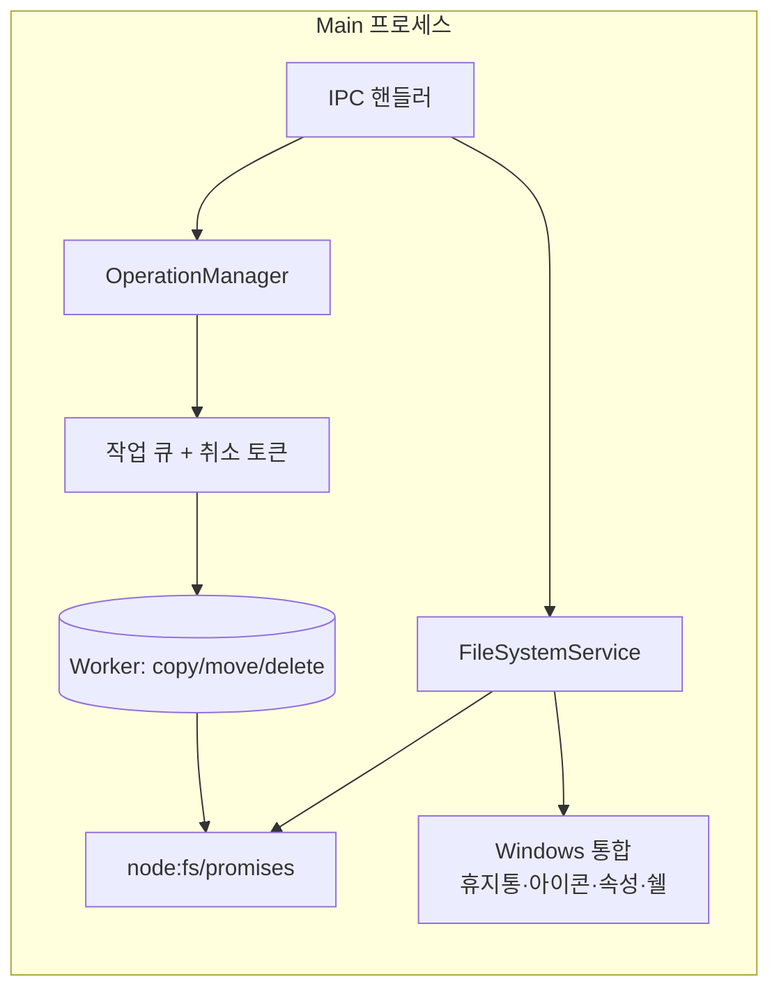

# 시스템 아키텍처 — Explorer (멀티 디렉토리 파일탐색기)

> 작성: 시니어 아키텍트 · 2026-06-06 · 상태: 제안 v1
> 입력: [PRD.md](../PRD.md) · [features.md](../features.md) · [user-stories.md](../user-stories.md) · [flows.md](../flows.md)
> 관련 설계: [software-architecture.md](./software-architecture.md) · [directory-structure.md](./directory-structure.md) · [adr/ADR-000-index.md](./adr/ADR-000-index.md) · [traceability.md](./traceability.md)

---

## 1. 개요

Explorer는 **Electron + TypeScript + React** 기반 Windows 데스크톱 파일탐색기다. 이 문서는 **프로세스 모델(Main/Renderer/Preload)**, **IPC 계약**, **파일시스템 접근 계층**, **대용량 작업의 비동기·취소·진행률 스트리밍**, **휴지통 연동**, **세션 영속화**를 정의한다. UI 내부의 도메인/계층/상태관리는 [software-architecture.md](./software-architecture.md)에서 다룬다.

핵심 설계 동인은 PRD 7장 비기능 요구다:
- **비차단 성능**: 무거운 I/O(디렉토리 읽기·복사·이동·삭제)는 UI 스레드를 멈추지 않는다 (US-5.2 / US-5.6).
- **진행률·취소**: 대용량 복사 200ms 이내 갱신, 사용자 취소 가능 (US-5.2).
- **데이터 안전**: 삭제는 휴지통 경유, 충돌 임의 덮어쓰기 금지 (US-2.4).
- **세션 복원**: 정상·비정상 종료 모두 복원 (US-5.5).
- **보안**: 로컬 전용, 텔레메트리 옵트인, OS 권한 존중 (PRD 7장·D5).

---

## 2. 프로세스 모델

### 2.1 시스템 컨텍스트

```mermaid
graph TB
    User([사용자])
    subgraph Electron 앱 (단일 인스턴스)
        Renderer["Renderer 프로세스<br/>(React UI · 도메인/유스케이스 상태)"]
        Preload["Preload 스크립트<br/>(contextBridge 안전 게이트)"]
        Main["Main 프로세스<br/>(앱 생명주기 · FS · OS 통합)"]
        Workers["Worker (UtilityProcess/Worker Threads)<br/>(대용량 복사/이동/디렉토리 스캔)"]
    end
    OS[("Windows OS<br/>파일시스템 · 휴지통 · 시스템 아이콘 · 클립보드")]

    User -->|입력/마우스/키보드| Renderer
    Renderer <-->|window.api 호출| Preload
    Preload <-->|ipcRenderer/ipcMain<br/>(검증된 채널)| Main
    Main -->|작업 위임| Workers
    Workers -->|진행률/결과| Main
    Main <-->|네이티브 API| OS
```

### 2.2 프로세스별 책임 (관심사 분리)

| 프로세스 | 책임 | 금지/경계 |
|---|---|---|
| **Main** | 앱 생명주기, 창/단일 인스턴스 관리, **모든 파일시스템·OS 접근**(읽기/쓰기/휴지통/시스템 아이콘/속성창/쉘 실행), Worker 오케스트레이션, 세션 영속화 저장소, IPC 핸들러(요청 검증·인가) | UI 렌더링 없음 |
| **Preload** | Renderer에 노출할 **안전한 API 표면(`window.api`)만** contextBridge로 정의. 인자 직렬화/형태 검증 1차. 채널을 메서드 단위로 한정 노출 | Node 전체/`ipcRenderer` 통째 노출 금지 |
| **Renderer** | React UI, 도메인/유스케이스 상태(탭/패널/레이아웃/선택/내비게이션), 가상 스크롤, 단축키 디스패치, 드래그&드롭 의도 판정. FS는 **오직 `window.api`로만** 접근 | 직접 `fs`/`child_process` 접근 금지, `nodeIntegration` 없음 |
| **Worker** (UtilityProcess 또는 Worker Threads) | CPU/I-O 집약 작업: 대용량 재귀 복사·이동·삭제, 대형 디렉토리 스캔, 썸네일 디코딩(Should). 청크 단위 진행률 보고, 취소 토큰 수신 | UI/IPC-Renderer 직접 통신 금지(Main 경유) |

> **근거(보안 모델)**: Electron 보안 모범사례에 따라 모든 `BrowserWindow`는 `contextIsolation: true`, `nodeIntegration: false`, `sandbox: true`, `webSecurity: true`로 생성한다. Renderer는 신뢰 경계 밖으로 취급하고, FS 권한은 Main에만 둔다. 상세 결정은 [ADR-005 프로세스/보안 모델](./adr/ADR-005-process-security-model.md).

### 2.3 창/인스턴스 관리

- **단일 인스턴스 락**(`app.requestSingleInstanceLock`). 중복 실행 시 기존 창 포커스 (PRD 7장: 단일 인스턴스 권장).
- 한 창 = 하나의 `Window` 도메인 루트. 다중 창은 향후 확장 여지로 두되 MVP는 단일 창 중심.

---

## 3. IPC 설계

### 3.1 통신 스타일

IPC 계약은 **타입 안전한 RPC + 단방향 이벤트 스트림** 혼합으로 정의한다. 자세한 비교/근거는 [ADR-003 IPC 계약 스타일](./adr/ADR-003-ipc-contract-style.md).

- **요청/응답(invoke/handle)**: 디렉토리 목록 조회, 단발 파일 작업 트리거, 메타 조회 등. `ipcRenderer.invoke` ↔ `ipcMain.handle`. 결과는 `Result<T, FileOpError>` 형태의 판별 유니온으로 반환(예외를 throw로만 흘리지 않음 → 권한 오류 등 도메인 오류를 1급으로 전파).
- **이벤트 스트림(send/on)**: 진행률·부분 결과·작업 완료/실패는 Main→Renderer 단방향 푸시. 작업마다 `operationId`로 구독을 식별한다.
- **계약 정의 위치**: `shared/ipc/` 에 채널명 상수 + 요청/응답 TS 타입을 **단일 출처**로 둔다. Preload·Main·Renderer가 같은 타입을 import → 컴파일 타임에 계약 위반 검출.

### 3.2 채널 카탈로그 (설계 수준 시그니처)

> 아래는 **계약 표현**이며 구현이 아니다. 채널은 도메인별 네임스페이스(`fs:`, `op:`, `session:`, `shell:`, `dialog:`)로 묶는다.

#### 디렉토리/메타 (요청-응답)

```text
fs:list(req: { path: string; showHidden: boolean })
  -> Result<{ entries: FileEntryDTO[]; truncated: boolean }, FileOpError>
  # 대형 디렉토리는 스트리밍(아래 fs:list:stream) 우선, 소형은 단발 응답

fs:stat(req: { path: string }) -> Result<FileEntryDTO, FileOpError>
fs:drives() -> Result<DriveDTO[], FileOpError>           # "내 PC" 드라이브 목록
fs:tree-children(req: { path: string }) -> Result<FileEntryDTO[], FileOpError>  # 사이드바 트리 지연 확장
fs:validate-path(req: { path: string }) -> Result<{ exists: boolean; isDir: boolean }, FileOpError>  # 주소창 검증
```

#### 파일 기본조작 — 단발 (생성/이름변경, US-2.2/B3 Must)

> 새 폴더(`Ctrl+Shift+N`)·새 파일·이름변경(`F2`)은 단일 항목 동기성 작업이라 `op:*`(대용량 비동기·진행률)와 분리해 **요청-응답** 채널로 둔다. 모두 **Main 프로세스**의 `FileSystemService`가 직접 수행하며, 경로는 §3.3 보안 규칙대로 정규화·검증한다.

```text
fs:mkdir(req: { parentDir: string; name: string })
  -> Result<FileEntryDTO, FileOpError>   # 새 폴더. 생성된 폴더의 DTO 반환(즉시 인라인 선택용)

fs:create-file(req: { parentDir: string; name: string; template?: string })
  -> Result<FileEntryDTO, FileOpError>   # 새 파일(빈 파일 또는 템플릿)

fs:rename(req: { path: string; newName: string })
  -> Result<FileEntryDTO, FileOpError>   # 이름변경(같은 부모 내). 갱신된 항목 DTO 반환
```

**오류 처리(FileOpError 코드로 1급 전파, throw 아님)**:
- 이름 충돌(동일 부모에 동명 항목 존재) → `code: 'EEXIST'` (Renderer가 "이름 (n)" 제안 또는 재입력 유도).
- 금지문자/예약명(`< > : " / \ | ? *`, `CON`/`PRN` 등 Windows 예약어)·빈 이름 → `code: 'EINVAL'`.
- 권한 거부 → `code: 'EACCES'`, 경로 없음 → `code: 'ENOENT'`.
- 처리 프로세스: **Main**(`fs.handlers.ts` → `FileSystemService`). Renderer는 `infra/api` 경유로만 호출.

#### 디렉토리 스트리밍 (대형 폴더 첫 렌더 1.5초 목표, US-5.6)

```text
요청:  fs:list:start(req: { path, showHidden }) -> Result<{ streamId: string }, FileOpError>
푸시:  fs:list:chunk  (evt: { streamId, entries: FileEntryDTO[] })   # 청크 단위 증분 전달
푸시:  fs:list:done   (evt: { streamId, total: number })
푸시:  fs:list:error  (evt: { streamId, error: FileOpError })
요청:  fs:list:cancel (req: { streamId }) -> void   # 사용자가 다른 폴더로 이동 시 스캔 취소
```

#### 파일 작업 (복사/이동/삭제 — 비동기·취소·진행률)

```text
요청:  op:start(req: {
          kind: 'copy' | 'move' | 'delete' | 'trash';
          sources: string[];
          destDir?: string;             # copy/move 대상
          conflictPolicy?: ConflictPolicy;  # 사전 일괄 규칙(없으면 충돌 시 질의)
       }) -> Result<{ operationId: string }, FileOpError>

푸시:  op:progress (evt: {
          operationId; processedBytes; totalBytes;
          processedItems; totalItems; currentName; bytesPerSec?;
       })   # Main이 200ms 스로틀로 합산·푸시 (US-5.2)

푸시:  op:conflict (evt: { operationId; conflictId; source: FileEntryDTO; target: FileEntryDTO })
요청:  op:resolve  (req: { operationId; conflictId; resolution: ConflictResolution; applyToAll: boolean }) -> void

푸시:  op:done (evt: { operationId; summary: OpSummary })  # 성공/실패 항목·사유 목록 포함
요청:  op:cancel(req: { operationId }) -> void              # 진행분까지 처리 후 done
```

#### 쉘/OS 통합 · 다이얼로그

```text
shell:open(req: { path }) -> Result<void, FileOpError>          # 더블클릭 실행(연결 프로그램)
shell:open-with(req: { path }) -> ...                            # 연결 프로그램 선택(S)
shell:show-properties(req: { path }) -> ...                      # OS 속성창
shell:icon(req: { path | ext }) -> Result<{ dataUrl }, FileOpError>  # 시스템 아이콘(캐시)
clipboard:copy-files / clipboard:cut-files / clipboard:paste-target(...)  # OS 클립보드 파일 연동
dialog:confirm-permanent-delete(...) -> Result<{ confirmed: boolean }, _>  # 영구삭제 확인은 Main 모달 권장
```

#### 세션/설정 (영속화)

```text
session:load() -> Result<SessionSnapshot, _>
session:save(req: { snapshot: SessionSnapshot }) -> void        # 디바운스 자동 저장
workspace:save / workspace:list / workspace:load / workspace:delete (S, US-5.8)
settings:get / settings:set                                     # 테마·시작위치·숨김표시 등
telemetry:set-opt-in(req: { enabled: boolean })                 # 기본 false (D5)
```

### 3.3 IPC 보안 규칙 (방어 심층)

1. **메서드 단위 노출**: Preload는 `ipcRenderer`를 통째로 넘기지 않고, 채널마다 래퍼 함수 하나만 `contextBridge.exposeInMainWorld('api', ...)`로 공개한다.
2. **양단 검증**: Preload에서 인자 형태 1차 검증, Main 핸들러에서 `event.senderFrame` 출처 확인 + 인자 스키마(zod 등) 재검증 — 어느 한 계층이 뚫려도 막힌다.
3. **경로 정규화/화이트리스트**: Main은 모든 입력 경로를 정규화하고, 시스템 보호 경로/상위 이탈(`..`) 악용을 차단. 사용자 권한 범위 밖 작업은 OS가 거부 → `FileOpError(code: 'EACCES')`로 전파.
4. **쉘 실행 계열 별도 방어(`shell:open`/`shell:open-with`/`shell:show-properties`)**: 임의 경로·인자 실행은 RCE 인접 표면이므로 다음을 강제한다.
   - 경로는 §3.3-3과 동일하게 **정규화 + 존재·권한 확인** 후에만 OS에 위임한다. 미존재/권한밖 경로는 `FileOpError`로 거부하고 실행하지 않는다.
   - **명령행 조립(인자 주입) 금지**. 사용자/Renderer가 준 문자열을 셸 명령으로 합성하지 않고, `shell.openPath`(파일·폴더) / `shell.openExternal`(URL)에 **검증된 단일 경로만** 전달한다.
   - `shell.openExternal` 사용 시 **프로토콜 화이트리스트**(`http`/`https`/`mailto`만 허용, `file:`/커스텀 스킴 차단) 적용. 파일 실행은 항상 `shell.openPath` 경로로만.
   - 연결 프로그램 선택·OS 속성창도 검증된 경로를 OS 다이얼로그에 위임할 뿐, 직접 프로세스를 spawn하지 않는다.
5. **CSP**: Renderer는 엄격한 Content-Security-Policy 적용, 원격 콘텐츠 로드 없음(로컬 번들만).
6. **네트워크 차단 기본**: 텔레메트리 옵트인 외 외부 전송 없음 (D5).

---

## 4. 파일시스템 접근 계층 (Main 측)



| 컴포넌트 | 책임 |
|---|---|
| **FileSystemService** | 디렉토리 읽기(스트리밍), stat, 드라이브 열거, 경로 검증, 시스템 아이콘 조회. 롱패스(`\\?\` 프리픽스)·유니코드·심볼릭/정션 링크 표시·네트워크 드라이브 예외 처리 (features F장) |
| **OperationManager** | `op:*` 작업의 생성·추적·취소·진행률 합산. 작업별 상태머신(대기→실행→충돌대기→실행→완료/취소/부분실패) 보유 |
| **작업 큐 + 취소 토큰** | 동시 작업 제어, `AbortController` 기반 협조적 취소 |
| **Worker** | 실제 재귀 복사/이동/삭제 수행. 청크(예: 64KB~수MB) 단위로 바이트 진행 보고, 충돌 발견 시 Main에 질의 |
| **Windows 통합** | 휴지통 이동(아래 4.2), 시스템 아이콘, OS 속성창 호출, `shell.openPath`로 연결 프로그램 실행 |

### 4.1 대용량 복사/이동의 비동기·취소·진행률 (US-5.2 / US-5.6)

흐름:
1. Renderer가 `op:start` 호출 → Main `OperationManager`가 `operationId` 발급, Worker에 작업+`AbortSignal` 위임.
2. Worker가 소스 트리를 순회하며 **사전 집계**(총 항목/총 바이트)를 빠르게 계산(또는 점증 추정) → 진행률 분모 확보.
3. Worker가 청크 단위로 복사하며 누적 바이트/항목을 Main에 보고. **Main이 200ms 스로틀**로 합산해 `op:progress` 1건씩 Renderer에 푸시 → 과도한 IPC 트래픽 방지하면서 200ms 갱신 목표 충족.
4. 충돌 발견 시 Worker→Main→`op:conflict` 푸시. Renderer가 다이얼로그 표시 후 `op:resolve`로 결정 회신(모두 적용 시 이후 동일 유형 자동 적용).
5. 취소: `op:cancel` → `AbortSignal` 발화 → Worker가 안전 지점에서 중단, 진행분 정리 후 `op:done(summary)` 반환(부분 성공/실패 목록 포함).
6. **UI 비차단**: 작업은 Worker에서 돌고 Renderer는 이벤트만 받으므로, 작업 중에도 다른 탭/패널 탐색이 자유롭다.

> **충돌·순환·자기위치 규칙**(features A3/feat-D4)은 Worker가 1차 판정하되, 정책 결정(덮어쓰기/병합/둘다유지/건너뛰기)은 Renderer 사용자 입력으로 받는다. 조상→자손 이동 차단, 동일 폴더 드롭 무시는 **작업 시작 전 Main에서 선검증**해 불필요한 작업 자체를 막는다.

### 4.2 휴지통 연동 (Windows, M)

- 삭제 기본값은 **휴지통 이동**(`op:trash`). Windows Shell의 휴지통 API를 쓰는 검증된 네이티브 래퍼(예: `trash`/Electron `shell.trashItem`)를 Main에서 호출.
- 영구 삭제(`Shift+Delete`)는 `op:delete` + **Main 모달 확인 다이얼로그**(`dialog:confirm-permanent-delete`)를 선행 (US-2.2).
- 되돌리기(`Ctrl+Z`, Should/B7): 직전 작업 메타(이동 원본↔대상, 휴지통 항목 핸들)를 **세션 범위 Undo 스택**에 보관해 역연산. 휴지통 복원은 Shell 복원 경로 활용. 범위·한계는 features B7대로 명세 확정 필요(미해결 질문 참조).

---

## 5. 상태 영속화 (세션 자동 복원, US-5.5 · 결정-D3)

### 5.1 무엇을 저장하나

`SessionSnapshot`(개념 스키마):
```text
SessionSnapshot {
  version: number
  windows: [{
    tabs: [{
      id, activePanelId,
      layout: 'single' | 'split-2-h' | 'split-2-v' | 'grid-4',
      panels: [{ id, path, sortKey, sortDir, viewMode,
                 history: { back: path[], forward: path[] }, scrollTop }]
    }],
    activeTabId
    # closedHistory(닫은 탭 복원 스택)는 창 수준 휘발 상태 → 직렬화/복원 대상 아님(아래 주석)
  }]
  sidebar: { favorites: path[], recent: path[], width, collapsed }
  ui: { theme, previewOpen }
}
```
> 선택 상태(Selection)·진행 중 작업·**닫은 탭 복원 스택(`closedHistory`, 창 수준)** 은 복원 대상에서 제외(휘발). 경로·레이아웃·정렬·보기·히스토리만 복원 (US-5.5 수용 기준). `closedHistory`는 `Window` 엔티티에 속하는 런타임 전용 상태이며 SessionSnapshot에 직렬화하지 않는다(앱 재시작 시 비워짐).

### 5.2 어디에·어떻게 저장하나

- **위치**: `app.getPath('userData')` 하위. 예: `%APPDATA%/Explorer/session.json`, `settings.json`, `workspaces/`.
- **형식**: JSON(스키마 버저닝). 단순·디버그 용이·이식성. 데이터 규모가 작아 SQLite는 과설계.
- **자동 저장 트리거**: 탭/패널/레이아웃/내비게이션 변경 시 **디바운스(예: 1초)** 후 `session:save`. 추가로 `before-quit`에 플러시.
- **비정상 종료 대응**: 변경 시점마다 저장하므로 크래시 후에도 마지막 스냅샷이 남는다. **원자적 쓰기**(temp 파일 → rename)로 쓰기 도중 크래시에도 파일 손상 방지.
- **명시적 워크스페이스(S, US-5.8)**: 동일 스냅샷 구조를 이름 붙여 `workspaces/<name>.json`에 별도 저장/불러오기.

### 5.3 스키마 버전 마이그레이션

`version` 필드로 구버전 스냅샷을 로드 시 변환. 파싱 실패/손상 시 안전 폴백(기본 "내 PC" 탭)으로 부팅 → 크래시 프리(PRD 안정성).

---

## 6. 배포 / 인프라 구성

- **타겟**: Windows 10/11 x64. NSIS 인스톨러 + 자동 업데이트 채널(향후). 코드 서명 권장.
- **패키징**: electron-builder (NSIS). 상세 비교/근거는 [ADR-006 패키징](./adr/ADR-006-packaging.md), [directory-structure.md](./directory-structure.md).
- **빌드**: electron-vite (Main/Preload/Renderer 동시 번들·HMR). [ADR-001 빌드툴](./adr/ADR-001-build-tool.md).
- **환경 분리**: dev(HMR, devtools) / prod(코드서명·압축·sourcemap 분리). 텔레메트리 엔드포인트는 옵트인 시에만 활성(D5).

---

## 7. 리스크 및 가정

| # | 리스크 | 영향 | 완화 |
|---|---|---|---|
| SR1 | Worker 모델 선택(UtilityProcess vs Worker Threads)에 따른 네이티브 모듈 호환·취소 정밀도 차이 | 중 | M1 스파이크로 두 방식 벤치(취소 지연·진행률 정확도·휴지통 모듈 로드). ADR-005에 후속 결정 기록 |
| SR2 | 대형 디렉토리 스캔 1.5초 목표 — 네트워크 드라이브/안티바이러스 간섭 | 높음 | 스트리밍+증분 렌더로 "첫 화면"을 빨리, 전체 스캔은 백그라운드. 네트워크 지연 시 패널 단위 로딩/오류 격리 |
| SR3 | 휴지통/롱패스/링크 등 Windows 특수 케이스의 네이티브 의존성 | 중 | 검증된 라이브러리(`shell.trashItem` 등) 우선, features F장 케이스를 QA 매트릭스화 |
| SR4 | IPC 직렬화 비용(대량 엔트리 전송) | 중 | 청크 스트리밍 + 가벼운 DTO(필요 필드만), 아이콘은 지연·캐시 |

가정: 단일 사용자·로컬/매핑 드라이브, OS 권한 그대로 존중, 시스템 아이콘/실행은 OS 위임(PRD 9장).

---

## 8. 미해결 질문 (확인 필요)

1. **Worker 실행 모델**: Electron `UtilityProcess`(프로세스 격리·크래시 내성 우수) vs `Worker Threads`(네이티브 모듈·메모리 공유 단순). M1 스파이크 후 확정 — 어느 쪽을 1차 기본값으로 둘지 PM/개발 확인.
2. **Undo(B7, Ctrl+Z) 영속 범위**: 세션 내 메모리 스택만(재시작 시 소멸) vs 영속화. features B7가 "범위·한계 확정 필요"로 열어둠.
3. **썸네일 디코딩 위치(S)**: Main Worker vs Renderer OffscreenCanvas — 미리보기/그리드(Should) 착수 시 결정.
