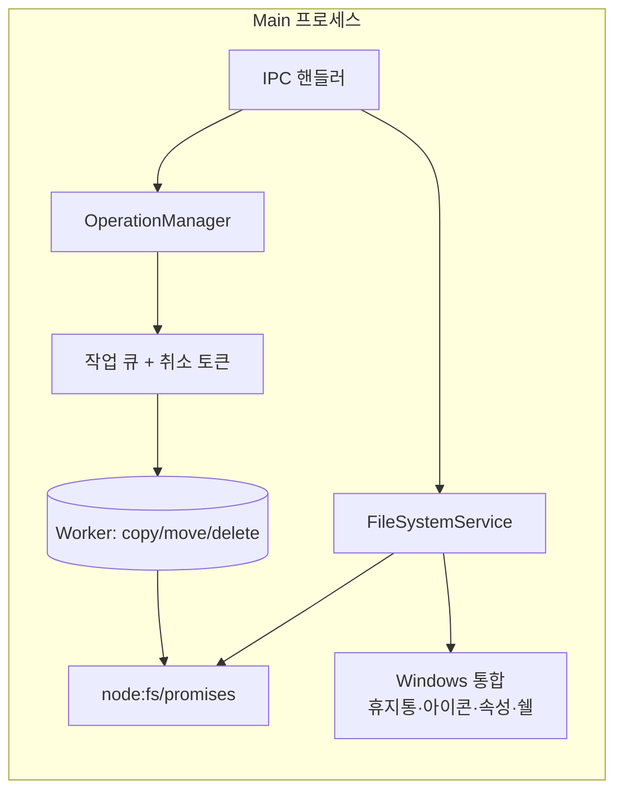
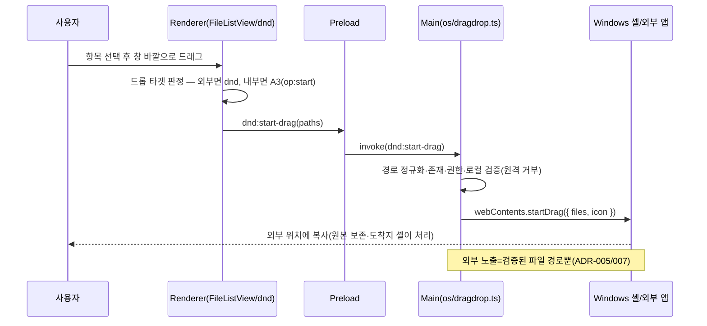
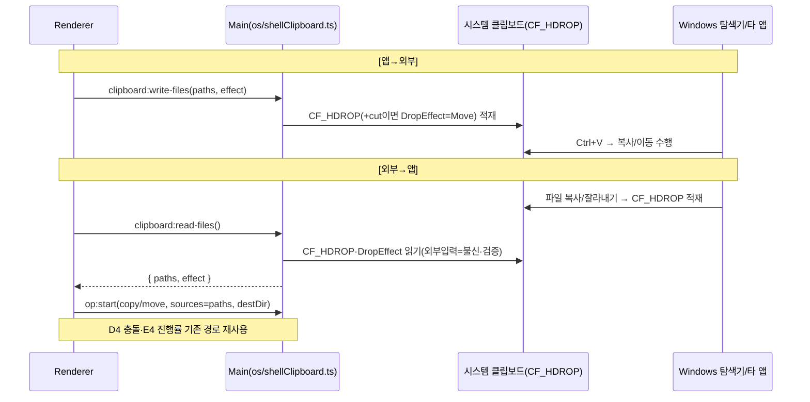
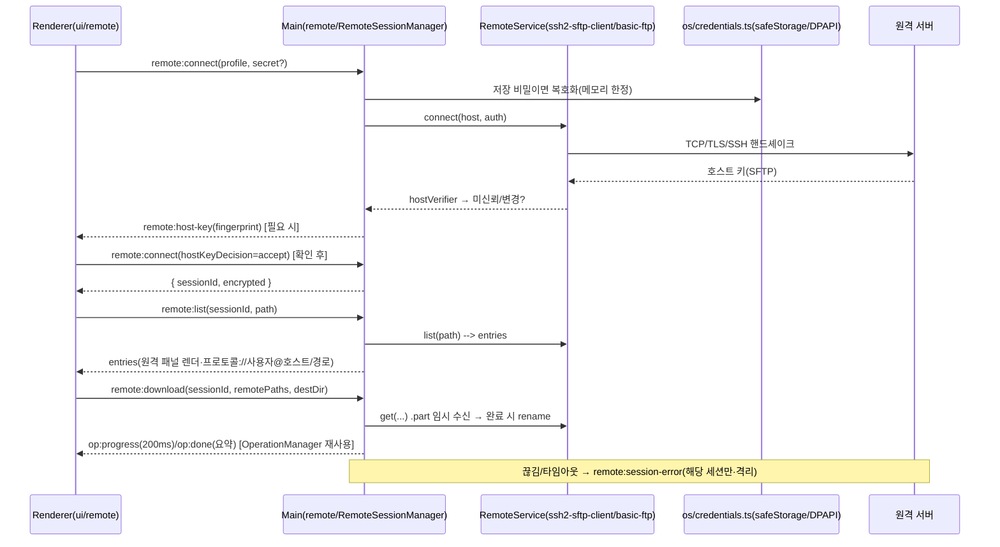
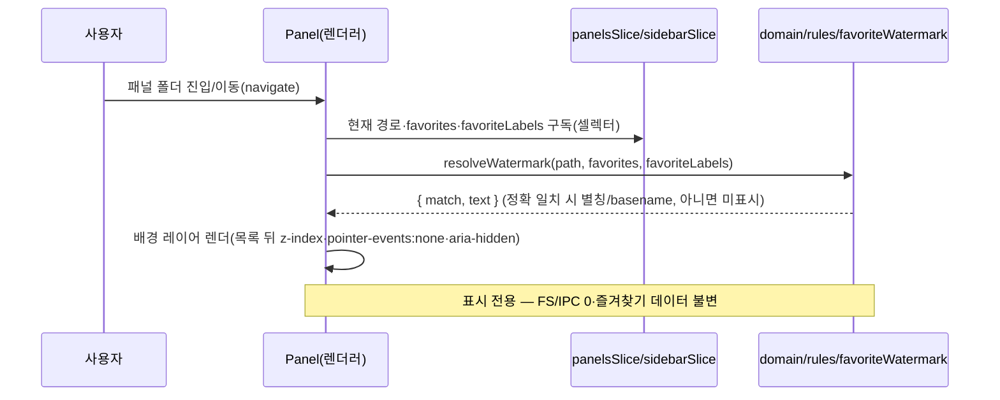
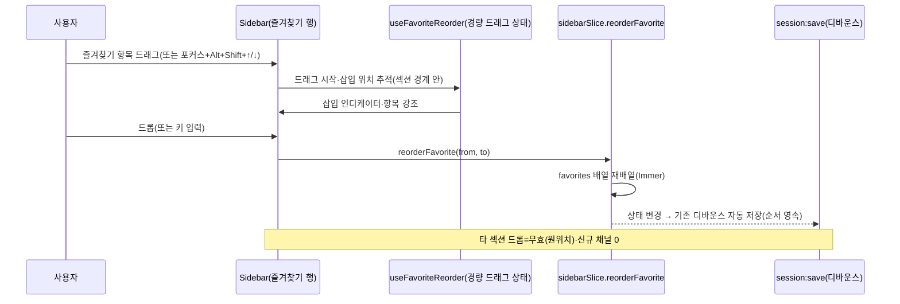

# 시스템 아키텍처 — Explorer (멀티 디렉토리 파일탐색기)

> 작성: 시니어 아키텍트 · 2026-06-06 · 상태: 제안 v1
> 입력: [PRD.md](../PRD.md) · [features.md](../features.md) · [user-stories.md](../user-stories.md) · [flows.md](../flows.md)
> 관련 설계: [software-architecture.md](./software-architecture.md) · [directory-structure.md](./directory-structure.md) · [adr/ADR-000-index.md](./adr/ADR-000-index.md) · [traceability.md](./traceability.md)

---

## 1. 개요

Explorer는 **Electron + TypeScript + React** 기반 Windows 데스크톱 파일탐색기다. 이 문서는 **프로세스 모델(Main/Renderer/Preload)**, **IPC 계약**, **파일시스템 접근 계층**, **대용량 작업의 비동기·취소·진행률 스트리밍**, **휴지통 연동**, **세션 영속화**를 정의한다. UI 내부의 도메인/계층/상태관리는 [software-architecture.md](./software-architecture.md)에서 다룬다.

핵심 설계 동인은 PRD 7장 비기능 요구다:
- **비차단 성능**: 무거운 I/O(디렉토리 읽기·복사·이동·삭제)는 UI 스레드를 멈추지 않는다 (US-5.2 / US-5.6).
- **진행률·취소**: 대용량 복사 200ms 이내 갱신, 사용자 취소 가능 (US-5.2).
- **데이터 안전**: 삭제는 휴지통 경유, 충돌 임의 덮어쓰기 금지 (US-2.4).
- **세션 복원**: 정상·비정상 종료 모두 복원 (US-5.5).
- **보안**: 로컬 전용, 텔레메트리 옵트인, OS 권한 존중 (PRD 7장·D5).

---

## 2. 프로세스 모델

### 2.1 시스템 컨텍스트

```mermaid
graph TB
    User([사용자])
    subgraph Electron 앱 (단일 인스턴스)
        Renderer["Renderer 프로세스<br/>(React UI · 도메인/유스케이스 상태)"]
        Preload["Preload 스크립트<br/>(contextBridge 안전 게이트)"]
        Main["Main 프로세스<br/>(앱 생명주기 · FS · OS 통합)"]
        Workers["Worker (UtilityProcess/Worker Threads)<br/>(대용량 복사/이동/디렉토리 스캔)"]
    end
    OS[("Windows OS<br/>파일시스템 · 휴지통 · 시스템 아이콘 · 클립보드")]

    User -->|입력/마우스/키보드| Renderer
    Renderer <-->|window.api 호출| Preload
    Preload <-->|ipcRenderer/ipcMain<br/>(검증된 채널)| Main
    Main -->|작업 위임| Workers
    Workers -->|진행률/결과| Main
    Main <-->|네이티브 API| OS
```

### 2.2 프로세스별 책임 (관심사 분리)

| 프로세스 | 책임 | 금지/경계 |
|---|---|---|
| **Main** | 앱 생명주기, 창/단일 인스턴스 관리, **모든 파일시스템·OS 접근**(읽기/쓰기/휴지통/시스템 아이콘/속성창/쉘 실행), Worker 오케스트레이션, 세션 영속화 저장소, IPC 핸들러(요청 검증·인가) | UI 렌더링 없음 |
| **Preload** | Renderer에 노출할 **안전한 API 표면(`window.api`)만** contextBridge로 정의. 인자 직렬화/형태 검증 1차. 채널을 메서드 단위로 한정 노출 | Node 전체/`ipcRenderer` 통째 노출 금지 |
| **Renderer** | React UI, 도메인/유스케이스 상태(탭/패널/레이아웃/선택/내비게이션), 가상 스크롤, 단축키 디스패치, 드래그&드롭 의도 판정. FS는 **오직 `window.api`로만** 접근 | 직접 `fs`/`child_process` 접근 금지, `nodeIntegration` 없음 |
| **Worker** (UtilityProcess 또는 Worker Threads) | CPU/I-O 집약 작업: 대용량 재귀 복사·이동·삭제, 대형 디렉토리 스캔, 썸네일 디코딩(Should). 청크 단위 진행률 보고, 취소 토큰 수신 | UI/IPC-Renderer 직접 통신 금지(Main 경유) |

> **근거(보안 모델)**: Electron 보안 모범사례에 따라 모든 `BrowserWindow`는 `contextIsolation: true`, `nodeIntegration: false`, `sandbox: true`, `webSecurity: true`로 생성한다. Renderer는 신뢰 경계 밖으로 취급하고, FS 권한은 Main에만 둔다. 상세 결정은 [ADR-005 프로세스/보안 모델](./adr/ADR-005-process-security-model.md).

### 2.3 창/인스턴스 관리

- **단일 인스턴스 락**(`app.requestSingleInstanceLock`). 중복 실행 시 기존 창 포커스 (PRD 7장: 단일 인스턴스 권장).
- 한 창 = 하나의 `Window` 도메인 루트. 다중 창은 향후 확장 여지로 두되 MVP는 단일 창 중심.

---

## 3. IPC 설계

### 3.1 통신 스타일

IPC 계약은 **타입 안전한 RPC + 단방향 이벤트 스트림** 혼합으로 정의한다. 자세한 비교/근거는 [ADR-003 IPC 계약 스타일](./adr/ADR-003-ipc-contract-style.md).

- **요청/응답(invoke/handle)**: 디렉토리 목록 조회, 단발 파일 작업 트리거, 메타 조회 등. `ipcRenderer.invoke` ↔ `ipcMain.handle`. 결과는 `Result<T, FileOpError>` 형태의 판별 유니온으로 반환(예외를 throw로만 흘리지 않음 → 권한 오류 등 도메인 오류를 1급으로 전파).
- **이벤트 스트림(send/on)**: 진행률·부분 결과·작업 완료/실패는 Main→Renderer 단방향 푸시. 작업마다 `operationId`로 구독을 식별한다.
- **계약 정의 위치**: `shared/ipc/` 에 채널명 상수 + 요청/응답 TS 타입을 **단일 출처**로 둔다. Preload·Main·Renderer가 같은 타입을 import → 컴파일 타임에 계약 위반 검출.

### 3.2 채널 카탈로그 (설계 수준 시그니처)

> 아래는 **계약 표현**이며 구현이 아니다. 채널은 도메인별 네임스페이스(`fs:`, `op:`, `session:`, `shell:`, `dialog:`)로 묶는다.

#### 디렉토리/메타 (요청-응답)

```text
fs:list(req: { path: string; showHidden: boolean })
  -> Result<{ entries: FileEntryDTO[]; truncated: boolean }, FileOpError>
  # 대형 디렉토리는 스트리밍(아래 fs:list:stream) 우선, 소형은 단발 응답

fs:stat(req: { path: string }) -> Result<FileEntryDTO, FileOpError>
fs:drives() -> Result<DriveDTO[], FileOpError>           # "내 PC" 드라이브 목록
fs:tree-children(req: { path: string }) -> Result<FileEntryDTO[], FileOpError>  # 사이드바 트리 지연 확장
fs:validate-path(req: { path: string }) -> Result<{ exists: boolean; isDir: boolean }, FileOpError>  # 주소창 검증
```

#### 파일 기본조작 — 단발 (생성/이름변경, US-2.2/B3 Must)

> 새 폴더(`Ctrl+Shift+N`)·새 파일·이름변경(`F2`)은 단일 항목 동기성 작업이라 `op:*`(대용량 비동기·진행률)와 분리해 **요청-응답** 채널로 둔다. 모두 **Main 프로세스**의 `FileSystemService`가 직접 수행하며, 경로는 §3.3 보안 규칙대로 정규화·검증한다.

```text
fs:mkdir(req: { parentDir: string; name: string })
  -> Result<FileEntryDTO, FileOpError>   # 새 폴더. 생성된 폴더의 DTO 반환(즉시 인라인 선택용)

fs:create-file(req: { parentDir: string; name: string; template?: string })
  -> Result<FileEntryDTO, FileOpError>   # 새 파일(빈 파일 또는 템플릿)

fs:rename(req: { path: string; newName: string })
  -> Result<FileEntryDTO, FileOpError>   # 이름변경(같은 부모 내). 갱신된 항목 DTO 반환
```

**오류 처리(FileOpError 코드로 1급 전파, throw 아님)**:
- 이름 충돌(동일 부모에 동명 항목 존재) → `code: 'EEXIST'` (Renderer가 "이름 (n)" 제안 또는 재입력 유도).
- 금지문자/예약명(`< > : " / \ | ? *`, `CON`/`PRN` 등 Windows 예약어)·빈 이름 → `code: 'EINVAL'`.
- 권한 거부 → `code: 'EACCES'`, 경로 없음 → `code: 'ENOENT'`.
- 처리 프로세스: **Main**(`fs.handlers.ts` → `FileSystemService`). Renderer는 `infra/api` 경유로만 호출.

#### 디렉토리 스트리밍 (대형 폴더 첫 렌더 1.5초 목표, US-5.6)

```text
요청:  fs:list:start(req: { path, showHidden }) -> Result<{ streamId: string }, FileOpError>
푸시:  fs:list:chunk  (evt: { streamId, entries: FileEntryDTO[] })   # 청크 단위 증분 전달
푸시:  fs:list:done   (evt: { streamId, total: number })
푸시:  fs:list:error  (evt: { streamId, error: FileOpError })
요청:  fs:list:cancel (req: { streamId }) -> void   # 사용자가 다른 폴더로 이동 시 스캔 취소
```

#### 파일 작업 (복사/이동/삭제 — 비동기·취소·진행률)

```text
요청:  op:start(req: {
          kind: 'copy' | 'move' | 'delete' | 'trash';
          sources: string[];
          destDir?: string;             # copy/move 대상
          conflictPolicy?: ConflictPolicy;  # 사전 일괄 규칙(없으면 충돌 시 질의)
       }) -> Result<{ operationId: string }, FileOpError>

푸시:  op:progress (evt: {
          operationId; processedBytes; totalBytes;
          processedItems; totalItems; currentName; bytesPerSec?;
       })   # Main이 200ms 스로틀로 합산·푸시 (US-5.2)

푸시:  op:conflict (evt: { operationId; conflictId; source: FileEntryDTO; target: FileEntryDTO })
요청:  op:resolve  (req: { operationId; conflictId; resolution: ConflictResolution; applyToAll: boolean }) -> void

푸시:  op:done (evt: { operationId; summary: OpSummary })  # 성공/실패 항목·사유 목록 포함
요청:  op:cancel(req: { operationId }) -> void              # 진행분까지 처리 후 done
```

#### 쉘/OS 통합 · 다이얼로그

```text
shell:open(req: { path }) -> Result<void, FileOpError>          # 더블클릭 실행(연결 프로그램)
shell:open-with(req: { path }) -> ...                            # 연결 프로그램 선택(S)
shell:show-properties(req: { path }) -> ...                      # OS 속성창
shell:icon(req: { path | ext }) -> Result<{ dataUrl }, FileOpError>  # 시스템 아이콘(캐시)
clipboard:copy-files / clipboard:cut-files / clipboard:paste-target(...)  # OS 클립보드 파일 연동
dialog:confirm-permanent-delete(...) -> Result<{ confirmed: boolean }, _>  # 영구삭제 확인은 Main 모달 권장
```

#### 세션/설정 (영속화)

```text
session:load() -> Result<SessionSnapshot, _>
session:save(req: { snapshot: SessionSnapshot }) -> void        # 디바운스 자동 저장
workspace:save / workspace:list / workspace:load / workspace:delete (S, US-5.8)
settings:get / settings:set                                     # 테마·시작위치·숨김표시 등
telemetry:set-opt-in(req: { enabled: boolean })                 # 기본 false (D5)
```

### 3.3 IPC 보안 규칙 (방어 심층)

1. **메서드 단위 노출**: Preload는 `ipcRenderer`를 통째로 넘기지 않고, 채널마다 래퍼 함수 하나만 `contextBridge.exposeInMainWorld('api', ...)`로 공개한다.
2. **양단 검증**: Preload에서 인자 형태 1차 검증, Main 핸들러에서 `event.senderFrame` 출처 확인 + 인자 스키마(zod 등) 재검증 — 어느 한 계층이 뚫려도 막힌다.
3. **경로 정규화/화이트리스트**: Main은 모든 입력 경로를 정규화하고, 시스템 보호 경로/상위 이탈(`..`) 악용을 차단. 사용자 권한 범위 밖 작업은 OS가 거부 → `FileOpError(code: 'EACCES')`로 전파.
4. **쉘 실행 계열 별도 방어(`shell:open`/`shell:open-with`/`shell:show-properties`)**: 임의 경로·인자 실행은 RCE 인접 표면이므로 다음을 강제한다.
   - 경로는 §3.3-3과 동일하게 **정규화 + 존재·권한 확인** 후에만 OS에 위임한다. 미존재/권한밖 경로는 `FileOpError`로 거부하고 실행하지 않는다.
   - **명령행 조립(인자 주입) 금지**. 사용자/Renderer가 준 문자열을 셸 명령으로 합성하지 않고, `shell.openPath`(파일·폴더) / `shell.openExternal`(URL)에 **검증된 단일 경로만** 전달한다.
   - `shell.openExternal` 사용 시 **프로토콜 화이트리스트**(`http`/`https`/`mailto`만 허용, `file:`/커스텀 스킴 차단) 적용. 파일 실행은 항상 `shell.openPath` 경로로만.
   - 연결 프로그램 선택·OS 속성창도 검증된 경로를 OS 다이얼로그에 위임할 뿐, 직접 프로세스를 spawn하지 않는다.
5. **CSP**: Renderer는 엄격한 Content-Security-Policy 적용, 원격 콘텐츠 로드 없음(로컬 번들만).
6. **네트워크 차단 기본**: 텔레메트리 옵트인 외 외부 전송 없음 (D5).

---

## 4. 파일시스템 접근 계층 (Main 측)



| 컴포넌트 | 책임 |
|---|---|
| **FileSystemService** | 디렉토리 읽기(스트리밍), stat, 드라이브 열거, 경로 검증, 시스템 아이콘 조회. 롱패스(`\\?\` 프리픽스)·유니코드·심볼릭/정션 링크 표시·네트워크 드라이브 예외 처리 (features F장) |
| **OperationManager** | `op:*` 작업의 생성·추적·취소·진행률 합산. 작업별 상태머신(대기→실행→충돌대기→실행→완료/취소/부분실패) 보유 |
| **작업 큐 + 취소 토큰** | 동시 작업 제어, `AbortController` 기반 협조적 취소 |
| **Worker** | 실제 재귀 복사/이동/삭제 수행. 청크(예: 64KB~수MB) 단위로 바이트 진행 보고, 충돌 발견 시 Main에 질의 |
| **Windows 통합** | 휴지통 이동(아래 4.2), 시스템 아이콘, OS 속성창 호출, `shell.openPath`로 연결 프로그램 실행 |

### 4.1 대용량 복사/이동의 비동기·취소·진행률 (US-5.2 / US-5.6)

흐름:
1. Renderer가 `op:start` 호출 → Main `OperationManager`가 `operationId` 발급, Worker에 작업+`AbortSignal` 위임.
2. Worker가 소스 트리를 순회하며 **사전 집계**(총 항목/총 바이트)를 빠르게 계산(또는 점증 추정) → 진행률 분모 확보.
3. Worker가 청크 단위로 복사하며 누적 바이트/항목을 Main에 보고. **Main이 200ms 스로틀**로 합산해 `op:progress` 1건씩 Renderer에 푸시 → 과도한 IPC 트래픽 방지하면서 200ms 갱신 목표 충족.
4. 충돌 발견 시 Worker→Main→`op:conflict` 푸시. Renderer가 다이얼로그 표시 후 `op:resolve`로 결정 회신(모두 적용 시 이후 동일 유형 자동 적용).
5. 취소: `op:cancel` → `AbortSignal` 발화 → Worker가 안전 지점에서 중단, 진행분 정리 후 `op:done(summary)` 반환(부분 성공/실패 목록 포함).
6. **UI 비차단**: 작업은 Worker에서 돌고 Renderer는 이벤트만 받으므로, 작업 중에도 다른 탭/패널 탐색이 자유롭다.

> **충돌·순환·자기위치 규칙**(features A3/feat-D4)은 Worker가 1차 판정하되, 정책 결정(덮어쓰기/병합/둘다유지/건너뛰기)은 Renderer 사용자 입력으로 받는다. 조상→자손 이동 차단, 동일 폴더 드롭 무시는 **작업 시작 전 Main에서 선검증**해 불필요한 작업 자체를 막는다.

### 4.2 휴지통 연동 (Windows, M)

- 삭제 기본값은 **휴지통 이동**(`op:trash`). Windows Shell의 휴지통 API를 쓰는 검증된 네이티브 래퍼(예: `trash`/Electron `shell.trashItem`)를 Main에서 호출.
- 영구 삭제(`Shift+Delete`)는 `op:delete` + **Main 모달 확인 다이얼로그**(`dialog:confirm-permanent-delete`)를 선행 (US-2.2).
- 되돌리기(`Ctrl+Z`, Should/B7): 직전 작업 메타(이동 원본↔대상, 휴지통 항목 핸들)를 **세션 범위 Undo 스택**에 보관해 역연산. 휴지통 복원은 Shell 복원 경로 활용. 범위·한계는 features B7대로 명세 확정 필요(미해결 질문 참조).

---

## 5. 상태 영속화 (세션 자동 복원, US-5.5 · 결정-D3)

### 5.1 무엇을 저장하나

`SessionSnapshot`(개념 스키마):
```text
SessionSnapshot {
  version: number
  windows: [{
    tabs: [{
      id, activePanelId,
      layout: 'single' | 'split-2-h' | 'split-2-v' | 'grid-4',
      panels: [{ id, path, sortKey, sortDir, viewMode,
                 history: { back: path[], forward: path[] }, scrollTop }]
    }],
    activeTabId
    # closedHistory(닫은 탭 복원 스택)는 창 수준 휘발 상태 → 직렬화/복원 대상 아님(아래 주석)
  }]
  sidebar: { favorites: path[], recent: path[], width, collapsed }
  ui: { theme, previewOpen }
}
```
> 선택 상태(Selection)·진행 중 작업·**닫은 탭 복원 스택(`closedHistory`, 창 수준)** 은 복원 대상에서 제외(휘발). 경로·레이아웃·정렬·보기·히스토리만 복원 (US-5.5 수용 기준). `closedHistory`는 `Window` 엔티티에 속하는 런타임 전용 상태이며 SessionSnapshot에 직렬화하지 않는다(앱 재시작 시 비워짐).

### 5.2 어디에·어떻게 저장하나

- **위치**: `app.getPath('userData')` 하위. 예: `%APPDATA%/Explorer/session.json`, `settings.json`, `workspaces/`.
- **형식**: JSON(스키마 버저닝). 단순·디버그 용이·이식성. 데이터 규모가 작아 SQLite는 과설계.
- **자동 저장 트리거**: 탭/패널/레이아웃/내비게이션 변경 시 **디바운스(예: 1초)** 후 `session:save`. 추가로 `before-quit`에 플러시.
- **비정상 종료 대응**: 변경 시점마다 저장하므로 크래시 후에도 마지막 스냅샷이 남는다. **원자적 쓰기**(temp 파일 → rename)로 쓰기 도중 크래시에도 파일 손상 방지.
- **명시적 워크스페이스(S, US-5.8)**: 동일 스냅샷 구조를 이름 붙여 `workspaces/<name>.json`에 별도 저장/불러오기.

### 5.3 스키마 버전 마이그레이션

`version` 필드로 구버전 스냅샷을 로드 시 변환. 파싱 실패/손상 시 안전 폴백(기본 "내 PC" 탭)으로 부팅 → 크래시 프리(PRD 안정성).

---

## 5-M. §M 외부 연계 — 외부 D&D · CF_HDROP 클립보드 · FTP/SFTP 원격 (2026-06-08 추가)

> 비파괴 추가. 신규 보안 결정은 [ADR-007](./adr/ADR-007-remote-protocol-and-network-boundary.md)(ADR-005 부분 개정). 채널은 ADR-003 단일출처 규약(`shared/ipc` 채널상수+계약타입, invoke/이벤트, Result, sender·zod·경로 화이트리스트)으로 추가한다. 상태: **🔜 미착수(설계 단계)**.

### 5-M.0 프로세스 배치 요약

| 기능 | 호출 진입 | 실행 위치 | 근거 |
|---|---|---|---|
| **M1 외부 D&D** | 렌더러 감지 → `dnd:start-drag` | **Main 스레드**(`webContents.startDrag`는 Main 전용 API) | ADR-007 ⑦ |
| **M2 CF_HDROP** | 렌더러 `Ctrl+C/X/V` → `clipboard:*` | **Main 스레드**(`os/shellClipboard.ts` clipboard buffer) | ADR-007 ⑦ |
| **M3 FTP/SFTP** | 렌더러 → `remote:*` | **Main 스레드** `RemoteService`(`src/main/remote/`·네트워크 I/O 바운드·비밀 단일 경계) | ADR-007 ⑤ |

원격은 로컬 대용량 복사와 달리 **Worker Threads로 내리지 않는다**(ADR-007 결정 ⑤ — 비밀 표면 최소·네트워크 I/O 바운드). 진행률·취소·세션은 기존 `OperationManager`(200ms 스로틀·`AbortController`·operationId) 재사용.

### 5-M.1 신규 IPC 채널 카탈로그 (설계 수준 시그니처)

#### M1 외부 드래그 (`dnd:*`)
```text
dnd:start-drag(req: { paths: string[]; iconHint?: 'single'|'multi'|'folder' })
  -> Result<{ started: boolean }, FileOpError>
  # Main이 paths를 정규화·존재·권한 검증 후 webContents.startDrag({ files: paths, icon }) 호출.
  # 외부로 나가는 것은 검증된 로컬 파일 경로뿐(ADR-007 ⑦·ADR-005). 원격(M3) 경로는 거부(로컬만).
  # 도착지가 앱 내부 패널이면 startDrag를 시작하지 않고 기존 A3 D&D 경로(op:start)로 처리 — 분기는 렌더러 드롭 타겟 판정.
```
검증: `paths` 비어있지 않음·각 항목 §3.3 경로 정규화·존재·로컬 FS(원격 네임스페이스 `sftp://`·`ftp://` 거부)·권한 확인. 실패 시 `FileOpError`로 거부하고 드래그 미시작.

#### M2 CF_HDROP 양방향 (`clipboard:*` 확장 — 기존 텍스트 폴백 대체)
```text
clipboard:write-files(req: { paths: string[]; effect: 'copy'|'cut' })
  -> Result<void, FileOpError>
  # CF_HDROP(+effect='cut'면 Preferred DropEffect=Move) 시스템 클립보드 적재 + 텍스트 경로 병기(호환)

clipboard:read-files() -> Result<{ paths: string[]; effect: 'copy'|'move'|'none' }, FileOpError>
  # 시스템 클립보드의 CF_HDROP·Preferred DropEffect 읽기. 외부 앱이 복사/잘라낸 파일도 동일 경로로 수신.
  # 파일 포맷 없으면 paths=[], effect='none'(파일 붙여넣기 미동작·렌더러가 안내).

clipboard:has-files() -> Result<{ has: boolean }, FileOpError>
  # 붙여넣기 버튼/메뉴 활성 판정용(폴링/포커스 시 1회).
```
- 붙여넣기 실행: 렌더러가 `clipboard:read-files`로 paths·effect를 얻어 기존 `op:start(kind: effect==='move'?'move':'copy', sources, destDir)` 호출 → **D4 충돌·E4 진행률 기존 경로 그대로**.
- 외부 입력은 **신뢰 못 하는 데이터**(ADR-007 ⑥): 읽은 경로를 정규화·존재 확인 후 사용.
- 내부/외부 우선순위: 시스템 클립보드를 단일 출처로 승격(ADR-007 ⑦ 통합 규칙). 기존 `clipboard:copy-files`/`cut-files`/`paste-target`/`read`(텍스트 폴백)는 위 3채널로 **대체·확장**(B4 동작 불변).

#### M3 FTP/SFTP 원격 (`remote:*`)
```text
# ── 자격증명·프로필 (비밀=OS 보관소만·D6) ──
remote:cred:save(req: { profileId: string; secret: { kind:'password'|'passphrase'|'privateKey'; value: string } })
  -> Result<void, FileOpError>          # safeStorage(DPAPI) 암호화 저장. value는 응답/로그에 미수록.
remote:cred:has(req: { profileId: string }) -> Result<{ has: boolean }, FileOpError>
remote:cred:delete(req: { profileId: string }) -> Result<void, FileOpError>
remote:profile:list() -> Result<RemoteProfileDTO[], FileOpError>   # 비밀 제외 메타만
remote:profile:upsert(req: { profile: RemoteProfileDTO }) -> Result<RemoteProfileDTO, FileOpError>
remote:profile:delete(req: { profileId: string }) -> Result<void, FileOpError>

# ── 연결/세션 ──
remote:connect(req: {
    profile: RemoteProfileDTO;            # protocol·host·port·username·authMethod (비밀 제외)
    secret?: { ... };                     # 미저장 1회용(저장 시 보관소에서 로드)
    hostKeyDecision?: 'accept'|'reject';  # 호스트 키 경고 후 사용자 결정 회신
  }) -> Result<{ sessionId: string; encrypted: boolean }, RemoteError>
푸시:  remote:host-key (evt: { connectId; fingerprint; algo; status:'unknown'|'changed' })
       # TOFU: unknown/changed면 사용자 확인 필요 → remote:connect 재호출(hostKeyDecision)

remote:disconnect(req: { sessionId }) -> Result<void, FileOpError>
푸시:  remote:session-error (evt: { sessionId; error: RemoteError })  # 타임아웃/끊김/도달불가 — 해당 세션만

# ── 탐색 ──
remote:list(req: { sessionId; path: string }) -> Result<{ entries: FileEntryDTO[] }, RemoteError>
remote:stat(req: { sessionId; path: string }) -> Result<FileEntryDTO, RemoteError>
remote:mkdir / remote:rename / remote:delete(req: { sessionId; ... }) -> Result<..., RemoteError>
  # 원격 내 기본 조작(프로토콜·권한 허용 범위). 미지원/거부는 RemoteError 사유.

# ── 전송 (진행률·취소: OperationManager 재사용) ──
remote:download(req: { sessionId; remotePaths: string[]; destDir: string; conflictPolicy? })
  -> Result<{ operationId: string }, RemoteError>   # 원격→로컬. op:progress/op:conflict/op:done 재사용
remote:upload(req: { sessionId; localPaths: string[]; remoteDir: string; conflictPolicy? })
  -> Result<{ operationId: string }, RemoteError>   # 로컬→원격. 동일 스트림
요청:  op:cancel(operationId)  # 전송 취소(AbortSignal→스트림 destroy·부분파일 .part 정리)
```
- **RemoteError**(FileOpError 확장): `code: 'EAUTH'|'ETIMEDOUT'|'ECONNRESET'|'EHOSTUNREACH'|'EHOSTKEY'|'EUNSUPPORTED'|'EACCES'|'ENOENT'`. **비밀 필드 미수록**(ADR-007 ③⑥). **직렬화/하위호환**: `RemoteError`는 `FileOpError`의 `code` 유니온만 확장하며(`message`·구조는 동일 형태) 별도 판별 `kind` 없이 직렬화한다 — 기존 `FileOpError` 소비 코드(렌더러 오류 처리)는 인식 못 하는 `code`를 일반 오류로 폴백 처리한다(unknown code = generic error).
- **경로 표기**: 렌더러는 원격 패널 경로를 `프로토콜://사용자@호스트/경로`로 표기(로컬과 구분·US-12.4). Main은 sessionId로 실제 연결을 찾고 path만 프로토콜 경로로 처리.
- **부분 전송 안전**: 다운로드/업로드는 `.part` 임시명 수신 후 완료 시 원자적 rename(ADR-007 ⑥-7·US-12.5). 이어받기는 후속.

### 5-M.2 데이터 흐름

#### F14 — M1 외부 D&D 복사


#### F15 — M2 CF_HDROP 양방향


#### F16 — M3 FTP/SFTP 접속→탐색→전송


### 5-M.3 보안 규칙 (§3.3 연장)

7. **네트워크 화이트리스트(ADR-007 ②)**: 네트워크 import는 `src/main/remote/`에만 ESLint 허용. 그 외 전 경로 금지 유지.
8. **자격증명(ADR-007 ③·D6)**: 비밀은 safeStorage(DPAPI) 암호화 저장만·평문/로그/응답 DTO 미수록·미저장 시 메모리 폐기.
9. **원격 응답 불신(ADR-007 ⑥)**: 원격 경로 traversal 방어(도착지 하위 이탈 차단)·심볼릭 미추종·파일명 새니타이즈·호스트 키 TOFU 검증·평문 FTP 비암호화 경고.
10. **외부 셸 입력(ADR-007 ⑦)**: `dnd:start-drag`·`clipboard:read-files`의 경로는 검증된 로컬 경로만. 임의 실행 표면 미추가(ADR-005 불변).

---

## 5-N. §N 즐겨찾기 UX — 경로 워터마크 · 드래그 정렬 (2026-06-08 추가)

> 비파괴 추가. 상태: **🔜 미착수(설계 단계)**. **신규 IPC 채널 0 · 신규 npm 의존성 0 · 신규 ADR 0**(작은 UX — 아래 §5-N.4 근거). N1·N2는 **렌더러 상태·도메인 순수 규칙·`SidebarSnapshot` 세션 영속의 비파괴 확장**으로 충분하며, Main FS/OS 접근이 필요 없다. 즐겨찾기·세션 데이터 흐름은 기존 SA §5(세션 영속)·SW §2(도메인 모델)를 그대로 따른다. Renderer 내부 모듈 경계는 [software-architecture §12](./software-architecture.md) 참조.

### 5-N.0 신규 채널이 필요 없는 이유 (프로세스 배치)

| 기능 | 진입 | 실행 위치 | 신규 채널 | 근거 |
|---|---|---|---|---|
| **N1 워터마크** | 패널 폴더 진입/이동(렌더러) | **Renderer 전용**(패널 경로 vs 즐겨찾기 목록 정확 일치 판정 → 배경 텍스트 렌더) | 0 | 패널 경로(`panelsSlice`)·즐겨찾기(`sidebarSlice.favorites/favoriteLabels`)는 모두 렌더러 상태. FS/OS 조회 불요 |
| **N2 드래그 정렬** | 사이드바 즐겨찾기 항목 드래그/키보드(렌더러) | **Renderer 전용**(`favorites` 배열 재배열) + 기존 `session:save`(디바운스 영속) | 0 | 순서는 기존 `SidebarSnapshot.favorites: string[]` **배열 순서 자체**가 단일 출처. 별도 채널·별도 order 필드 불요(아래 §5-N.2) |

> 즐겨찾기 데이터는 이미 렌더러(`sidebarSlice`)에 상주하고 세션은 기존 `session:load/save`로 영속된다(SA §5). N1·N2 어디에도 **Main 측 신규 핸들러·신규 채널이 없다**. P1 채널 동결 이후 신규 채널 추가 선례(`preview:read`·`fs:watch:*` 등)가 있으나, **§N은 그 선례를 쓸 필요조차 없다**(채널 0).

### 5-N.1 N1 — 즐겨찾기 경로 워터마크 (US-13.1·F17)

**판정·텍스트 소스는 도메인 순수 규칙(`domain/rules/favoriteWatermark.ts`)에 격리**하고, 렌더는 패널 배경 레이어(UI)에서만 한다.

- **일치 판정(순수)**: 현재 패널 경로를 `normalizeDisplay`(기존 `domain/paths`)로 정규화한 뒤 즐겨찾기 목록(각 항목도 동일 정규화)과 **정확 일치(===)** 만 매치. 부분/하위 경로는 1차 비매치(F17 "과표시 방지"·features §N1). "내 PC"(`''`)·원격 경로(`locationKindOf!=='local'`, 기존 `remoteLocation` 규칙)는 비매치(즐겨찾기 추가 대상이 아님·기존 `addFavorite`가 `''` 무시).
- **다중 일치 규칙(결정론)**: 같은 경로가 즐겨찾기에 둘 이상 존재할 수 있는 경우(`addFavorite`이 중복을 막지만 `hydrateSidebar`/외부 스냅샷 경로로 유입 가능 — 방어적), `resolveFavoriteWatermark`는 `favorites` 배열의 **첫 일치 인덱스 1개만** 반환하고 나머지는 무시한다(겹쳐 깔지 않음 — features §N1 "다중 일치 시 1개만" 충족). 표시 텍스트는 그 첫 일치 항목의 별칭/basename.
- **텍스트 소스(순수)**: 매치 시 `favoriteLabels[path]`(J7 별칭)가 있고 비어있지 않으면 별칭, 없으면 `baseName(path)`(기존 `domain/paths`) — **J7과 동일한 폴백 규칙 재사용**(Sidebar `FavoriteRow.display`와 일치). 별칭 변경 시 워터마크도 자동 반영(같은 상태 구독).
- **렌더 위치·접근성**: 패널 배경 레이어(파일 목록 **뒤** z-index). `position:absolute`로 패널 본문 영역을 덮되 `pointer-events:none`(클릭·박스선택·D&D 무간섭)·`aria-hidden="true"`(스크린리더·접근성 트리 제외)·`user-select:none`. **절대배치 기준 컨테이너 전제**: 현재 `ui/panel/Panel.tsx` 외곽 div는 `display:flex; flexDirection:column`만 있고 `position`이 없으므로, 워터마크 absolute가 패널 본문에 정확히 갇히도록 **Panel(또는 본문 영역) 컨테이너에 `position:relative`를 추가**한다(없으면 가장 가까운 positioned 조상/viewport 기준으로 어긋남). 워터마크는 그 안에서 `inset:0`(또는 중앙/구석) 절대배치, `FileListView`는 같은 컨테이너 내 더 높은 z-index. 파일 목록·아이콘·텍스트가 항상 워터마크 **위**에 그려져 본문 가독성·WCAG 대비에 영향 0(F17·features §N1 수용기준). 빈 폴더 안내 텍스트와는 배치를 분리(워터마크는 패널 한쪽/중앙 큰 글자, 빈 폴더 안내는 목록 영역 — 비중첩).
- **테마별 반투명도**: 4테마(라이트/다크/시스템/블루라이트) 각각 워터마크 불투명도 토큰을 `ui/theme`에 추가(예: `--c-watermark-opacity`). 시스템은 resolved(light/dark) 따름. 토큰값은 본문 위 비중첩이라 WCAG 대비 게이트 대상 아님(배경 장식)이나, 너무 진하지 않게(저대비) 설정.
- **긴 이름**: 패널 폭 초과 시 `text-overflow:ellipsis` 또는 `font-size` 축소(가로 넘침 없음·F17).
- **패널 격리**: 2/4분할 시 패널마다 자기 경로로 독립 판정·렌더(Panel 컴포넌트 단위 — 기존 패널 독립성 SW §2.2 그대로).
- **토글**: 1차 기본값 = **항상 표시**(별도 설정 토글 없음 — 작은 UX·과설계 회피). 후속 설정 토글은 `uiSlice` 1필드로 확장 가능하게만 열어둠(미해결 질문).

### 5-N.2 N2 — 즐겨찾기 드래그 정렬 (US-13.2·F18)

**순서 데이터 형태 결정: 기존 `SidebarSnapshot.favorites: string[]` 배열 순서를 단일 출처로 재사용**(별도 순서 배열·인덱스 필드 추가 안 함).

- **근거**: `favorites`는 이미 배열이고 Sidebar가 그 순서대로 렌더하며(`favorites.map`), `session.ts`가 `[...s.favorites]`로 순서 보존 직렬화, `coerceSidebar`가 `asStrArray`로 순서 보존 복원한다(코드 확인). **배열을 재배열하면 표시·영속·복원이 전부 자동 충족** — 별도 필드는 중복·정합 리스크만 추가(과설계). `favoriteLabels`(맵)는 경로 키 기반이라 순서와 무관(영향 0).
- **재배열 액션(상태)**: `sidebarSlice.reorderFavorite(from: number, to: number)` 신규 — `favorites` 배열에서 항목을 빼 대상 인덱스에 삽입(Immer 적용 슬라이스). 영속은 기존 디바운스 `session:save`가 자동 처리(스키마 버전 미상향 — 구조 불변).
- **드래그 구현 방식 결정: 사이드바 전용 경량 구현**(기존 파일 D&D `useDrag`/`dragState` **미재사용**). 근거: 파일 D&D는 "파일 경로 묶음 → 드롭 폴더 → 복사/이동 의도(`resolveDragIntent`)·`performDrop`" 전용 모델로, 사이드바 "항목 인덱스 재정렬"과 의미가 전혀 다르다(드롭 대상=폴더 아님·전송 아님). 억지 재사용은 누수. 대신 `ui/sidebar/useFavoriteReorder.ts`(포인터 기반 경량 훅) 또는 HTML5 draggable로 즐겨찾기 행에만 적용.
- **시각 피드백**: 드래그 중 삽입 위치 인디케이터(행 사이 선)·드래그 항목 강조(반투명/그림자). 기존 `dragState` 패턴(외부 pub/sub + `useSyncExternalStore`)을 사이드바 전용 경량 스토어로 모방(파일 dragState와 별개 인스턴스).
- **섹션 격리**: 즐겨찾기 섹션 내에서만 재정렬. 타 섹션(트리/드라이브/휴지통/최근/원격)으로의 드롭은 무효·원위치 복귀(드롭 핸들러가 즐겨찾기 컨테이너 경계 안에서만 인덱스 계산). 즐겨찾기 0~1개면 무동작·드래그 취소(Esc)는 순서 미변경.
- **0~1개 경계(섹션 조건부 렌더 정합)**: 실제 `Sidebar.tsx`는 `favorites.length>0`일 때만 즐겨찾기 섹션을 렌더하므로 **0개=섹션 미렌더(드래그 대상 자체 없음 — 자연 충족)**, **1개=섹션은 보이나 유효 드롭 위치가 자기 자리뿐 → 드래그 시작은 허용하되 원위치 복귀**. 키보드 이동도 동일(유일 항목은 위/아래 이동 무효).
- **키보드 대체수단(접근성)**: 즐겨찾기 항목 포커스(`tabindex`로 행 포커스 가능) 후 **`Alt+Shift+↑` / `Alt+Shift+↓`** 로 위/아래 한 칸 이동(= `reorderFavorite` 호출). **충돌 0 근거(코드 정합)**: 이 조합은 전역 `KeyBindingRegistry`(`domain/keybindings`)에 **미배정**이다(기존 Ctrl/Alt 조합 전수 확인 — `Alt+←/→/↑`·`Alt+↓` 등과 겹치지 않음). 따라서 `KeyboardDispatcher`의 `window` capture 단계가 이 조합을 어떤 commandId로도 매핑하지 못해 가로채지 않고, 버블 단계의 Sidebar 로컬 `onKeyDown` 핸들러가 정상 동작한다. **즉 "컨텍스트 분리"가 아니라 키 조합 자체가 미사용이라 충돌 0** — `KeyContext` 확장이나 `setInputContext` 전환이 불필요(`KeyContext`에 `'sidebar'`가 없어도 안전). ARIA: 즐겨찾기 리스트 `role="listbox"` 유사·항목 `aria-roledescription="정렬 가능한 즐겨찾기"`·`aria-posinset/aria-setsize`로 현재 위치/총 개수 안내·드래그 중 `aria-grabbed` 상태 표시. 키 처리는 Sidebar 컴포넌트 로컬(전역 레지스트리 등록 불요 — 미배정 조합이라 capture 가로채임 없음).
  > **PRD §8 갱신 필요 메모**: PRD §8 단축키 표에 즐겨찾기 키보드 재정렬 항목이 있으면 `Alt+Shift+↑/↓`로 일관 정정 필요(기획 문서이므로 doc-sync/기획 영역에서 처리 — 본 설계 문서가 직접 수정하지 않음).
- **불변식**: 순서만 변경. J7 별칭·경로·즐겨찾기 추가/제거 동작 불변(별칭 항목은 위치만 이동·별칭 유지).

### 5-N.3 데이터 흐름

#### F17 — N1 즐겨찾기 워터마크


#### F18 — N2 즐겨찾기 드래그 정렬


### 5-N.4 신규 ADR 불필요 판단

§N은 **신규 ADR을 만들지 않는다**. 근거: ① 보안 경계·프로세스 모델·네트워크·외부 의존성 변화 없음(ADR-005/007 불변), ② 신규 IPC 채널·신규 npm 의존성 0, ③ 기존 결정(C4 즐겨찾기·J7 별칭·ADR-002 Zustand·SA §5 세션 영속)을 **승계**하는 작은 UX 확장이라 새 트레이드오프 결정이 없음. 순서 데이터 형태(배열 재사용 vs 별도 필드)·드래그 방식(경량 vs `useDrag` 재사용)은 본 문서 §5-N.2·SW §12에 근거와 함께 기록했고 ADR 급(되돌리기 비용 큰 구조 결정)이 아니다.

---

## 6. 배포 / 인프라 구성

- **타겟**: Windows 10/11 x64. NSIS 인스톨러 + 자동 업데이트 채널(향후). 코드 서명 권장.
- **패키징**: electron-builder (NSIS). 상세 비교/근거는 [ADR-006 패키징](./adr/ADR-006-packaging.md), [directory-structure.md](./directory-structure.md).
- **빌드**: electron-vite (Main/Preload/Renderer 동시 번들·HMR). [ADR-001 빌드툴](./adr/ADR-001-build-tool.md).
- **환경 분리**: dev(HMR, devtools) / prod(코드서명·압축·sourcemap 분리). 텔레메트리 엔드포인트는 옵트인 시에만 활성(D5).

---

## 7. 리스크 및 가정

| # | 리스크 | 영향 | 완화 |
|---|---|---|---|
| SR1 | Worker 모델 선택(UtilityProcess vs Worker Threads)에 따른 네이티브 모듈 호환·취소 정밀도 차이 | 중 | M1 스파이크로 두 방식 벤치(취소 지연·진행률 정확도·휴지통 모듈 로드). ADR-005에 후속 결정 기록 |
| SR2 | 대형 디렉토리 스캔 1.5초 목표 — 네트워크 드라이브/안티바이러스 간섭 | 높음 | 스트리밍+증분 렌더로 "첫 화면"을 빨리, 전체 스캔은 백그라운드. 네트워크 지연 시 패널 단위 로딩/오류 격리 |
| SR3 | 휴지통/롱패스/링크 등 Windows 특수 케이스의 네이티브 의존성 | 중 | 검증된 라이브러리(`shell.trashItem` 등) 우선, features F장 케이스를 QA 매트릭스화 |
| SR4 | IPC 직렬화 비용(대량 엔트리 전송) | 중 | 청크 스트리밍 + 가벼운 DTO(필요 필드만), 아이콘은 지연·캐시 |
| SR5 (§M3) | 네트워크 경계 부분 개방으로 인한 외부 공격면 확대 | 높음 | 네트워크 import를 `src/main/remote/` 단일 디렉토리로 ESLint 격리(ADR-007 ②)·원격 응답 불신 검증(ADR-007 ⑥)·감사 비중 집중 |
| SR6 (§M3) | 자격증명 평문 누출(로그·세션·오류 메시지) | 높음 | safeStorage(DPAPI) 암호화 저장만·비밀 필드를 DTO/로그/Error에서 구조적으로 배제(ADR-007 ③⑥)·헤드리스 verify로 "응답에 비밀 없음" 불변식 검증 권장 |
| SR7 (§M3) | SFTP 라이브러리 네이티브 가속(cpu-features) 빌드/서명 영향 | 중 | 순수 JS 모드 기본 번들(가속 optional)·필요 시에만 `@electron/rebuild`(ADR-007 ④) |
| SR8 (§M2) | CF_HDROP/DROPFILES 바이트 레이아웃 조립 오류 | 중 | `os/shellClipboard.ts`에 격리·방어적 파싱(길이·널종단·UTF-16)·런타임 스모크로 탐색기 왕복 검증 |

가정: 단일 사용자·로컬/매핑 드라이브, OS 권한 그대로 존중, 시스템 아이콘/실행은 OS 위임(PRD 9장). **§M3 한정: 네트워크 연결은 사용자가 명시 입력/저장한 원격 호스트로만(D7).**

---

## 8. 미해결 질문 (확인 필요)

1. **Worker 실행 모델**: Electron `UtilityProcess`(프로세스 격리·크래시 내성 우수) vs `Worker Threads`(네이티브 모듈·메모리 공유 단순). M1 스파이크 후 확정 — 어느 쪽을 1차 기본값으로 둘지 PM/개발 확인.
2. **Undo(B7, Ctrl+Z) 영속 범위**: 세션 내 메모리 스택만(재시작 시 소멸) vs 영속화. features B7가 "범위·한계 확정 필요"로 열어둠.
3. **썸네일 디코딩 위치(S)**: Main Worker vs Renderer OffscreenCanvas — 미리보기/그리드(Should) 착수 시 결정.

**§M(외부 연계) 미해결 질문** — 결정 회피 4건(safeStorage UI 노출·전송 resume/체크섬 범위·원격↔원격 직접 전송·원격 전용 UtilityProcess)은 [ADR-007 "미해결 질문(설계 deferral)"](./adr/ADR-007-remote-protocol-and-network-boundary.md#미해결-질문-설계-deferral) 절을 단일 출처로 둔다(번호·1차 결정·후속 트리거·비차단 여부 정리). 전부 1차 범위 밖·구현 착수 비차단.

**§N(즐겨찾기 UX) 미해결 질문** — 전부 시각/배치 디테일이라 구현 착수 비차단(1차 합리적 기본값 본 문서 §5-N에 명시):
4. **N1 워터마크 배치·반투명도 토큰**: 중앙 vs 한쪽 구석, 폰트 크기, 4테마별 불투명도 값. 1차 기본값=항상 표시·저대비 장식(WCAG 게이트 비대상). flows §5 시각 질문과 동일 — UI 디자인 단계 확정.
5. **N1 토글 제공 여부**: 1차 기본값 = 항상 표시(설정 토글 없음). 후속 `uiSlice` 1필드 확장으로 열어둠.
6. **N2 키 바인딩**: **확정 — `Alt+Shift+↑/↓`**(전역 `KeyBindingRegistry` 미배정 조합·`KeyboardDispatcher` capture 가로채임 0·`KeyContext` 확장 불요). 과거 1차안 `Alt+↑/↓`는 `domain/keybindings`에 `alt+arrowup→nav.up`(context `'list'`)이 전역 등록돼 있어 사이드바 포커스 중에도 capture 단계 전역 디스패처가 `nav.up`을 가로채는 문제가 있어 폐기(검증 보고 review-N [높음-1]·옵션① 채택). **PRD §8 단축키 메모는 `Alt+Shift+↑/↓`로 갱신 필요(기획 영역·doc-sync 처리).**
